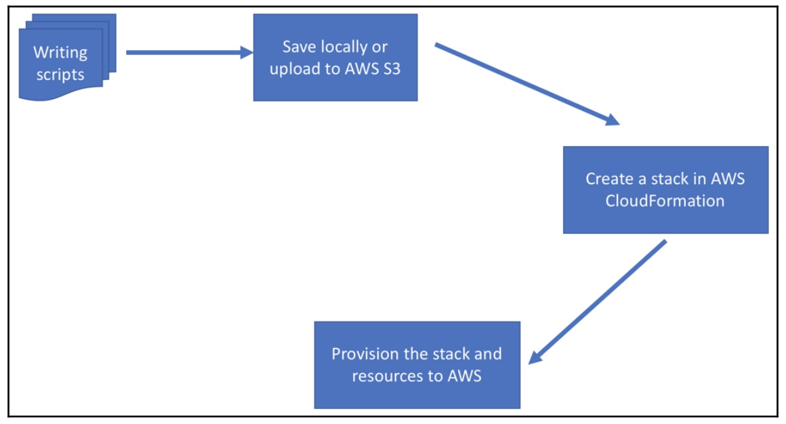
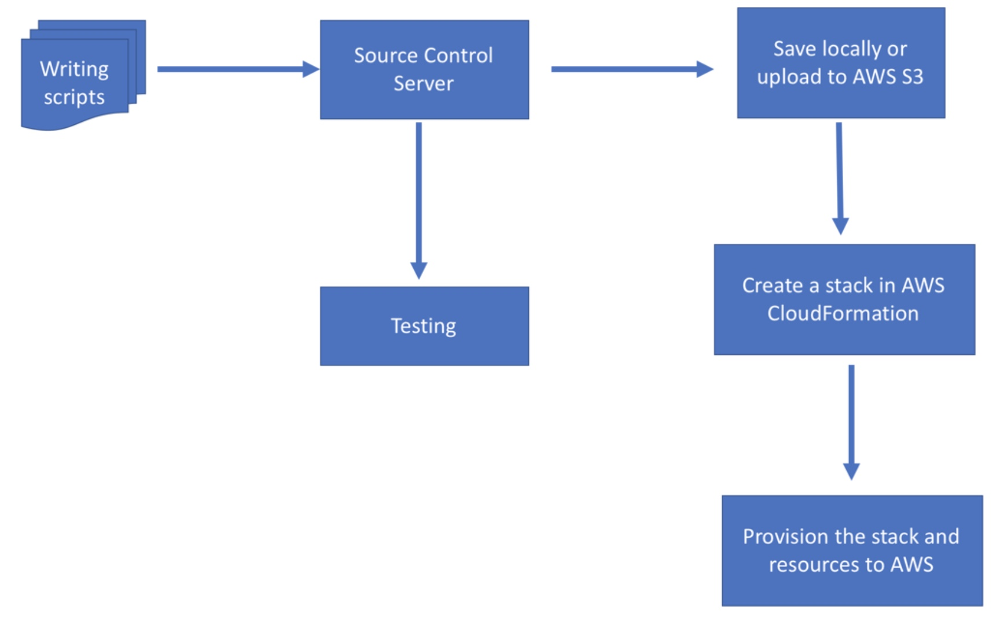
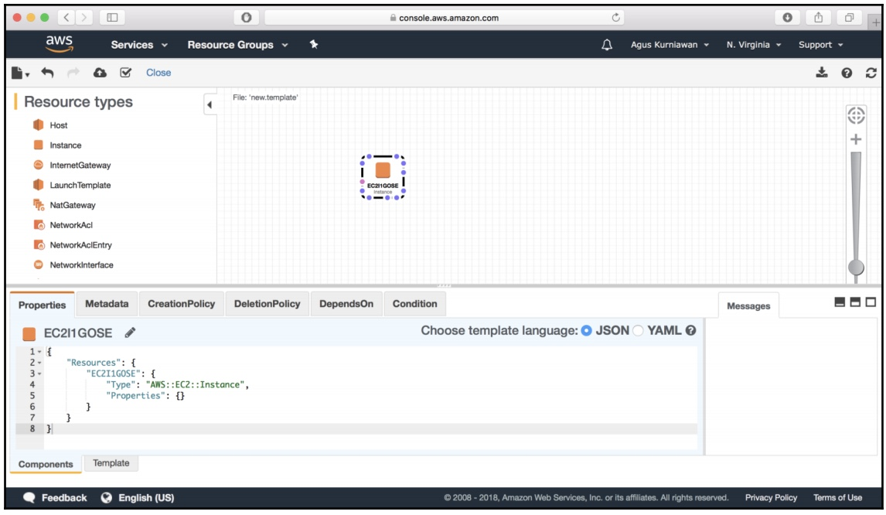

# AWS CloudFormation

* Amazon AWS is a cloud-based platform that provides cloud services.
* AWS CloudFormation is designed to implement IaC. We can write scripts to build a custom infrastructure.
* AWS CloudFormation is a solution for dynamic infrastructures.
* AWS CloudFormation allows us to model your entire infrastructure in a text file. 

* AWS CloudFormation is available at no additional charge, and we pay only for the AWS resources needed to run our applications.

### benefits:

- **MODEL IT ALL:** AWS CloudFormation allows us to model your entire infrastructure in a text file. This template becomes the single source of truth for your infrastructure. This helps to standardize infrastructure components used across the organization, enabling configuration compliance and faster troubleshooting.

- **AUTOMATE AND DEPLOY:** AWS CloudFormation provision resources in a safe, repeatable manner, allowing us to build and rebuild our infrastructure and applications, without having to perform manual actions or write custom scripts. CloudFormation takes care of determining the right operations to perform when managing the stack, and rolls back changes automatically if errors are detected.

- **IT'S JUST CODE:** Codifying the infrastructure allow us to treat our infrastructure as just code. We can author it with any code editor, check it into a version control system, and review the files with team members before deploying into production.

## How does it work?



<br>

1. In AWS CloudFormation; we canb write IaC scripts in:
    1. JSON, 
    2. YAML 

2. After completing the scripts, we can upload that script file to AWS CloudFormation. We can also put it on AWS S3 first, so AWS CloudFormation will download it directly.  
3. AWS CloudFormation provisions a stack and then creates AWS resources based on the scripts. We also can set the target region for the CloudFormation stack.

## Controlling IaC source scripts

We can use Git to manage IaC scripts. Once the scripts are released, we can push them to AWS CloudFormation to provision the AWS resources.



<br>

# CloudFormation Templates

[AWS sample templates](https://docs.aws.amazon.com/AWSCloudFormation/latest/UserGuide/cfn-sample-templates.html)

* A CloudFormation template is simply a JSON (JavaScript Object Notation) or YAML-formatted text file that describes the AWS infrastructure needed to run an application or service along with any interconnection between them.

* Templates concisely capture resource relationships, such as EC2 instances that must be associated with an Elastic Load Balancing load balancer, or the fact that an EBS volume must be in the same EC2 Availability Zone as the instance to which it is attached.

* Using template parameters enable a single template to be used for many infrastructure deployments with different configuration values, such as how many instances to deploy for the application.

* Avoid collisions: All AWS resources in a template are identified using logical names, allowing multiple stacks to be created from a template without fear of naming collisions between AWS resources.

* Write and go: Use any method to launch a stack without having to register the template with AWS CloudFormation beforehand.   

* Visualize your stack: CloudFormation Designer lets us visualize our templates in a diagram. We can easily view our AWS resources and their relationships, and arrange their layout so that the diagram makes sense. We can edit the templates using the drag-and-drop interface and the integrated JSON editor. The modifications we make to the diagram automatically modify the template’s JSON.    



<br>

* Look up resources: AWS CloudFormation retains a copy of the stack template so we can use the AWS Management Console, the command line tools or the APIs to look up the precise resource configurations that were applied during stack creation.

* Automate: We have the option to automate template generation using a programming language or a tool of our choice. We also have the option to automate stack creation from the templates using the CloudFormation API, AWS SDKs, or AWS CLI.

```
{

    "Description" : "A text description for the template usage",

    "Parameters": {

        // A set of inputs used to customize the template per deployment

    },

    "Resources" : {

        // The set of AWS resources and relationships between them

    },

    "Outputs" : {

        // A set of values to be made visible to the stack creator

    },

    "AWSTemplateFormatVersion" : "2010-09-09"

}
```

<br>

Example in JSON:

```
{

    "Description" : "Create an EC2 instance running the Amazon Linux 32 bit AMI.",

    "Parameters" : {

        "KeyPair" : {

            "Description" : "The EC2 Key Pair to allow SSH access to the instance",

            "Type" : "String"

        }

    },

    "Resources" : {

        "Ec2Instance" : {

            "Type" : "AWS::EC2::Instance",

            "Properties" : {

                "KeyName" : { "Ref" : "KeyPair" },

                "ImageId" : "ami-3b355a52"

            }

        }

    },

    "Outputs" : {

        "InstanceId" : {

            "Description" : "The InstanceId of the newly created EC2 instance",

            "Value" : {

                "Ref" : "Ec2Instance"

            }

        }

    },

    "AWSTemplateFormatVersion" : "2010-09-09"

}   
```

<br>

Example in YAML:

```
---
Description: Create an EC2 instance running the Amazon Linux 32 bit AMI.
Parameters:
  KeyPair:
    Description: The EC2 Key Pair to allow SSH access to the instance
    Type: String
Resources:
  Ec2Instance:
    Type: AWS::EC2::Instance
    Properties:
      KeyName:
        Ref: KeyPair
      ImageId: ami-3b355a52
Outputs:
  InstanceId:
    Description: The InstanceId of the newly created EC2 instance
    Value:
      Ref: Ec2Instance
AWSTemplateFormatVersion: "2010-09-09"
```


