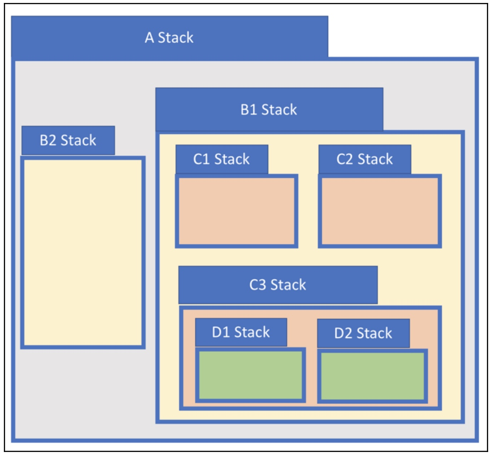
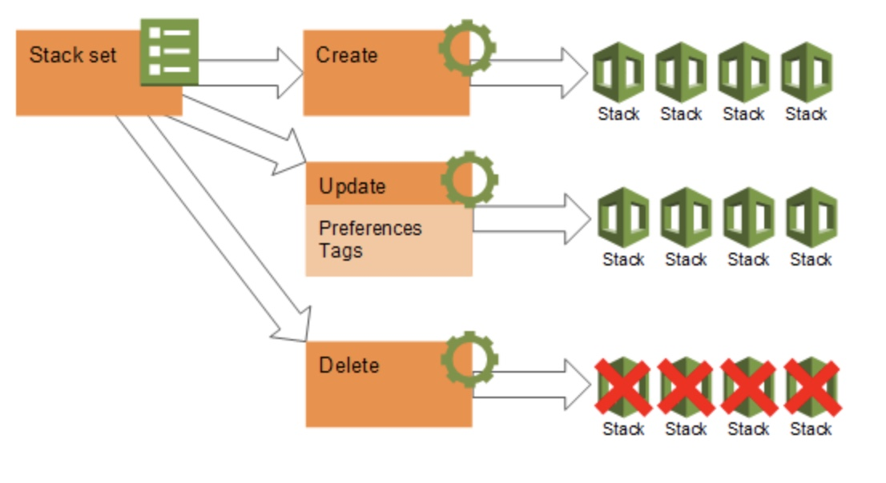
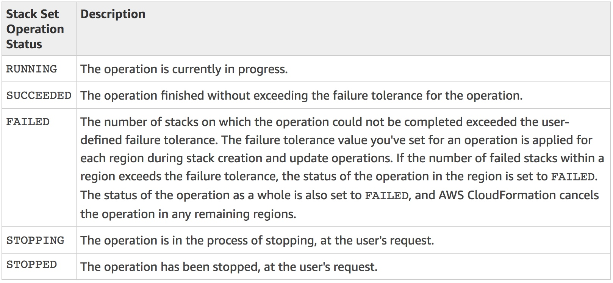
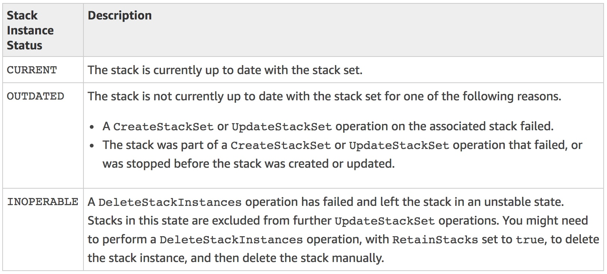

# CloudFormation Stacks

* A stack is a collection of AWS resources that you can manage as a single unit.

* Based on the template and any dependencies specified in a stack, AWS CloudFormation determines what AWS resources need to be created and in what order.

* When we develop an AWS CloudFormation stack, ensure all resources with CloudFormation templates meet with AWS regions. Not all regions have the same resources.

* We can create, update, or delete a collection of resources by creating, updating, or deleting stacks.

* To update a stack, we provide a template with the desired configuration of all of the resources in our stack. We can modify properties of the existing resources in our stack to react to changes in our environment or new application requirements.

* AWS CloudFormation will create or update a stack it in its entirety. If a stack cannot be created or updated in its entirety, AWS CloudFormation will roll it back.

## Nested stacks

Sometimes, we use various resources in our infrastructure design, such as database clustering. In this scenario, we can develop CloudFormation nested stacks. 

This means our CloudFormation stack consists of several stacks. For instance, we draw a design like the one in the following diagram. 

The CloudFormation stack consists of two stacks: B1 and B2. Inside the B1 Stack, we use three CloudFormation stacks: C1, C2, and C3. Then, we build two stacks within the C3 Stack, as shown in the following example model of AWS CloudFormation nested stacks:

 

## CloudFormation StackSets

- CloudFormation StackSet is designed to enable you to create CloudFormation stacks in AWS accounts across regions by using a single AWS CloudFormation template. 

- All the resources included in each stack are defined by the stack set's AWS CloudFormation template. 

- After we've defined a stack set, we can create, update, or delete stacks in the target accounts and regions you specify. 

- When we edit our StackSet, AWS CloudFormation will update all the stacks. When we perform a deletion operation on a StackSet, AWS CloudFormation will delete all the stacks related to that StackSet.

- When we create, update, or delete stacks, we can also specify operation preferences, such as the order of regions in which you want the operation to be performed, the failure tolerance beyond which stack operations stop, and the number of accounts in which operations are performed on stacks concurrently.

- A stack set is a regional resource. If we create a stack set in one region, we cannot see it or change it in other regions.

logical relationships between stack sets, stack operations, and stacks.

 

## Stack instances

- A stack instance is a reference to a stack in a target account within a region. 
- A stack instance can exist without a stack; for example, if the stack could not be created for some reason, the stack instance shows the reason for stack creation failure. 
- A stack instance is associated with only one stack set.

## Stack set operations

1. **Create stack set**:

* Creating a new stack set includes specifying an AWS CloudFormation template that we want to use to create stacks, specifying the target accounts in which you want to create stacks, and identifying the AWS regions in which we want to deploy stacks in your target accounts. 

* A stack set ensures consistent deployment of the same stack resources, with the same settings, to all specified target accounts within the regions you choose.

2. **Update stack set**

* When we update a stack set, we push changes out to stacks in our stack set. 
* We can update a stack set in one of the following ways. Note that our template updates always affect all stacks; you cannot selectively update the template for some stacks in the stack set, but not others.

    - Change existing settings in the template or add new resources, such as updating parameter settings for a specific service, or adding new Amazon EC2 instances.

    - Replace the template with a different template.

    - Add stacks in existing or additional target accounts, across existing or additional regions.

3. **Delete stacks:**

* When we delete stacks, we are removing a stack and all its associated resources from the target accounts you specify, within the regions we specify. We can delete stacks in the following ways.

    - Delete stacks from some target accounts, while leaving other stacks in other target accounts running.

    - Delete stacks from some regions, while leaving stacks in other regions running.

    - Delete stacks from your stack set, but save them so they continue to run independently of your stack set by choosing the Retain Stacks option. _Retained stacks are managed in AWS CloudFormation, outside of your stack set._

    - Delete all stacks in your stack set, in preparation for deleting your entire stack set.

4. **Delete stack set**

We can delete your stack set only when there are no stack instances in it.    

## Stack set and stack instance status codes

 

The following table describes status codes for stack instances within stack sets.

 

