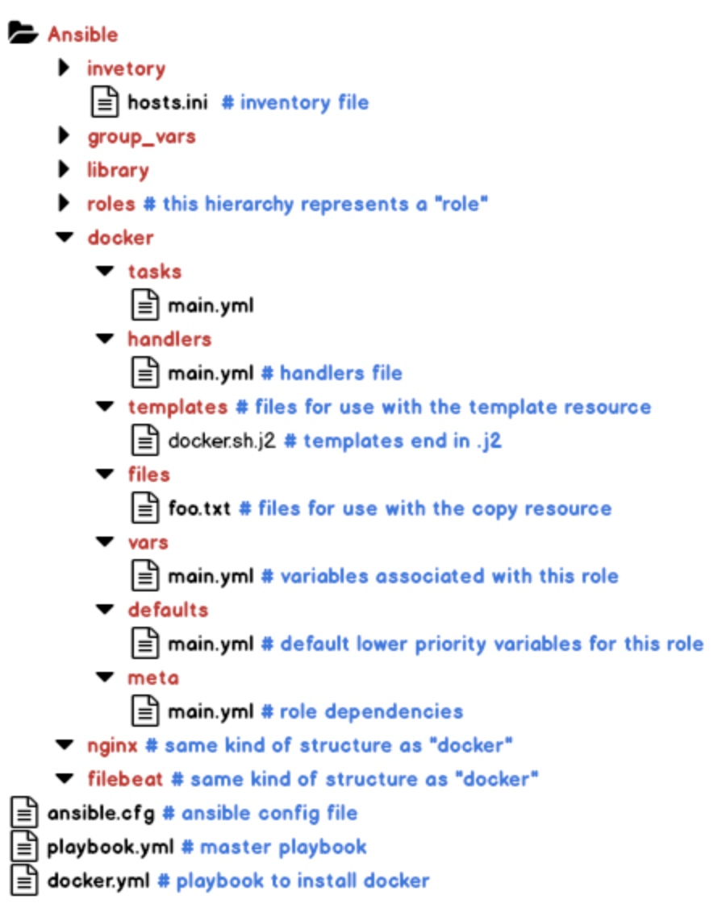

# Ansible

## What is Ansible?

* Ansible is an open-source automation tool, or platform, used for IT tasks such as:
    1. configuration management, 
    2. application deployment, 
    3. provisioning,
    4. orchestration.

* Initial release: February 20, 2012    
* Stable release: 2.7.4 / November 30, 2018
* Original Author: [Michael DeHaan](https://www.linkedin.com/in/michaeldehaan/)

* OS:  Red Hat Enterprise Linux, Debian, CentOS, macOS, BSD, Ubuntu, MacOS, Windows
* Integration: Ansible can deploy to **bare metal hosts**, virtualized systems and cloud environments, including **AWS**, Atomic, CenturyLink, Cloudscale, CloudStack, DigitalOcean, Dimension Data, Docker, Google Cloud Platform, KVM, Linode, LXC, LXD, **Microsoft Azure**, OpenStack, OVH, oVirt, Packet, Profitbricks, PubNub, Rackspace, Scaleway, SmartOS, SoftLayer, Univention, VMware, Webfaction, and XenServer.

* Developers: Ansible Community/ Ansible Inc./ Red Hat Inc.
* Repository: [github.com/ansible/ansible](https://github.com/ansible/ansible)

* Written in: Python, PowerShell, Shell, Ruby
* Requirement: Python 2.7 or higher
* Syntax: YAML

 

 

## Why Ansible?

1. **Free:** Ansible is an open-source tool.
2. **Very simple to set up and use:** No special coding skills are necessary to use Ansible’s playbooks.
3. **Powerful:** Ansible lets you model even highly complex IT workflows. 
4. **Flexible:** We can orchestrate the entire application environment no matter where it’s deployed. 
5. **Agentless:** Leaves behind almost nothing. Uses SSH. We don’t need to install any other software or firewall ports on the client systems we want to automate. 
6. **Efficient:** Because we don’t need to install any extra software, there’s more room for application resources on your server.
7. **Secure:** Uses OS level security
8. **Idempotent:** No duplication of effort for configuration.

## Ansible features & capabilities

### Configuration Management
* Ansible is designed to be very simple, reliable and consistent for configuration management.
* Ansible configurations are simple data descriptions of an infrastructure, and are both readable by humans and parsable by machines.(written in yml)

### Application Deployment

* Ansible is the simplest way to deploy our applications. 
* It gives us the power to deploy multi-tier applications reliably and consistently, all from one common framework.
* No need to write custom code to automate our systems; we just list the tasks needed to be done by writing a playbook, and Ansible will figure out how to get our systems to the state we want them to be in.

### Orchestration

* Ansible provides Orchestration in the sense of aligning the business request with the applications, data, and infrastructure. 
* It defines the policies and service levels through automated workflows, provisioning, and change management. 
* This creates an application-aligned infrastructure that can be scaled up or down based on the needs of each application. 

### Provisioning

* Provisioning with Ansible allows us to seamlessly transition into configuration management, orchestration and application deployment using the same simple, human readable, automation language.

### Security and Compliance

* As with application deployment, sitewide security policies (such as firewall rules or locking down users) can be implemented along with other automated processes. 
* If we configure the security details on the control machine and run the associated playbook, all the remote hosts will automatically be updated with those details.

## How ansible works?

Ansible dependencies: [link](https://github.com/ansible/ansible/blob/a8d4bf86421d151d8df7132e8e87d04b6662f45a/packaging/rpm/ansible.spec)

Playbook execution code: [link](https://github.com/ansible/ansible/blob/a8d4bf86421d151d8df7132e8e87d04b6662f45a/lib/ansible/executor/playbook_executor.py)

Playbook libraries: [link](https://github.com/ansible/ansible/tree/a8d4bf86421d151d8df7132e8e87d04b6662f45a/lib/ansible/playbook)

Inventory libraries: [link](https://github.com/ansible/ansible/tree/a8d4bf86421d151d8df7132e8e87d04b6662f45a/lib/ansible/inventory)

Ansible modules: [link](https://github.com/ansible/ansible/tree/a8d4bf86421d151d8df7132e8e87d04b6662f45a/lib/ansible/modules)

## Ansible Structs

1. Controller
2. Playbook
3. Play
4. Facts
5. Inventory
6. Tasks
7. Role
8. Handlers
9. Variables
10. Templates

