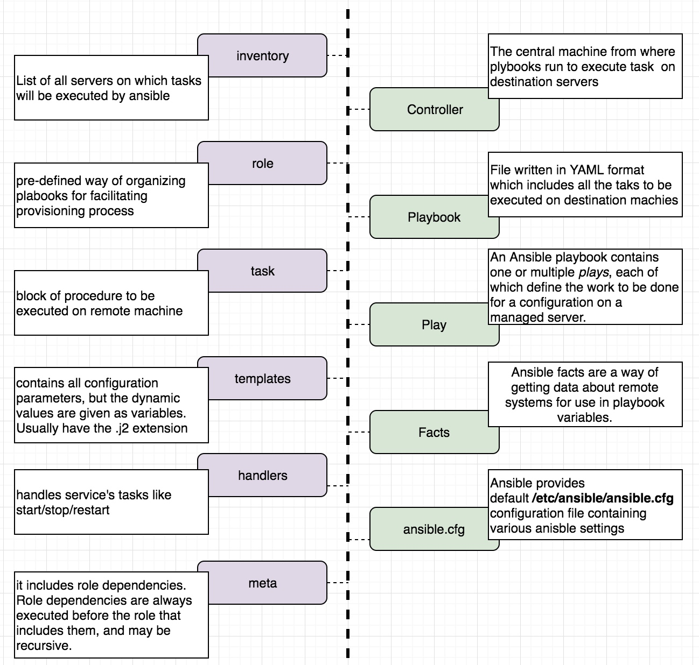

# Ansible

## What is Ansible?

* Ansible is an open-source automation tool, or platform, used for IT tasks such as:
    1. configuration management, 
    2. application deployment, 
    3. provisioning,
    4. orchestration.

* Initial release: February 20, 2012    
* Stable release: 2.7.4 / November 30, 2018
* Original Author: [Michael DeHaan](https://www.linkedin.com/in/michaeldehaan/)

* OS:  Red Hat Enterprise Linux, Debian, CentOS, macOS, BSD, Ubuntu, MacOS, Windows
* Integration: Ansible can deploy to **bare metal hosts**, virtualized systems and cloud environments, including **AWS**, Atomic, CenturyLink, Cloudscale, CloudStack, DigitalOcean, Dimension Data, Docker, Google Cloud Platform, KVM, Linode, LXC, LXD, **Microsoft Azure**, OpenStack, OVH, oVirt, Packet, Profitbricks, PubNub, Rackspace, Scaleway, SmartOS, SoftLayer, Univention, VMware, Webfaction, and XenServer.

* Developers: Ansible Community/ Ansible Inc./ Red Hat Inc.
* Repository: [github.com/ansible/ansible](https://github.com/ansible/ansible)

* Written in: Python, PowerShell, Shell, Ruby
* Requirement: Python 2.7 or higher
* Syntax: YAML

<br>


<br>

## Why Ansible?

1. **Free:** Ansible is an open-source tool.
2. **Very simple to set up and use:** No special coding skills are necessary to use Ansible’s playbooks.
3. **Powerful:** Ansible lets you model even highly complex IT workflows. 
4. **Flexible:** We can orchestrate the entire application environment no matter where it’s deployed. 
5. **Agentless:** Leaves behind almost nothing. Uses SSH. We don’t need to install any other software or firewall ports on the client systems we want to automate. 
6. **Efficient:** Because we don’t need to install any extra software, there’s more room for application resources on your server.
7. **Secure:** Uses OS level security
8. **Idempotent:** No duplication of effort for configuration.

## Ansible features & capabilities

### Configuration Management
* Ansible is designed to be very simple, reliable and consistent for configuration management.
* Ansible configurations are simple data descriptions of an infrastructure, and are both readable by humans and parsable by machines.(written in yml)

### Application Deployment

* Ansible is the simplest way to deploy our applications. 
* It gives us the power to deploy multi-tier applications reliably and consistently, all from one common framework.
* No need to write custom code to automate our systems; we just list the tasks needed to be done by writing a playbook, and Ansible will figure out how to get our systems to the state we want them to be in.


### Orchestration

* Ansible provides Orchestration in the sense of aligning the business request with the applications, data, and infrastructure. 
* It defines the policies and service levels through automated workflows, provisioning, and change management. 
* This creates an application-aligned infrastructure that can be scaled up or down based on the needs of each application. 

### Provisioning

* Provisioning with Ansible allows us to seamlessly transition into configuration management, orchestration and application deployment using the same simple, human readable, automation language.


### Security and Compliance

* As with application deployment, sitewide security policies (such as firewall rules or locking down users) can be implemented along with other automated processes. 
* If we configure the security details on the control machine and run the associated playbook, all the remote hosts will automatically be updated with those details.

## Ansible Architecture


1. **Inventory:**
    - The host inventory file determines the target machines where these plays will be executed.
2. **Playbooks:**
    - The playbooks consist of one or more tasks that are expressed either with core modules that come with Ansible or custom modules that you can write for specific situations. 
    - The plays are executed sequentially from top to bottom, so there is no explicit order that you have to define. 
3. **Plugins:**
    - Plugins are pieces of code that augment Ansible’s core functionality.
    - Action, cache and callback plugins are three examples.
4. **Modules:**    
    - Modules are like small programs that Ansible pushes out from a control machine to all the nodes, or remote hosts. 
    - Ansible then executes these modules (over SSH by default), and removes them when finished.
    - Ansible provides more than 450 modules for common tasks.
    - list of moudles: [link](https://docs.ansible.com/ansible/latest/modules/list_of_all_modules.html)
5. **APIs:**
    - Various APIs (application programming interfaces) are available so we can extend Ansible’s connection types (meaning more than just SSH for transport), callbacks and more.
    - Python API: [link](https://docs.ansible.com/ansible/latest/dev_guide/developing_api.html)

## Ansible Structs

1. Controller
2. Playbook
3. Play
4. Facts
5. Inventory
6. Tasks
7. Role
8. Handlers
9. Variables
10. Templates
11. Meta

#### Ansible structs explained:



#### Ansible directory structure


## How ansible works?


___

* Ansible dependencies: [link](https://github.com/ansible/ansible/blob/a8d4bf86421d151d8df7132e8e87d04b6662f45a/packaging/rpm/ansible.spec)
* Playbook execution code: [link](https://github.com/ansible/ansible/blob/a8d4bf86421d151d8df7132e8e87d04b6662f45a/lib/ansible/executor/playbook_executor.py)
* Playbook libraries: [link](https://github.com/ansible/ansible/tree/a8d4bf86421d151d8df7132e8e87d04b6662f45a/lib/ansible/playbook)
* Inventory libraries: [link](https://github.com/ansible/ansible/tree/a8d4bf86421d151d8df7132e8e87d04b6662f45a/lib/ansible/inventory)
* Ansible modules: [link](https://github.com/ansible/ansible/tree/a8d4bf86421d151d8df7132e8e87d04b6662f45a/lib/ansible/modules)

___


## Ansible ad-hoc commands

* Ad hoc commands are commands which can be run individually to perform quick functions. 
* These ad-hoc commands are not used for configuration management and deployment, because these commands are of one time usage.

#### Syntax

```
ansible <host-group> -m <ansible-moudle> -a <OPT_ARGS> <flags>
```
* flags:
    - `-u {username}`: run command as different user
    - `--ask-pass`, `-k`: prompts for password
    - `-f {n}`: run command in n paralle forks
    - `--become`, `-b`: run command thorugh sudo
    - `--ask-become-pass`, `-K`: interactive prompt to pass password
    - `-i {invenotry file}`
    - `--ask-vault-pass`: to pass vault password in interactive mode  

e.g Copy SSH key manually
```
ansible <HOST_GROUP> -m authorized_key -a "user=root key='ssh-rsa AAAA...XXX == root@hostname'"
```


#### use-cases of [ad-hoc](https://docs.ansible.com/ansible/latest/user_guide/intro_adhoc.html) commands

An ad-hoc command is something that we might type in to do something really quick, but don’t want to save for later.


1. Parallelism and Shell Commands:
    - To run reboot for all servers in a group, `webservers` in inventory, in 12 parallel forks
    ```
    ansible webservers -a "/sbin/reboot" -f 12
    ```
2. File Transfer:
    - Transferring file to many servers/machines
    ```
    ansible webservers -m copy -a "src = /etc/yum.conf dest = /tmp/yum.conf"
    ```
3. Managing Packages:
    - The Ad-hoc commands are available for yum and apt
    ```
    ansible webservers -m yum -a "name = demo-tomcat-1 state = present"
    ```
4. Gathering Facts
    - Facts can be used for implementing conditional statements in playbook.
    ```
    ansible all -m setup 
    ```

_**ansible-adhoc commands should not be used for configuration management and deployment, use playbook instead.**_

## Configuring ansible

* Ansible configuration file uses an INI format to store its configuration data. 
* We can overwrite nearly all of the configuration settings either through Ansible playbook options or environment variables.

* While running an Ansible command, the command looks for its configuration file in a predefined order, as follows:

    

* Configuration can be done in two ways:
    1. Configuration using environment variables
    2. Configuration using ansible.cfg

### Configuration using environment variables

We can use most of the configuration parameters directly via environment variables by appending ANSIBLE_ to the configuration parameter.

e.g `export ANSIBLE_SUDO_USER=root`

### Configuration using ansible.cfg

Ansible has many configuration parameters. We will consider some of the configuration parameters, as follows, and see how to use them:

Default ansible.cfg:

```
hostfile = /etc/ansible/hosts
library = /usr/share/ansible
forks = 5
sudo_user = root
remote_port = 22
host_key_checking = False
timeout = 60
log_path = /var/log/ansible.log
```


1. `hostfile`: This parameter indicates the path to the inventory file. The inventory file consists of a list of hosts that Ansible can connect to.

2. `library`: Whenever Ansible performs any action, whether it is a local action or a remote one, it uses a piece of code to perform the action; this piece of code is called a **module**. The library parameter points to the path of the directory where Ansible modules are stored. 

3. `forks`: This parameter is the default number of processes that you want Ansible to spawn. It defaults to _five maximum processes in parallel._

4. `sudo_user`: This parameter specifies the default user that should be used against the issued commands.

5. `remote_port`: This parameter is used to specify the port used for SSH connections, which defaults to 22. 

6. `host_key_checking`:  This parameter is used to disable the SSH host key checking; this is set to True by default. 

7. `timeout`: This is the default value for the timeout of SSH connection attempts.

8. `log_path`: By default, Ansible doesn't log anything; if we would like to send the Ansible output to a logfile, then set the value of log_path to the file you would like to store the Ansible logs in.


## Playbooks

* Playbooks are one of the core features of Ansible and tell Ansible what to execute. 
* They are like a to-do list for Ansible that contains a list of tasks; each task internally links to a piece of code called a module. 
* Playbooks are simple human-readable YAML files, whereas modules are a piece of code that can be written in any language with the condition that its _output should be in the JSON format._
* Palybook can be single file or seprated over multiple roles which can perform different set of tasks.

### Play
* A playbook can consists multiple plays.
* Each play conisists of multiple taks.
* Different plays can run on different host groups.

### Directory layout:

     

```
mukund@ubuntu:~/all/Ansible$ tree -I "ntc-templates|library"
.
├── group_vars
│   ├── all.yml
├── hosts
├── host_vars
├── roles
│   ├── common
│   │   ├── defaults
│   |   │   ├── main.yml
│   │   ├── files
│   │   ├── handlers
│   |   │   ├── main.yml
│   │   ├── tasks
│   |   │   ├── main.yml
│   │   ├── meta
│   │   ├── templates
│   │   └── vars
│   └── apache
│       ├── defaults
│       ├── files
│       ├── handlers
│       ├── meta
│       ├── tasks
│       │   ├── main.yml
│       ├── templates
│       └── vars
│           ├── main.yml
├── site.retry
├── webservers.yml
├── DBservers.yml
└── master_playbook.yml
```

#### Sample playbook with plays:

```
---
- hosts: aws 
  pre_tasks:
    - name: Load Environment Variables for Production vCenter
      include_vars:
        file: group_vars/all.yml
  roles:
    - role: aws-user-setup
    - role: aws-prerequisites
    - role: ec2-install
    - role: rds-db-setup
    - role: client-config
    - role: dns-mgmt
      vars:
        dnsip: "{{ output.ansible_facts.hw_eth0.ipaddresses[0] }}" 
      ignore_errors: yes
      
  tasks:
     - name: Wait until the DNS name is resolving  
       wait_for: 
         host: "{{ inventory_hostname }}" 
         port: 22 
         state: started 
         timeout: 600 
         delay: 5   

- hosts: localhost
  roles:
    - role: app-config
  post_tasks:
    - name: create Backup job to run at 22.30 daily
      cron:
        job: '/bin/dsmc i /etc/opt/conf /var/opt/conf'
        hour: '22'
        minute: '30'
        state: present
        user: root    

- hosts: localhost
  roles:
    - role: app-repo-creation
```    


            


