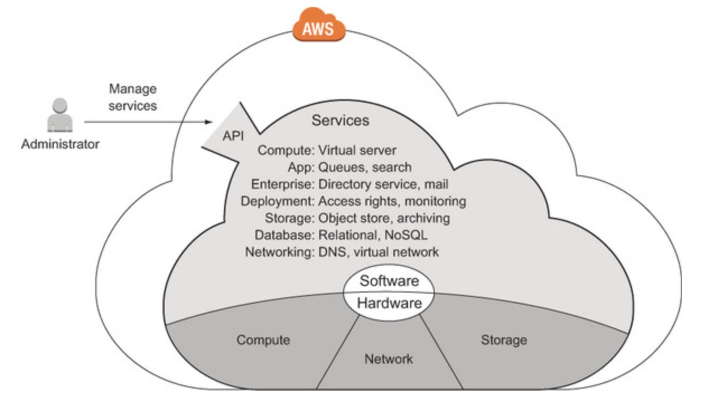
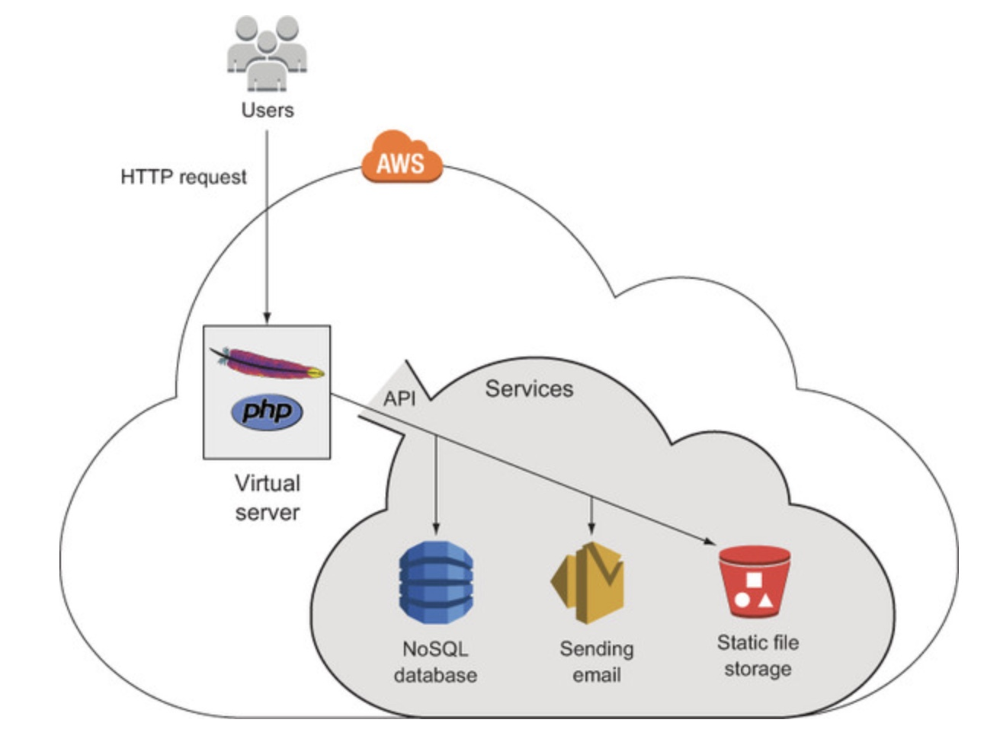
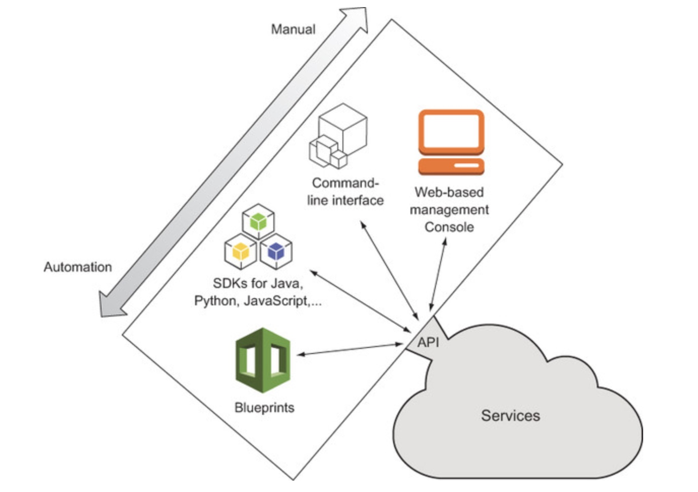
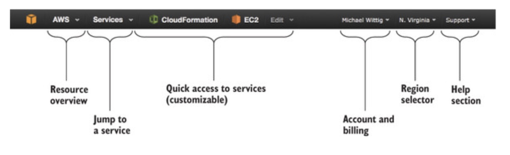

# AWS learnings

## What is Amazon Web Services?

* Amazon Web Services (AWS) is a platform of web services offering solutions for computing, storage, and networking, at different layers of abstraction. 
* The term web service means services can be controlled via a web interface. The web interface can be used by machines or by humans via a graphical user interface.
* The most prominent services are EC2, which offers virtual servers, and S3, which offers storage capacity.
* Services are charged for on a pay-per-use [pricing](https://aws.amazon.com/ec2/pricing/on-demand/)   model.

* The AWS Global infrastructure is built around Regions and Availability Zones (AZs). 
* AWS Regions provide multiple, physically separated and isolated Availability Zones which are connected with low latency, high throughput, and highly redundant networking. 
* These Availability Zones offer AWS customers an easier and more effective way to design and operate applications and databases, making them more highly available, fault tolerant, and scalable than traditional single datacenter infrastructures or multi-datacenter infrastructures. 
* For customers who specifically need to replicate their data or applications over greater geographic distances, there are AWS Local Regions.
* An AWS Local Region is a single datacenter designed to complement an existing AWS Region.
* Like all AWS Regions, AWS Local Regions are completely isolated from other AWS Regions. 

Details for AWS availability zones can be found [here](https://aws.amazon.com/about-aws/global-infrastructure/)


## What is Cloud computing?

Cloud computing is a model for 

* enabling ubiquitous, 
* convenient, 
* on-demand network access to a shared pool of configurable computing resources (e.g., networks, servers, storage, applications, and services) 

that can be rapidly provisioned and released with minimal management effort or service provider interaction.

Clouds are often divided into the following types:

* **Public** —A cloud managed by an organization and open to use by the general public
* **Private** —A cloud that virtualizes and shares the IT infrastructure within a single organization
* **Hybrid** —A mixture of a public and a private cloud

AWS is a public cloud. Cloud computing services also have several classifications:

* **Infrastructure as a service (IaaS)** —Offers fundamental resources like computing, storage, and networking capabilities, using virtual servers such as Amazon EC2, Google Compute Engine, and Microsoft Azure virtual machines

* **Platform as a service (PaaS)** —Provides platforms to deploy custom applications to the cloud, such as AWS Elastic Beanstalk, Google App Engine, and Heroku

* **Software as a service (SaaS)** —Combines infrastructure and software running in the cloud, including office applications like Amazon WorkSpaces, Google Apps for Work, and Microsoft Office 365

## Comparsion of hosting an appication in DC vs AWS


## Benefits of AWS

1. **Innovative and fast-growing platform** 
2. **Services solve common problems** -  Common problems such as load balancing, queuing, sending email, and storing files are solved for us by AWS services. We don’t need to reinvent the wheel. 
3. **Enabling automation** - Because AWS has an API, we can automate everything: we can write code to create networks, start virtual server clusters, or deploy a relational database. Automation increases reliability and improves efficiency.
4. **Flexible capacity (scalability)** - Flexible capacity frees us from planning. We can scale from one server to thousands of servers. Out storage can grow from gigabytes to petabytes. We no longer need to predict 


r future capacity needs for the coming months and years.
5. **Built for failure (reliability)** - Most AWS services are fault-tolerant or highly available. 
6. **Reducing time to market**
7. **Worldwide**
8. **Complaince** - ISO 27001, FedRAMP & DoD CSM, PCI DSS Level 1, ISO 9001.

## Free [tier](http://aws.amazon.com/free)

Here is what’s included in the Free Tier:

* 750 hours (roughly a month) of a small virtual server running Linux or Windows. This means we can run one virtual server the whole month or we can run 750 virtual servers for one hour.
* 750 hours (or roughly a month) of a load balancer.
* Object store with 5 GB of storage.
* Small database with 20 GB of storage, including backup.

Below is an example of billing in a network:


* Based on hours of usage —If we use a server for 61 minutes, that’s usually counted as 2 hours.
* Based on traffic —Traffic can be measured in gigabytes or in number of requests.
* Based on storage usage —Usage can be either provisioned capacity (for example, 50 GB volume no matter how much we use) or real usage (such as 2.3 GB used).

## Comparison of cloud providers


## AWS Services

The AWS cloud is composed of hardware and software services accessible via an API.



1. **Compute services** offer computing power and memory. You can start virtual servers and use them to run your applications.
2. **App services** offer solutions for common use cases like message queues, topics, and searching large amounts of data to integrate into your applications.
3. **Enterprise services** offer independent solutions such as mail servers and directory services.
4. **Deployment and administration services** work on top of the services mentioned so far. They help you grant and revoke access to cloud resources, monitor your virtual servers, and deploy applications.
5. **Storage** is needed to collect, persist, and archive data. AWS offers different storage options: an object store or a network-attached storage solution for use with virtual servers.
6. **Database** storage has some advantages over simple storage solutions when you need to manage structured data. AWS offers solutions for relational and NoSQL databases.
7. **Networking services** are an elementary part of AWS. You can define private networks and use a well-integrated DNS.

_Handling an HTTP request with a custom web application using additional AWS services_



## Interacting with AWS

1. **Management console**- web-based Management Console to interact with AWS.
2. **Command-line interface**- CLI is typically used to automate tasks on AWS.
3. **SDKs**- SDKs are typically used to integrate AWS services into applications. AWS provides SDKs for:
    > - Android
    > - Browsers (JavaScript)
    > - iOS
    > - Java
    > - .NET
    > - Node.js (JavaScript)
    > - PHP
    > - Python
    > - Ruby
    > - Go
4. **Blueprints**- a description of your system containing all services and dependencies. The blueprint doesn’t say anything about the necessary steps or the order to achieve the described system.A blueprint removes much of the burden from you because you no longer need to worry about dependencies during system creation—the blueprint automates the entire process. 



## AWS account

[Steps](https://docs.aws.amazon.com/AmazonSimpleDB/latest/DeveloperGuide/AboutAWSAccounts.html)



## Creating a key pair

To access a virtual server in AWS, we need a key pair consisting of a private key and a public key. The public key will be uploaded to AWS and inserted into the virtual server. The private key is ours; it’s like our password, but much more secure. Protect the private key as if it’s a password. It’s our secret, so don’t lose it—we can’t retrieve it.

Steps:

```
EC2 Dashboard > Network & Security > Key Pairs > Click Create Key Pair > Name the Key Pair mykey >  download file called mykey.pem > run chmod 400 mykey.pem in the terminal

```


