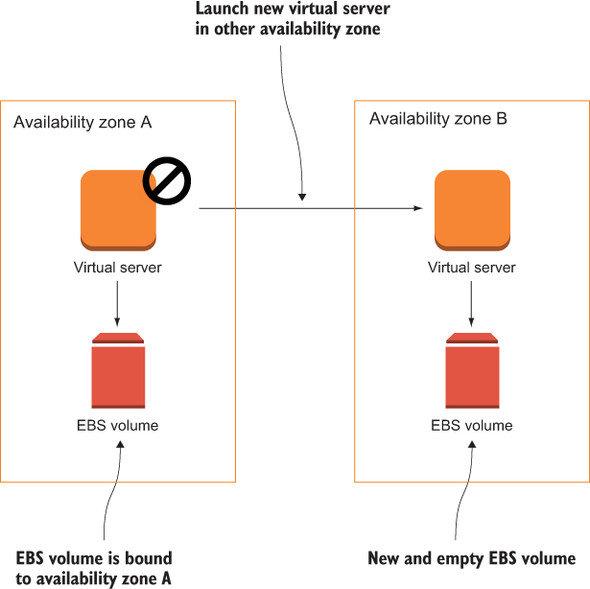

# Achieving high availability: availability zones, auto-scaling, and CloudWatch

* High availability describes a system that’s operating with almost no downtime. Even if a failure occurs, the system can provide its services at a high probability. Although a short interruption might be necessary to recover from a failure, there’s no need for human interaction. 

* The Harvard Research Group (HRG) defines high availability with the classification AEC-2, which requires an uptime of 99.99 % over a year.

### High availability vs. fault tolerance

- A highly available system can recover from a failure automatically with a short downtime.

- A fault-tolerant system, in contrast, requires the system to provide its services without interruption in case of a component failure. 

### AWS offers tools for building highly available systems based on EC2 instances:

1. Monitoring the health of virtual servers with CloudWatch and triggering recovery automatically if needed.
2. Building a highly available infrastructure by using multiple isolated data centers, called availability zones, within a region.
3. Using auto-scaling to have a guaranteed number of virtual servers running and replace failed instances automatically.

## Recovering from server failure with CloudWatch

The status of every virtual server is checked by the EC2 service automatically. Checks are performed every minute and are available as CloudWatch metrics. 

### AWS CloudWatch is a service offering metrics, logs, and alarms for AWS resources.

- A system status check detects a loss of network connectivity or power and software or hardware issues on the physical host. 

- AWS needs to be involved to repair failures detected by the system status check. 
- One possible strategy to resolve such failures is to recover by moving the virtual machine to another physical host.

 In the case of a hardware failure, CloudWatch triggers the recovery of the virtual server.

 

 <br>

 - After the recovery, a new virtual server is running with the same ID and private IP address. Data on EBS volumes, the network-attached storage, is restored as well. 
 - No data is lost because the EBS volume stays the same. Virtual servers with local disks (instance storage) aren’t supported for the CloudWatch alarm-based recovery process. 
 - If the old virtual server was connected to an Elastic IP address, the new server is connected to the same public IP address.

 ### Requirements for recovering EC2 instances

A virtual server must fulfill the following requirements if you want to use the recovery feature:

1. It must be running in a virtual private cloud (VPC) network.
2. The instance family must be c3 (compute optimized), c4 (compute optimized), m3 (general), r3 (memory optimized), or t2 (burstable performance). Earlier instance families aren’t supported (such as t1).
3. The EC2 instance must use EBS volumes exclusively because data on instance storage would be lost after a recovery of the instance.

### Creating a CloudWatch alarm:

A CloudWatch alarm consists of the following:

1. A metric that monitors data (health check, CPU usage, and so on)
2. A rule defining a threshold based on a statistical function over a period of time
3. Actions to trigger if the state of the alarm changes (such as triggering a recovery of an EC2 instance if the state changes to ALARM)

The following states are available for an alarm:

1. OK —Everything is fine; the threshold hasn’t been reached.
2. INSUFFICIENT_DATA —There isn’t enough data to evaluate the alarm.
3. ALARM —Something is broken: the threshold has been overstepped.

Sample CloudWatch alarm:


<br>

## Monitoring and recovering a jenkins server based on a CloudWatch alarm

```
$ aws cloudformation create-stack --stack-name jenkins \
--template-url https://s3.amazonaws.com/mukund-learning-aws-jenkins-setup/jenkins.json \
--parameters ParameterKey=JenkinsAdminPassword,ParameterValue=iwonttellu108

{
    "StackId": "arn:aws:cloudformation:us-east-1:825796472415:stack/jenkins/cb9bded0-0a67-11e9-b5ce-12a3b4ca1ea2"
}
$
```

<br>


<br>


<br>


<br>


<br>

Alarm in the CLoudWatch


<br>


<br>

Recovery


<br>

##  Availability zones: multiple data centers per region

AWS operates multiple locations worldwide, called regions.

* Each region consists of multiple availability zones. 
* A*vailability zone are isolated data centers and a region as an area where multiple isolated data centers are located at a sufficient distance. 
* The availability zones are connected through low-latency links, so requests between different availability zones aren’t as expensive as requests across the internet in terms of latency.


<br>

AWS services can operate in a single availability zone, over multiple availability zones within a region, or even globally.

- There are services operating globally over multiple regions: Route 53 (DNS) and CloudFront (CDN).
- Some services are using multiple availability zones within a region so they can recover from a data center outage: S3 (object store) and DynamoDB (NoSQL database).
- The relational database service (RDS) offers the ability to deploy a master-standby setup, called Multi-AZ deployment, so you can failover into another availability zone if necessary.
- A virtual server runs in a single availability zone. But AWS offers tools to build an architecture based on EC2 instances that can failover into another availability zone.


<br>

List of availability [zones](https://howto.lintel.in/list-of-aws-regions-and-availability-zones/):


<br>

## Dependencies of VPC service on availability zone

1. A VPC is always bound to a region.
2. A subnet within a VPC is linked to an availability zone.
3. A virtual server is launched into a single subnet.


## Auto-scaling

Auto-scaling is part of the EC2 service and helps us to ensure that a specified number of virtual servers is running.

To configure auto-scaling, you need to create two parts of the configuration:

1. A launch configuration contains all information needed to launch a virtual server: 
    - instance type (size of virtual server) and 
    - image (AMI) to start from.
2. An auto-scaling group tells the EC2 service how many virtual servers should be started with a specific launch configuration, how to monitor the instances, and in which subnets virtual servers should be started.


<br>


<br>

Configuring an auto-scaling group and a launch configuration


<br>

Jenkins CI server with auto-scaling in two availability zones


<br>


<br>

## Pitfall: network-attached storage recovery

* The EBS service offers network-attached storage for virtual servers. 
* EC2 instances are linked to a subnet, which is linked to an availability zone. 
* EBS volumes are also located in a single availability zone. 
* If the virtual server is started in another availability zone because of an outage, the data stored on the EBS volume is no longer available.

<br>



<br>

There are multiple solutions to this problem:

1. Outsource the state of your virtual server to a managed service that uses multiple availability zones by default: relational database service (RDS), DynamoDB (NoSQL database), or S3 (object store).
2. Create snapshots of your EBS volumes, and use these snapshots if a virtual server needs to recover in another availability zone. EBS snapshots are stored on S3 to be available in multiple availability zones.
3. Use a distributed third-party storage solution to store your data in multiple availability zones: GlusterFS, DRBD, MongoDB, and so on.

## Pitfall: network interface recovery

If a virtual server has to be started in another availability zone to recover from a data center outage, it must be started in another subnet. It’s not possible to use the same private IP address for the new virtual server.


<br>

There are different possibilities to provide a static endpoint when using auto-scaling to build high availability for a single virtual server:

1. Allocate an Elastic IP, and associate this public IP address during the bootstrap of the virtual server.
2. Create or update a DNS entry linking to the current public or private IP address of the virtual server. For this approach we may need to link a domain with the Route 53 (DNS) service.
3. Use an Elastic Load Balancer (ELB) as a static endpoint that forwards requests to the current virtual server.

Below is an example of elastic ip approach:


<br>

# DISASTER-RECOVERY 

Disaster recovery is easier and cheaper in the cloud than in a traditional data center, but it increases the complexity and therefore the initial and operating costs of your system. The recovery time objective (RTO) and recovery point objective (RPO) are standard for defining the importance of disaster recovery for a system from the business point of view.

* **The recovery time objective (RTO)** is the time it takes for a system to recover from a failure; it’s the length of time until the system service level is reached after an outage. In the example with a Jenkins server, the RTO would be the time until a new virtual server is started and Jenkins is installed and running after an outage of a virtual server or an entire data center.

* **The recovery point objective (RPO)** is the acceptable data-loss time caused by a failure. The amount of data loss is measured in time. If an outage happens at 10:00 AM and the system recovers with a data snapshot from 09:00 AM, the time span of the data loss is one hour. In the example with a Jenkins server using auto-scaling, the RPO would be the maximum time span between two EBS snapshots. Configuration and results from Jenkins jobs that changed after the last EBS snapshot would be lost in case of a recovery in another data center.


<br>


# FAULT TOLERANCE

It’s important to differentiate among services that guarantee the following:

* Nothing (single point of failure) —No requests are served in case of failure.
* High availability —In case of failure, it takes some time until requests are served as before.
* Fault-tolerance —In case of failure, requests are served as before without any availability issues.

Following are the guarantees of the AWS services covered in this book in detail. Single point of failure (SPOF) means this service will fail if, for example, a hardware failure occurs:

1. **Amazon Elastic Compute Cloud (EC2) instance** — A single EC2 instance can fail for many reasons: hardware failure, network problems, availability-zone problems, and so on. Use auto-scaling groups to have a fleet of EC2 instances serve requests in a redundant way to achieve high availability or fault-tolerance.

2. **Amazon Relational Database Service (RDS)** single instance — A single RDS instance can fail for many reasons: hardware failure, network problems, availability zone problems, and so on. Use Multi-AZ mode to achieve high availability.


Highly available (HA) means that when a failure occurs the service won’t be available for a short time but will come back automatically:

1. **Elastic Network Interface (ENI)** — A network interface is bound to an AZ (availability zone), so if this AZ goes down, our network interface is down.
2. **Amazon Virtual Private Cloud (VPC) subnet** — A VPC subnet is bound to an AZ, so if this AZ goes down, our subnet is down. Use multiple subnets in different AZs to remove the dependency on a single AZ.
3. **Amazon Elastic Block Store (EBS) volume**— An EBS volume is bound to an AZ, so if this AZ goes down, our volume is unavailable (our data won’t be lost). We can create EBS snapshots from time to time so you can recreate an EBS volume in another AZ.
4. **Amazon Relational Database Service (RDS) Multi-AZ instance** — When running in Multi-AZ mode, a short downtime (one minute) is expected if an issue occurs with the master instance while changing DNS records to switch to the standby instance.


Fault-tolerant means that if a failure occurs, you won’t notice it:

- Elastic Load Balancing (ELB), deployed to at least two AZs
- Amazon EC2 Security Group
- Amazon Virtual Private Cloud (VPC) with an ACL and a route table
- Elastic IP Address (EIP)
- Amazon Simple Storage Service (S3)
- Amazon Elastic Block Store (EBS) snapshot
- Amazon DynamoDB
- Amazon CloudWatch
- Auto-scaling group
- Amazon Simple Queue Service (SQS)
- AWS Elastic Beanstalk
- AWS OpsWorks
- AWS CloudFormation
- AWS Identity and Access Management (IAM, not bound to a single region; if you create an IAM user, that user is available in all regions)


