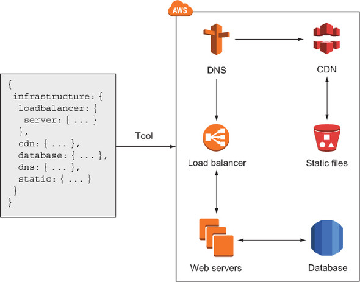
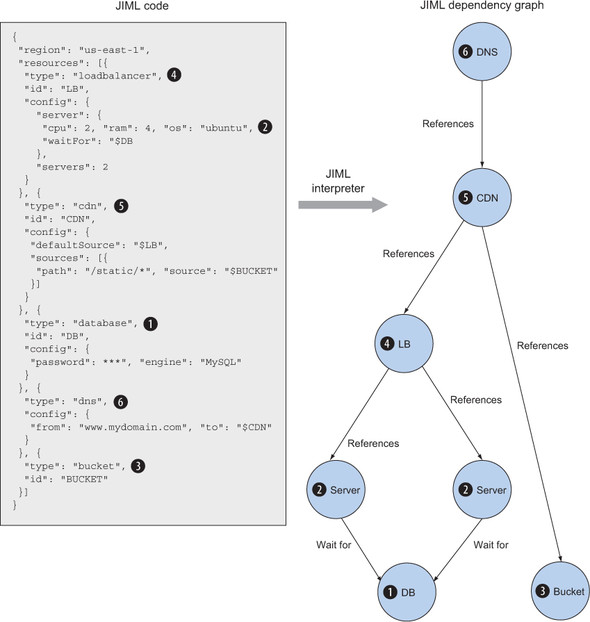
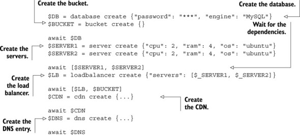

# Programming your infrastructure: the command line, SDKs, and CloudFormation

## Agenda

* Understanding the idea of infrastructure as code
* Using the CLI to start a virtual server
* Using the JavaScript SDK for Node.js to start a virtual server
* Using CloudFormation to start a virtual server


AWS provides infrastructure that can be controlled via an interface called an application programming interface (API) which is a REST API using HTTPS protocol. Calling the API is possible with SDKs for most programming languages, the command line, and more sophisticated tools.

Calling the API directly using plain HTTPS requests is inconvenient. That's why we use the command-line interface or SDKs.

##JIML

JSON Infrastructure Markup Language




**Sample JIML for an infra setup**

```
{
  "region": "us-east-1",
  "resources": [{
    "type": "loadbalancer",
    "id": "LB",
    "config": {

      "server": {
        "cpu": 2,
        "ram": 4,
        "os": "ubuntu",
        "waitFor": "$DB"
      },
      "servers": 2
    }
  }, {
    "type": "cdn",
    "id": "CDN",
    "config": {
      "defaultSource": "$LB",
      "sources": [{
        "path": "/static/*",
        "source": "$BUCKET"
      }]
    }
  }, {
    "type": "database",
    "id": "DB",
    "config": {
      "password": "***",
      "engine": "MySQL"
    }
  }, {
    "type": "dns",
    "config": {
      "from": "www.mydomain.com",
      "to": "$CDN"
    }
  }, {
    "type": "bucket",
    "id": "BUCKET"
  }]
}
```

How JIML works:

1.  Parse the JSON input.
2.  The JIML interpreter creates a dependency graph by connecting the resources with their dependencies.
3.  The JIML interpreter derives a linear flow of commands from the dependency graph by traversing the tree from the bottom (leaves) to the top (root). The commands are expressed in a pseudo language.
4.  The commands in pseudo language are translated into AWS API calls by the JIML runtime.



**Command flow**



