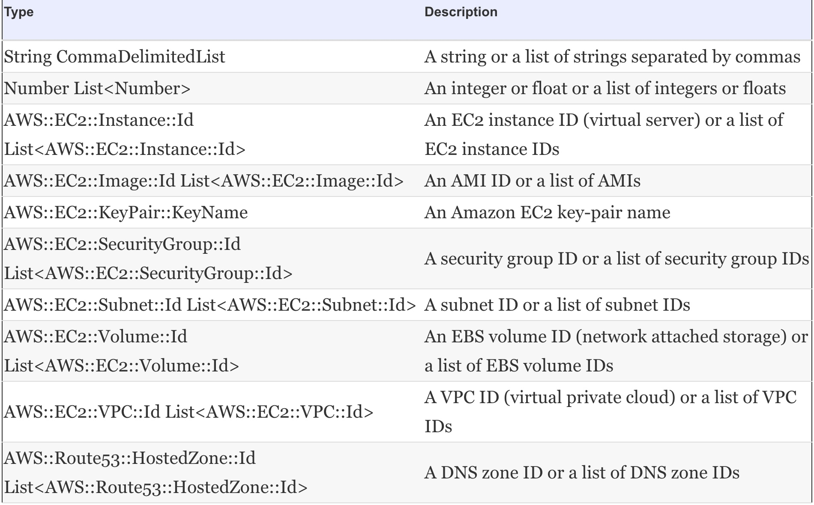

# Programming your infrastructure: the command line, SDKs, and CloudFormation

## Agenda

* Understanding the idea of infrastructure as code
* Using the CLI to start a virtual server
* Using the JavaScript SDK for Node.js to start a virtual server
* Using CloudFormation to start a virtual server


AWS provides infrastructure that can be controlled via an interface called an application programming interface (API) which is a REST API using HTTPS protocol. Calling the API is possible with SDKs for most programming languages, the command line, and more sophisticated tools.

Calling the API directly using plain HTTPS requests is inconvenient. That's why we use the command-line interface or SDKs.

## JIML

JSON Infrastructure Markup Language


<br><br>
**Sample JIML for an infra setup**

```
{
  "region": "us-east-1",
  "resources": [{
    "type": "loadbalancer",
    "id": "LB",
    "config": {

      "server": {
        "cpu": 2,
        "ram": 4,
        "os": "ubuntu",
        "waitFor": "$DB"
      },
      "servers": 2
    }
  }, {
    "type": "cdn",
    "id": "CDN",
    "config": {
      "defaultSource": "$LB",
      "sources": [{
        "path": "/static/*",
        "source": "$BUCKET"
      }]
    }
  }, {
    "type": "database",
    "id": "DB",
    "config": {
      "password": "***",
      "engine": "MySQL"
    }
  }, {
    "type": "dns",
    "config": {
      "from": "www.mydomain.com",
      "to": "$CDN"
    }
  }, {
    "type": "bucket",
    "id": "BUCKET"
  }]
}
```

How JIML works:

1.  Parse the JSON input.
2.  The JIML interpreter creates a dependency graph by connecting the resources with their dependencies.
3.  The JIML interpreter derives a linear flow of commands from the dependency graph by traversing the tree from the bottom (leaves) to the top (root). The commands are expressed in a pseudo language.
4.  The commands in pseudo language are translated into AWS API calls by the JIML runtime.


<br><br>
**Command flow**


<br><br>

# AWS CLI

The CLI requires Python (2.6.5 and greater, 2.7.x and greater, 3.3.x and greater, or 3.4.x and greater) and pip. pip is the recommended tool for installing Python packages.

### CLI Installation

Steps for [installation](https://docs.aws.amazon.com/cli/latest/userguide/cli-chap-install.html)

### CLI Configuration

Open terminal and type `aws configure`

```
$ aws configure
AWS Access Key ID [None]: AKIAJXMDAVKJHASDHJKKCM5ZTX7PQ
AWS Secret Access Key [None]: SSKIng7jkAKERpcTsadfasd3YphX4cD86sBYgWVw2enqBj7
Default region name [None]: us-east-1
Default output format [None]: json
```

The user needs to be attached with access policy for authorization.


<br><br>
Once configutation is done we can test the cli:

```
$ aws ec2 describe-regions
{
    "Regions": [
        {
            "Endpoint": "ec2.ap-south-1.amazonaws.com", 
            "RegionName": "ap-south-1"
        }, 
        {
            "Endpoint": "ec2.eu-west-3.amazonaws.com", 
            "RegionName": "eu-west-3"
        }, 
        {
            "Endpoint": "ec2.eu-north-1.amazonaws.com", 
            "RegionName": "eu-north-1"
        }, 
        {
            "Endpoint": "ec2.eu-west-2.amazonaws.com", 
            "RegionName": "eu-west-2"
        }, 
        {
            "Endpoint": "ec2.eu-west-1.amazonaws.com", 
            "RegionName": "eu-west-1"
        }, 
        {
            "Endpoint": "ec2.ap-northeast-2.amazonaws.com", 
            "RegionName": "ap-northeast-2"
        }, 
        {
            "Endpoint": "ec2.ap-northeast-1.amazonaws.com", 
            "RegionName": "ap-northeast-1"
        }, 
        {
            "Endpoint": "ec2.sa-east-1.amazonaws.com", 
            "RegionName": "sa-east-1"
        }, 
        {
            "Endpoint": "ec2.ca-central-1.amazonaws.com", 
            "RegionName": "ca-central-1"
        }, 
        {
            "Endpoint": "ec2.ap-southeast-1.amazonaws.com", 
            "RegionName": "ap-southeast-1"
        }, 
        {
            "Endpoint": "ec2.ap-southeast-2.amazonaws.com", 
            "RegionName": "ap-southeast-2"
        }, 
        {
            "Endpoint": "ec2.eu-central-1.amazonaws.com", 
            "RegionName": "eu-central-1"
        }, 
        {
            "Endpoint": "ec2.us-east-1.amazonaws.com", 
            "RegionName": "us-east-1"
        }, 
        {
            "Endpoint": "ec2.us-east-2.amazonaws.com", 
            "RegionName": "us-east-2"
        }, 
        {
            "Endpoint": "ec2.us-west-1.amazonaws.com", 
            "RegionName": "us-west-1"
        }, 
        {
            "Endpoint": "ec2.us-west-2.amazonaws.com", 
            "RegionName": "us-west-2"
        }
    ]
}

```

## JMESPath

One important feature of the CLI. The --query option uses JMESPath, which is a query language for JSON, to extract data from the result. This can be useful because usually we only need a specific field from the result.

example:

```
{
  "Images": [
    {
      "ImageId": "ami-146e2a7c",
      "State": "available"
    },
    {
      "ImageId": "ami-b66ed3de",
      "State": "available"
    }
  ]
}
```

```
aws ec2 describe-images --filters "Name=description, Values=Amazon Linux AMI 2015.03.? x86_64 HVM GP2" --query "Images[0].ImageId" --output text
```

**the result of this query is "ami-146e2a7c"**

# Programming with SDK

AWS offers software development kits (SDKs) for a number of programming languages:

> - Android
> - Browsers (JavaScript)
> - iOS
> - Java
> - .NET
> - Node.js (JavaScript)
> - PHP
> - Python
> - Ruby
> - Go


An AWS SDK is a convenient way to make calls to the AWS API from programming languages. The SDK takes care of things like authentication, retry on error, HTTPS communication, and JSON (de)serialization.

This module is not being explained much here. For more details of one of the SDK e.g, Go SDK click [here](https://aws.amazon.com/sdk-for-go/)

# AWS CloudFormation

AWS CloudFormation is a service that helps us model and set up our Amazon Web Services resources so that we spend less time managing those resources and more time focusing on our applications that run in AWS.

* _There is no additional charge for AWS CloudFormation._
* CloudFormation is based on templates know as blueprints.
* A template is a description of the infrastructure in JSON that can be interpreted by CloudFormation.
* The idea of describing something rather than listing the necessary actions is called a descriptive approach. Descriptive means we tell CloudFormation how the infrastructure should look and how it’s connected. 

## Benefits of CloudFormation

1. It’s a consistent way to describe infrastructure on AWS.
2. It can handle dependencies.
3. It’s replicable. Is the test environment an exact copy of your production environment? Using CloudFormation, we can create two identical infrastructures and keep them in sync.
4. It’s customizable. We can insert custom parameters into CloudFormation to customize our templates as you wish.
5. It’s testable. Infrastructure is testable if we can create it from a template. Just start a new infrastructure, run the tests, and shut it down again.
6. It’s updatable. CloudFormation supports updates to the infrastructure. It will figure out the parts of the template that have changed and apply those changes as smoothly as possible to the infrastructure.
7. minimizes human failure. 
8. It’s the documentation for the infrastructure. A CloudFormation template is a JSON document. One can treat it as code and use a version control system like Git to keep track of the changes.
9. Free! Free! Free!

## Anatomy of a CloudFormation template

A basic template looks like the following listing:


<br><br>
A template has following components:

1. **Format version**
    - The latest template format version is 2010-09-09, and this is currently the only valid value.
    - Specify this; the default is the latest version, which will cause problems if a new format version is introduced in the future.
    - **_The only valid AWSTemplateFormatVersion value at the moment is "2010-09-09"_**

2.  **Description**
    - What is this template about? 
    - Not manadatory.

3.  **Parameters**
    - Parameters are used to customize a template with values: for example, domain name, customer ID, and database password. 
    - A parameter has at least a name and a type.
<br><br>
    
<br><br>
    Valid parameter types:
<br><br>
    
<br><br>
    Parameter properties:
<br><br>    
    
<br><br>
    A parameter section of a CloudFormation template could look like this:
<br><br>
    
<br><br>    
4.  **Resources**
    - A resource is the smallest block you can describe. Examples are a virtual server, a load balancer, or an elastic IP address.
    - A resource has at least a name, a type, and some properties.
<br><br>
        

5.  **Outputs**
    - An output is comparable to a parameter, but the other way around. An output returns something from your template, such as the public name of an EC2 server.
    - A CloudFormation template’s output includes at least a name (like parameters and resources) and a value.
<br><br>
    

An example of CloudFormation Template: [ec2.json](CloudFormation/ec2.json). Its semi-automated template in which Stack Name, subnet ID etc needs to be passed manually.


## COMPARING DEPLOYMENT TOOLS

We can deploy infra on AWS using tools like CloudFormation, Beanstalk, OpsWorks etc. Here is a comaprison:

<br>


<br>


