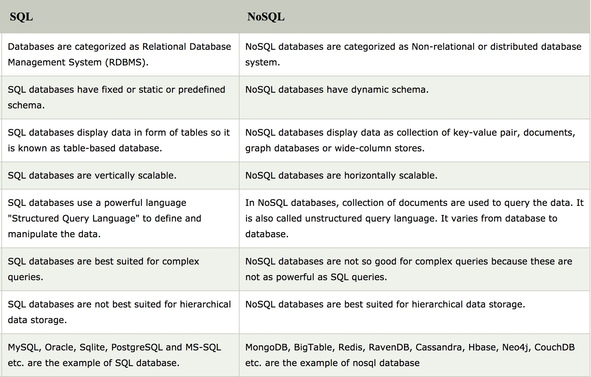
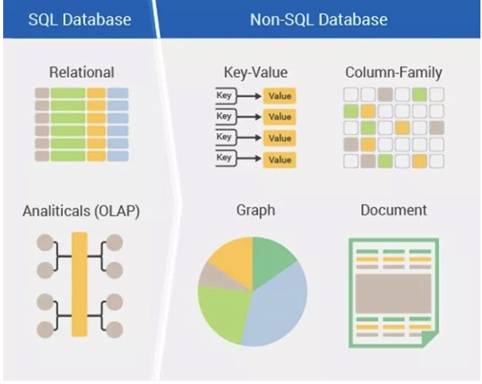
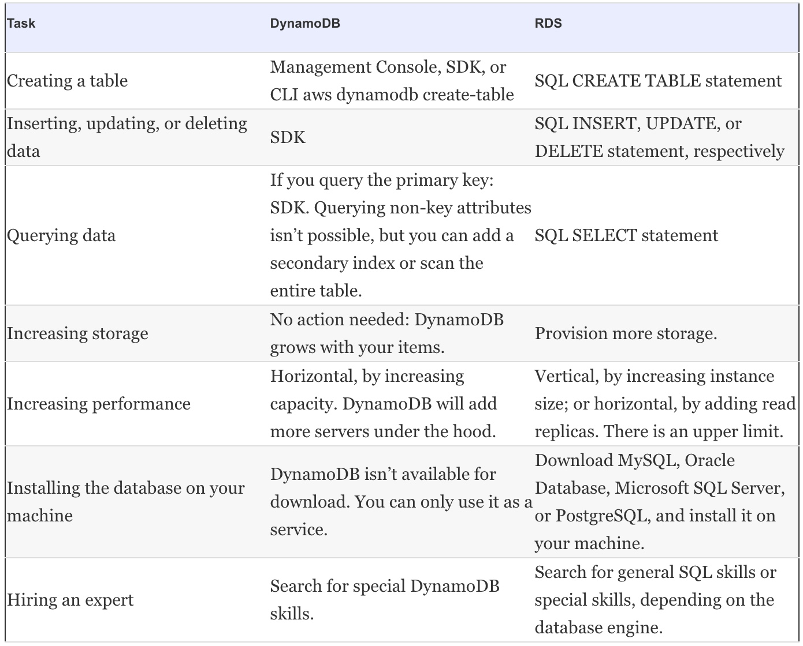

# NoSQL database service: DynamoDB

### Why do we need NoSQL DB?

Scaling a traditional, relational database is difficult because transactional guarantees (atomicity, consistency, isolation, and durability, also known as **ACID**) require communication among all nodes of the database. The more nodes are added, the slower the database becomes, because more nodes must coordinate transactions between each other. The way to tackle this has been to use databases that don’t adhere to these guarantees. They’re called NoSQL databases.

### SQL vs NoSQL

 

There are four types of NoSQL databases—document, graph, columnar, and key-value store—each with its own uses and applications. 

 

# DynamoDB

* Amazon provides a NoSQL database service called DynamoDB. 
* DynamoDB is a fully managed, proprietary, closed source key-value store. 
* DynamoDB is highly available and highly durable. It can scaled from one item to billions and from one request per second to tens of thousands of requests per second.

## Operating DynamoDB

* DynamoDB isn’t software we can download. Instead, it’s a NoSQL database as a service. Therefore, we really can’t install DynamoDB like you install MySQL or MongoDB. 
* This also means we don’t have to update your database; the software is maintained by AWS.
* DynamoDB runs on a fleet of servers operated by AWS. They take care of the OS and all security-related questions. 

* From a security perspective, it’s our job to grant the right permissions in IAM to the users of DynamoDB tables.
* DynamoDB replicates the data among multiple servers and across multiple data centers. There’s no need for a backup from a durability point of view—the backup is already in the database.

* DynamoDB doesn’t support SQL. Instead, you must use the SDK to communicate with DynamoDB from your application. This also implies that you can’t use an existing application to run with DynamoDB without touching the code.
* DynamoDB uses expressions to make more complex interactions with the database possible, such as when you update an item.

* [Pricing](https://aws.amazon.com/dynamodb/pricing/)

## Comparison with RDS

 

