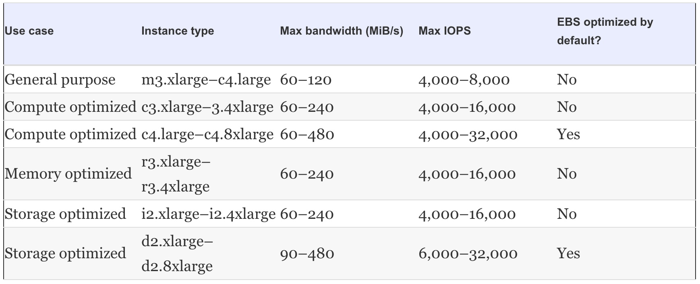
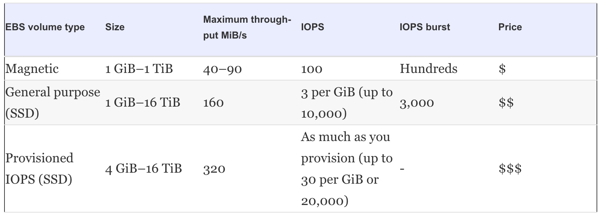
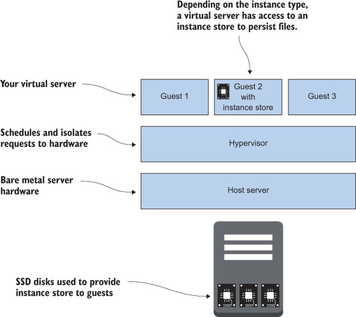
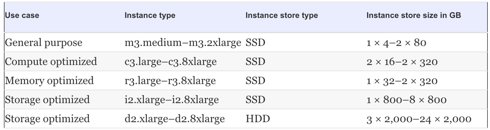
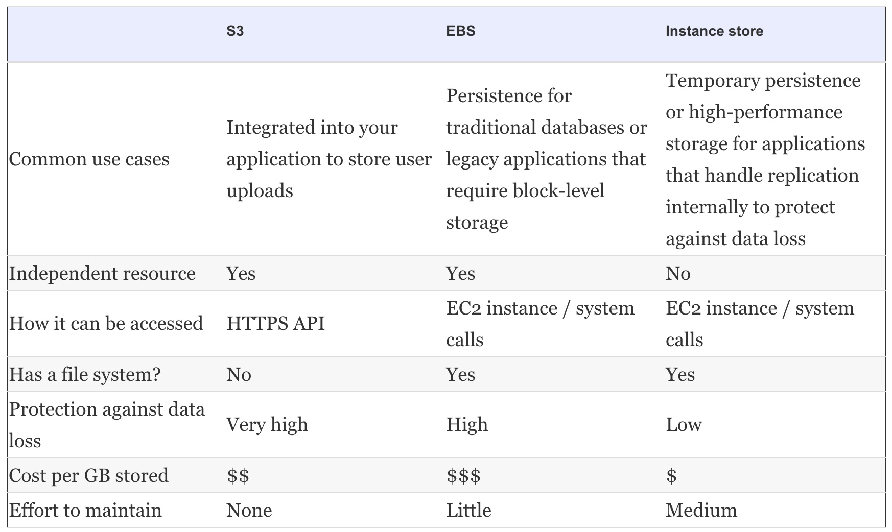

# Storing your data on hard drives: EBS and instance store

Block-level storage with a disk file system (FAT32, NTFS, ext3, ext4, XFS, and so on) can be used to store files as we do on a personal computer. 

A block is a sequence of bytes and the smallest addressable unit. The OS is the intermediary between the application that wants to access files and the underlying file system and block-level storage. The disk file system manages where (at what block address) your files are persisted on the underlying block-level storage. We can use block-level storage only in combination with an EC2 instance where the OS runs.

---

The OS provides access to block-level storage via open, write, and read system calls. The simplified flow of a read request goes like this:

1.  An application wants to read the file /path/to/file.txt and makes a read system call.

2.  The OS forwards the read request to the file system.

3.  The file system translates /path/to/file.txt to the block on the disk where the data is stored.

Applications like databases that read or write files by using system calls must have access to block-level storage for persistence. _We can’t tell a MySQL database to store its files in an object store because MySQL uses system calls to access files._

---

AWS provides two kinds of block-level storage:
1. **Network-attached storage (NAS):**
    - NAS is (like iSCSI) attached to your EC2 instance via a network connection.
    - EBS provides NAS storage in AWS.
    - NAS is the best choice for most problems because it provides 99.999% availability of the data.
2. **Instance storage:**:
    - instance storage is a normal hard disk that the host system provides to your EC2 instance.  
    - Instance storage is interesting if we’re optimizing for performance. 


# NETWORK-ATTACHED STORAGE(EBS)

* Elastic Block Store (EBS) provides network-attached, block-level storage with 99.999% availability.
* EBS volumes are independent resources but can only be used when attached to an EC2 instance.
* _We can’t attach the same EBS volume to multiple servers!_

* EBS volumes:
    - Aren’t part of EC2 instances; they’re attached to EC2 instance via a network connection. 
    - If we terminate the EC2 instance, the EBS volumes remain.
    - Can be attached to no EC2 instances or one EC2 instance at a time.
    - Can be used like normal hard disks.
    - Are comparable to RAID1: data is saved to multiple disks in the background.

## Creating an EBS volume and attaching it to your server    

An EBS volume is a standalone resource. This means EBS volume can exist without an EC2 server, but we need an EC2 server to use the EBS volume.

```
{
	"AWSTemplateFormatVersion": "2010-09-09",
	"Description": "mukund-learning-aws EBS learning",
	"Parameters": {
		"KeyName": {
			"Description": "Key Pair name",
			"Type": "AWS::EC2::KeyPair::KeyName",
			"Default": "mykey"
		},
		"VPC": {
			"Description": "Just select the one and only default VPC",
			"Type": "AWS::EC2::VPC::Id"
		},
		"Subnet": {
			"Description": "Just select one of the available subnets",
			"Type": "AWS::EC2::Subnet::Id"
		},
		"AttachVolume": {
			"Description": "Should the volume be attached?",
			"Type": "String",
			"Default": "yes",
			"AllowedValues": ["yes", "no"]
		}
	},
	"Mappings": {
		"EC2RegionMap": {
			"us-east-1": {"AmazonLinuxAMIHVMEBSBacked64bit": "ami-1ecae776"}
		}
	},
	"Conditions": {
		"Attached": {"Fn::Equals": [{"Ref": "AttachVolume"}, "yes"]}
	},
	"Resources": {
		"SecurityGroup": {
			"Type": "AWS::EC2::SecurityGroup",
			"Properties": {
				"GroupDescription": "My security group",
				"VpcId": {"Ref": "VPC"},
				"SecurityGroupIngress": [{
					"CidrIp": "0.0.0.0/0",
					"FromPort": 22,
					"IpProtocol": "tcp",
					"ToPort": 22
				}]
			}
		},
		"IamRole": {
			"Type": "AWS::IAM::Role",
			"Properties": {
				"AssumeRolePolicyDocument": {
					"Version": "2012-10-17",
					"Statement": [
						{
							"Effect": "Allow",
							"Principal": {
								"Service": ["ec2.amazonaws.com"]
							},
							"Action": ["sts:AssumeRole"]
						}
					]
				},
				"Path": "/",
				"Policies": [
					{
						"PolicyName": "ec2",
						"PolicyDocument": {
							"Version": "2012-10-17",
							"Statement": [{
								"Effect" : "Allow",
								"Action" : ["ec2:DescribeVolumes", "ec2:CreateSnapshot", "ec2:DescribeSnapshots", "ec2:DeleteSnapshot"],
								"Resource": "*"
							}]
						}
					}
				]
			}
		},
		"IamInstanceProfile": {
			"Type": "AWS::IAM::InstanceProfile",
			"Properties": {
				"Path": "/",
				"Roles": [{"Ref": "IamRole"}]
			}
		},
		"Server": {
			"Type": "AWS::EC2::Instance",
			"Properties": {
				"IamInstanceProfile": {"Ref": "IamInstanceProfile"},
				"ImageId": {"Fn::FindInMap": ["EC2RegionMap", {"Ref": "AWS::Region"}, "AmazonLinuxAMIHVMEBSBacked64bit"]},
				"InstanceType": "t2.micro",
				"KeyName": {"Ref": "KeyName"},
				"SecurityGroupIds": [{"Ref": "SecurityGroup"}],
				"SubnetId": {"Ref": "Subnet"}
			}
		},
		"Volume": {
			"Type": "AWS::EC2::Volume",                                             # EBS Volume Description
			"Properties": {
				"AvailabilityZone": {"Fn::GetAtt": ["Server", "AvailabilityZone"]},
				"Size": "5",                                                        # 5GB capacity
				"VolumeType": "gp2"                                                 # SSD backed
			}
		},
		"VolumeAttachment": {
			"Type": "AWS::EC2::VolumeAttachment",                                   # Attach EBS volume to server
			"Condition": "Attached",
			"Properties": {
				"Device": "/dev/xvdf",                                              # Device name
				"InstanceId": {"Ref": "Server"},
				"VolumeId": {"Ref": "Volume"}
			}
		}
	},
	"Outputs": {
		"PublicName": {
			"Value": {"Fn::GetAtt": ["Server", "PublicDnsName"]},
			"Description": "Public name (connect via SSH as user ec2-user)"
		},
		"VolumeId": {
			"Value": {"Ref": "Volume"},
			"Description": "Volume id"
		}
	}
}
```

<br>

Once the stack is completed, we can see the volumes from CLI:

```
$ aws ec2 describe-volumes | jq '.Volumes[]'

{
  "AvailabilityZone": "us-east-1e",
  "Attachments": [
    {
      "AttachTime": "2018-12-27T14:56:07.000Z",
      "InstanceId": "i-03053b26643a3a2d5",
      "VolumeId": "vol-0e2e05a7c307f6d9d",
      "State": "attached",
      "DeleteOnTermination": true,
      "Device": "/dev/xvda"
    }
  ],
  "Encrypted": false,
  "VolumeType": "gp2",
  "VolumeId": "vol-0e2e05a7c307f6d9d",
  "State": "in-use",
  "Iops": 100,
  "SnapshotId": "snap-b772aec8",
  "CreateTime": "2018-12-27T14:56:06.961Z",
  "Size": 8
}
{
  "AvailabilityZone": "us-east-1e",
  "Attachments": [
    {
      "AttachTime": "2018-12-27T14:57:00.000Z",
      "InstanceId": "i-03053b26643a3a2d5",
      "VolumeId": "vol-03920178f3e49435e",
      "State": "attached",
      "DeleteOnTermination": false,
      "Device": "/dev/xvdf"
    }
  ],
  "Tags": [
    {
      "Value": "Volume",
      "Key": "aws:cloudformation:logical-id"
    },
    {
      "Value": "mukund",
      "Key": "Name"
    },
    {
      "Value": "arn:aws:cloudformation:us-east-1:825796472415:stack/ebs/3382db60-09e7-11e9-ba3c-0eaaceea2200",
      "Key": "aws:cloudformation:stack-id"
    },
    {
      "Value": "ebs",
      "Key": "aws:cloudformation:stack-name"
    }
  ],
  "Encrypted": false,
  "VolumeType": "gp2",
  "VolumeId": "vol-03920178f3e49435e",
  "State": "in-use",
  "Iops": 100,
  "SnapshotId": "",
  "CreateTime": "2018-12-27T14:56:41.447Z",
  "Size": 5
}
```

<br>

We can check in the server:

```
[root@ip-172-31-77-152 ~]# fdisk -l
WARNING: fdisk GPT support is currently new, and therefore in an experimental phase. Use at your own discretion.

Disk /dev/xvda: 8589 MB, 8589934592 bytes, 16777216 sectors
Units = sectors of 1 * 512 = 512 bytes
Sector size (logical/physical): 512 bytes / 512 bytes
I/O size (minimum/optimal): 512 bytes / 512 bytes
Disk label type: gpt


#         Start          End    Size  Type            Name
 1         4096     16777182      8G  Linux filesyste Linux
128         2048         4095      1M  BIOS boot parti BIOS Boot Partition

Disk /dev/xvdf: 5368 MB, 5368709120 bytes, 10485760 sectors     <<<<< Attahced EBS volume as mentioned in ebs.json
Units = sectors of 1 * 512 = 512 bytes
Sector size (logical/physical): 512 bytes / 512 bytes
I/O size (minimum/optimal): 512 bytes / 512 bytes

```

<br>

Creating a FS:

```
[root@ip-172-31-77-152 ~]# sudo mkfs -t ext4 /dev/xvdf
mke2fs 1.42.12 (29-Aug-2014)
Creating filesystem with 1310720 4k blocks and 327680 inodes
Filesystem UUID: 3361b24f-0118-49c1-9472-419dcd8753ea
Superblock backups stored on blocks: 
	32768, 98304, 163840, 229376, 294912, 819200, 884736

Allocating group tables: done                            
Writing inode tables: done                            
Creating journal (32768 blocks): done
Writing superblocks and filesystem accounting information: done 
```

<br>

After the file system has been created, we can mount the device:

```
[root@ip-172-31-77-152 ~]# mkdir /mnt/volume/
[root@ip-172-31-77-152 ~]# mount /dev/xvdf /mnt/volume/
[root@ip-172-31-77-152 ~]# df -h
Filesystem      Size  Used Avail Use% Mounted on
/dev/xvda1      7.8G  1.1G  6.7G  14% /
devtmpfs        490M   60K  490M   1% /dev
tmpfs           499M     0  499M   0% /dev/shm
/dev/xvdf       4.8G   10M  4.6G   1% /mnt/volume

[root@ip-172-31-77-152 ~]# fdisk -l
WARNING: fdisk GPT support is currently new, and therefore in an experimental phase. Use at your own discretion.

Disk /dev/xvda: 8589 MB, 8589934592 bytes, 16777216 sectors
Units = sectors of 1 * 512 = 512 bytes
Sector size (logical/physical): 512 bytes / 512 bytes
I/O size (minimum/optimal): 512 bytes / 512 bytes
Disk label type: gpt


#         Start          End    Size  Type            Name
 1         4096     16777182      8G  Linux filesyste Linux
128         2048         4095      1M  BIOS boot parti BIOS Boot Partition

Disk /dev/xvdf: 5368 MB, 5368709120 bytes, 10485760 sectors
Units = sectors of 1 * 512 = 512 bytes
Sector size (logical/physical): 512 bytes / 512 bytes
I/O size (minimum/optimal): 512 bytes / 512 bytes

```

<br>

## Tweaking performance

EBS performance is a bit more complicated. Performance depends on the EC2 instance type and the EBS volume type.



<br>

EBS volume types differ



<br>


EBS volumes are charged for based on the size of the volume, no matter how much you use of that size. If you provision a 100 GiB volume, you pay for 100 GiB even if you have no data on the volume. If you use magnetic volumes, you must also pay for every I/O operation you perform. A provisioned IOPS (SSD) volume is additionally charged for based on the provisioned IOPS. 

**GiB and TiB**

___

The terms gibibyte (GiB) and tebibyte (TiB) aren’t used often; you’re probably more familiar with gigabyte and terabyte. But AWS uses them in some places. Here’s what they mean:

1 GiB = 2^30 bytes = 1,073,741,824 bytes
1 GiB is ~ 1.074 GB
1 GB = 10^9 bytes = 1,000,000,000 bytes

___

* Use general-purpose (SSD) volumes as the default. If the workload requires more IOPS, then go with provisioned IOPS (SSD). Attach multiple EBS volumes to a single instance to increase overall capacity or for additional performance.

* Increase performance by combining two (or more) volumes together in a software RAID0, also called **striping.** RAID0 means that if you have two disks, your data is distributed over those two disks, but data resides only on one disk. A software RAID can be created with mdadm in Linux.


## Backing up your data

* EBS volumes offer 99.999% availability, but we should still create backups from time to time. 

* EBS offers an optimized, easy-to-use way of backing up EBS volumes with EBS snapshots. 

* A snapshot is a block-level incremental backup that is saved on S3. 
* If the volume is 5 GB in size and use is 1 GB of data, the first snapshot will be around 1 GB in size. After the first snapshot is created, only the changes will be saved to S3 to reduce the size of the backup. 
* EBS snapshots are charged for based on how many gigabytes you use.

## Creating snapshot

Creating a snapshot of an attached, mounted volume is possible but can cause problems with writes that aren’t flushed to disk. If we must have to create a snapshot while the volume is in use, we can do so safely as follows:

1.  Freeze all writes by running fsfreeze -f /mnt/volume/ on the server.

2.  Create a snapshot.

3.  Resume writes by running fsfreeze -u /mnt/volume/ on the server.

4.  Wait until the snapshot is completed.

We must only freeze when snapshot creation is requested. We must not freeze until the snapshot is completed.

To restore a snapshot, we must create a new EBS volume based on that snapshot. While launching an EC2 instance from an AMI, AWS creates a new EBS volume (root volume) based on a snapshot (an AMI is a snapshot).

# INSTANCE STORES

* An instance store provides block-level storage like a normal hard disk.
* The instance store is part of an EC2 instance and available only if the instance is running; it won’t persist any data if we stop or terminate the instance. There is no built-in backup mechanism for instance store volumes. 
* Instance store is not separately chrged; instance store charges are included in the EC2 instance price.
* An instance store can be used to get the highest available I/O performance.
* It can be used for caching, temporary processing, or applications that replicate data to several servers as some databases do. 



<br>

AWS offers SSD and HDD instance stores from 4 GB up to 48 TB:

 

 <br>

 # COMPARING BLOCK-LEVEL STORAGE SOLUTIONS

 

 <br>

 # Amazon Elastic File System(EFS)

* Scalable, elastic, cloud-native file system for Linux based on the Network File System version 4 (NFSv4) protocol.

[**COMING SOON!**](https://aws.amazon.com/efs/)

* Amazon Elastic File System (Amazon EFS) provides a simple, scalable, elastic file system for Linux-based workloads for use with AWS Cloud services and on-premises resources. 
* It is built to scale on demand to petabytes without disrupting applications, growing and shrinking automatically as you add and remove files, so your applications have the storage they need – when they need it. 
* It is designed to provide massively parallel shared access to thousands of Amazon EC2 instances, enabling your applications to achieve high levels of aggregate throughput and IOPS with consistent low latencies. Amazon EFS is a fully managed service that requires no changes to your existing applications and tools, providing access through a standard file system interface for seamless integration. 
* Amazon EFS is a regional service storing data within and across multiple Availability Zones (AZs) for high availability and durability. 
* We can access our file systems across AZs, regions, and VPCs and share files between thousands of Amazon EC2 instances and on-premises servers via AWS Direct Connect or AWS VPN.

* Amazon EFS is well suited to support a broad spectrum of use cases from highly parallelized, scale-out workloads that require the highest possible throughput to single-threaded, latency-sensitive workloads. 
* Use cases such as lift-and-shift enterprise applications, big data analytics, web serving and content management, application development and testing, media and entertainment workflows, database backups, and container storage.


The Amazon Elastic File System Infrequent Access storage class is cost-optimized for files not accessed every day, reducing costs by up to 85% compared to the EFS Standard storage class.


        


