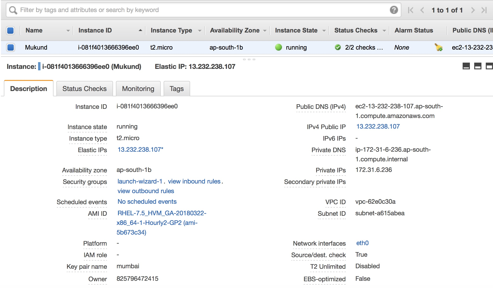

# EC2: Elastic Cloud Compute

## Agenda
* Launching a virtual server with Linux
* Controlling a virtual server remotely via SSH
* Monitoring and debugging a virtual server
* Reducing costs for virtual servers

 **On AWS, virtual servers are offered by the service called Elastic Compute Cloud (EC2).**

Typical use cases for a EC2(virtual server) are as follows:

* Hosting a web application
* Executing enterprise applications
* Transforming or analyzing data

## Virtual appliances on AWS

A virtual appliance is an image containing an OS and preconfigured software that can be run on a hypervisor. It’s the hypervisor’s job to run one or more virtual appliances. Because a virtual appliance contains a fixed state, every time we start the virtual appliance, we’ll get exactly the same result.

**AMI**

* The AMI is the virtual appliance image in AWS. 
* It’s a special virtual appliance for use with the EC2 service for virtual servers. 
* An AMI technically consists of a read-only file-system including the OS, additional software, and configuration; _**it doesn’t include the kernel of the OS.**_ 
* The kernel is loaded from an Amazon Kernel Image (AKI). 
* We can also use AMIs for deploying software on AWS.

AWS uses **Xen, an open source hypervisor**, as the underlying technology for the EC2 service. 

The current generations of virtual servers on AWS use hardware-assisted virtualization. The technology is called Hardware Virtual Machine (HVM) and uses the Intel VT-x platform. 

A virtual server run by an AMI based on HVM uses a fully virtualized set of hardware and can take advantage of hardware extensions that provide fast access to the underlying hardware.

_**Using a 3.8+ kernel for wer virtual Linux servers will provide the best performance. To do so, we should use at least Amazon Linux 13.09, Ubuntu 14.04, or RHEL7.**_

## Instance types and families

The names for different instance types are all structured in the same way. The instance family groups instance types for the same focus. 

AWS releases new instance types and families from time to time; the different versions are called and marked as generations. The instance size defines the capacity of CPU, memory, storage, and networking.

For example, the instance type t2.micro tells we the following:

1.  The instance family is **t**. It groups small, cheap virtual servers with low baseline CPU performance but with the ability to burst significantly over baseline CPU performance for a short time.

2.  We’re using generation 2 of this instance type.

3.  The size is micro, indicating that the instance is very small.

## Manual steps to creat ec2 instance

1. **_choosing OS for VS_**


2. **_choosing instance type_**


3. **_configure instance details_**


4. **_choose storage_**


5. **_add tag_**

Tags help us to organize resources on AWS. A tag is nothing more than a key-value pair. Add at least a Name tag to the resources to help us find our stuff later. 


6. **_confgure security_**


7. **_review and launch_**


8. **_select/create key-pair_**


9. **_ec2 launch_**


10. **_ec2 instance launched!_**


11. **_ssh to the ec2 instance_**

```
$ ssh -i "mykey.pem" ubuntu@ec2-3-82-247-35.compute-1.amazonaws.com
The authenticity of host 'ec2-3-82-247-35.compute-1.amazonaws.com (3.82.247.35)' can't be established.
ECDSA key fingerprint is SHA256:sXAgU0UvP3JMJql2M6gfPVGRtj/WgQZNBMxMLz+hIT4.
Are we sure we want to continue connecting (yes/no)? yes
Warning: Permanently added 'ec2-3-82-247-35.compute-1.amazonaws.com,3.82.247.35' (ECDSA) to the list of known hosts.
Welcome to Ubuntu 18.04.1 LTS (GNU/Linux 4.15.0-1021-aws x86_64)

 * Documentation:  https://help.ubuntu.com
 * Management:     https://landscape.canonical.com
 * Support:        https://ubuntu.com/advantage

  System information as of Mon Dec 24 18:32:38 UTC 2018

  System load:  0.87              Processes:           87
  Usage of /:   13.3% of 7.69GB   Users logged in:     0
  Memory usage: 14%               IP address for eth0: 172.31.94.226
  Swap usage:   0%

  Get cloud support with Ubuntu Advantage Cloud Guest:
    http://www.ubuntu.com/business/services/cloud

0 packages can be updated.
0 updates are security updates.


The programs included with the Ubuntu system are free software;
the exact distribution terms for each program are described in the
individual files in /usr/share/doc/*/copyright.

Ubuntu comes with ABSOLUTELY NO WARRANTY, to the extent permitted by
applicable law.

To run a command as administrator (user "root"), use "sudo <command>".
See "man sudo_root" for details.

ubuntu@ip-172-31-94-226:~$ uname -a
Linux ip-172-31-94-226 4.15.0-1021-aws #21-Ubuntu SMP Tue Aug 28 10:23:07 UTC 2018 x86_64 x86_64 x86_64 GNU/Linux
ubuntu@ip-172-31-94-226:~$ 


ubuntu@ip-172-31-94-226:~$ sudo apt-get update -y
Hit:1 http://us-east-1.ec2.archive.ubuntu.com/ubuntu bionic InRelease
Get:2 http://us-east-1.ec2.archive.ubuntu.com/ubuntu bionic-updates InRelease [88.7 kB]
Get:3 http://us-east-1.ec2.archive.ubuntu.com/ubuntu bionic-backports InRelease [74.6 kB]
Get:4 http://us-east-1.ec2.archive.ubuntu.com/ubuntu bionic/multiverse Sources [181 kB]
Get:5 http://us-east-1.ec2.archive.ubuntu.com/ubuntu bionic/restricted Sources [5324 B]
Get:6 http://us-east-1.ec2.archive.ubuntu.com/ubuntu bionic/main Sources [829 kB]              
Get:7 http://security.ubuntu.com/ubuntu bionic-security InRelease [83.2 kB]                            
Get:8 http://us-east-1.ec2.archive.ubuntu.com/ubuntu bionic/universe Sources [9051 kB]                           
Get:9 http://us-east-1.ec2.archive.ubuntu.com/ubuntu bionic/universe amd64 Packages [8570 kB]                        
Get:10 http://us-east-1.ec2.archive.ubuntu.com/ubuntu bionic/universe Translation-en [4941 kB]
Get:11 http://us-east-1.ec2.archive.ubuntu.com/ubuntu bionic/multiverse amd64 Packages [151 kB]
Get:12 http://us-east-1.ec2.archive.ubuntu.com/ubuntu bionic/multiverse Translation-en [108 kB]
Get:13 http://us-east-1.ec2.archive.ubuntu.com/ubuntu bionic-updates/main Sources [224 kB]
Get:14 http://us-east-1.ec2.archive.ubuntu.com/ubuntu bionic-updates/universe Sources [121 kB]
Get:15 http://us-east-1.ec2.archive.ubuntu.com/ubuntu bionic-updates/restricted Sources [2064 B]
Get:16 http://us-east-1.ec2.archive.ubuntu.com/ubuntu bionic-updates/multiverse Sources [3824 B]
Get:17 http://us-east-1.ec2.archive.ubuntu.com/ubuntu bionic-updates/main amd64 Packages [476 kB]
Get:18 http://us-east-1.ec2.archive.ubuntu.com/ubuntu bionic-updates/main Translation-en [177 kB]
Get:19 http://us-east-1.ec2.archive.ubuntu.com/ubuntu bionic-updates/restricted amd64 Packages [6992 B]
Get:20 http://us-east-1.ec2.archive.ubuntu.com/ubuntu bionic-updates/restricted Translation-en [3076 B]
Get:21 http://us-east-1.ec2.archive.ubuntu.com/ubuntu bionic-updates/universe amd64 Packages [706 kB]
Get:22 http://us-east-1.ec2.archive.ubuntu.com/ubuntu bionic-updates/universe Translation-en [171 kB]
Get:23 http://us-east-1.ec2.archive.ubuntu.com/ubuntu bionic-updates/multiverse amd64 Packages [6372 B]
Get:24 http://us-east-1.ec2.archive.ubuntu.com/ubuntu bionic-updates/multiverse Translation-en [3356 B]
Get:25 http://us-east-1.ec2.archive.ubuntu.com/ubuntu bionic-backports/universe Sources [2068 B]
Get:26 http://us-east-1.ec2.archive.ubuntu.com/ubuntu bionic-backports/universe amd64 Packages [3468 B]
Get:27 http://us-east-1.ec2.archive.ubuntu.com/ubuntu bionic-backports/universe Translation-en [1604 B]
Get:28 http://security.ubuntu.com/ubuntu bionic-security/main Sources [66.7 kB]
Get:29 http://security.ubuntu.com/ubuntu bionic-security/multiverse Sources [1336 B]
Get:30 http://security.ubuntu.com/ubuntu bionic-security/universe Sources [28.6 kB]
Get:31 http://security.ubuntu.com/ubuntu bionic-security/main amd64 Packages [235 kB]
Get:32 http://security.ubuntu.com/ubuntu bionic-security/main Translation-en [88.9 kB]
Get:33 http://security.ubuntu.com/ubuntu bionic-security/universe amd64 Packages [110 kB]
Get:34 http://security.ubuntu.com/ubuntu bionic-security/universe Translation-en [62.2 kB]
Get:35 http://security.ubuntu.com/ubuntu bionic-security/multiverse amd64 Packages [1440 B]
Get:36 http://security.ubuntu.com/ubuntu bionic-security/multiverse Translation-en [996 B]
Fetched 26.6 MB in 5s (5412 kB/s)              
Reading package lists... Done
ubuntu@ip-172-31-94-226:~$ 

```

11. **_check system logs_**

Select ec2 intance > Actions > Instance Settings > Get System Logs


12. **_Monitoring ec2_**


## CRUD Operations

* **Start** We can always start a stopped virtual server. If we want to create a completely new server, we’ll need to launch a virtual server.

* **Stop** we can always stop a running virtual server. A stopped virtual server isn’t billed and can be started later. If we’re using network-attached storage, out data persists. A stopped virtual server doesn’t incur charges, except for attached resources like network-attached storage.

* **Reboot** —Have we tried turning it off and on again? If we need to reboot wer virtual server, this action will help. We won’t lose any data when rebooting a virtual server, and all software is still installed after a reboot.

* **Terminate** —Terminating a virtual server means deleting it. We can’t start a virtual server that we’ve already terminated. The virtual server is deleted, together with dependencies like network-attached storage and public and private IP addresses.

**_A terminated virtual server doesn’t incur charges._** 


## Note:

1. You can change the instance type only when the ec2 instance is in stopped state.

Stop ec2 > Actions > Instance Settings > Change Instance Type


2. A key-pair generated is limited to the region.


## Installing apache on ec2

While configuring Security group we need to add one more rule as HTTP. All values will be in default.

Once the instance is created, just run below(for ubuntu):

1. sudo apt-get update
2. sufo apt-get install pache2 apache2-doc apache2-utils
3. sudo service start apache2
4. hit the public ip of instance on port 80: http://13.232.43.29:80. Below page will appear in browser:


We can put a custom page index.html file in /var/www/html and access the website.


## Allocating a public IP to running instance.

Allocating a public IP address can be useful if we need to make sure the endpoint to our application doesn’t change, even if we have to replace the virtual server behind the scenes.

Go to EC2 dashboard > Network Security > Elastic IPs > Allocate new address > Scope VPC > Click Allocate > Select IP > Associate address > Select Instance and Pirvate IP > Click Associate


The allocated IP will reflect in EC2 instance.




## Spot requests

With a spot instance, we bid for unused capacity in the AWS cloud. A spot market is a market where standardized products are traded for immediate delivery. The price of the products on the market depend on supply and demand. On the AWS spot market, the traded products are virtual servers, and they’re delivered by starting a virtual server.

If the current spot price is lower than your maximum price for a specific virtual server in a specific data center, your spot request will be fulfilled, and a virtual server will start. If the current spot price exceeds your bid, your virtual server will be terminated (not stopped) by AWS after two minutes.

