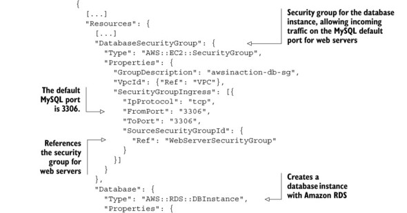
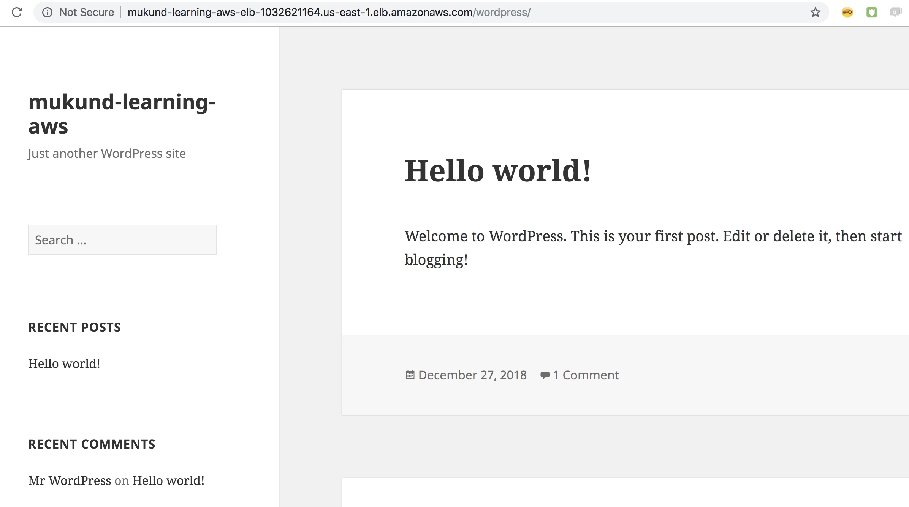
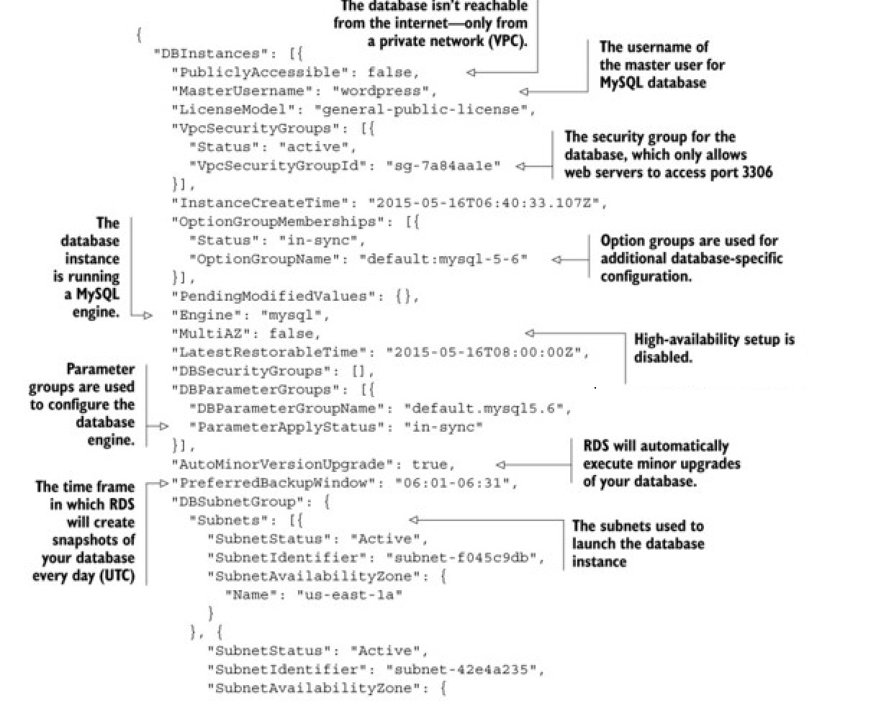
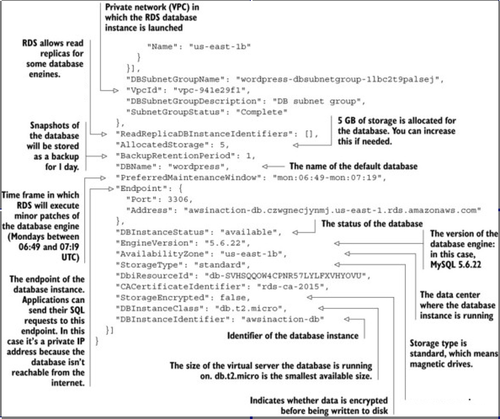
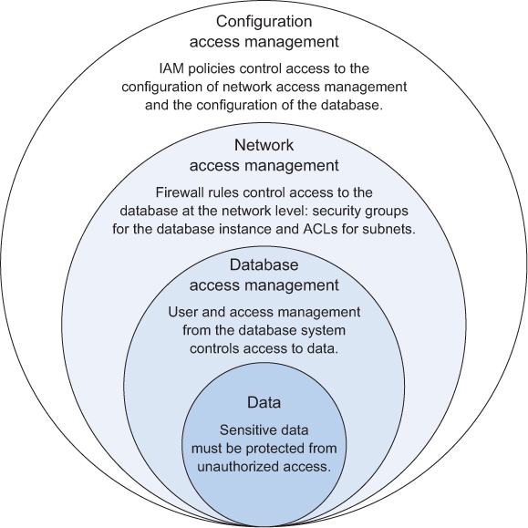
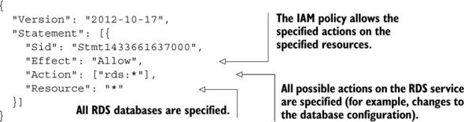
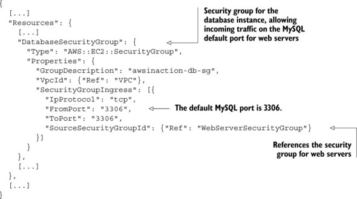
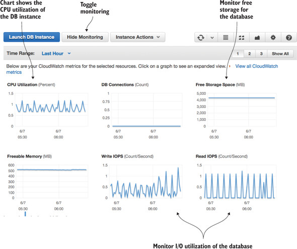

# Relational database service: RDS

Relational databases are the de facto standard for storing and querying **structured** data, and many applications are built on top of a relational database system such as MySQL, Oracle Database, Microsoft SQL Server, or PostgreSQL.

RDS is a managed service.

With AWS we have two options:

1. Use the managed relational database service _Amazon RDS_, which is offered by AWS.
2. Operate a relational database yourself on top of virtual servers.

# Amazon RDS

* The Amazon Relational Database Service (Amazon RDS) offers ready-to-use relational databases. 
* Under the hood, Amazon RDS operates a common relational database. 
* MySQL, Oracle Database, Microsoft SQL Server, and PostgreSQL are supported.
* An RDS database can be deployed into a virtual private network (VPC)


<br>

## STARTING A MYSQL DATABASE

### Launching a WordPress platform with an Amazon RDS database

Command:

```
$ aws cloudformation create-stack --stack-name wordpress --template-url \
https://s3.amazonaws.com/mukund-learning-aws/rds.json \
--parameters ParameterKey=KeyName,ParameterValue=mykey \
ParameterKey=AdminPassword,ParameterValue=delhi1234 \
ParameterKey=AdminEMail,ParameterValue=xxxxxxxmukund@mail.com

{
    "StackId": "arn:aws:cloudformation:us-east-1:825796472415:stack/wordpress/b04bc9c0-0a02-11e9-9d2f-120371d9064c"
}

$ aws cloudformation describe-stacks 
{
    "Stacks": [
        {
            "StackId": "arn:aws:cloudformation:us-east-1:825796472415:stack/wordpress/b04bc9c0-0a02-11e9-9d2f-120371d9064c", 
            "Description": "mukund-learning-aws-rds", 
            "Parameters": [
                {
                    "ParameterValue": "mykey", 
                    "ParameterKey": "KeyName"
                }, 
                {
                    "ParameterValue": "admin", 
                    "ParameterKey": "AdminUsername"
                }, 
                {
                    "ParameterValue": "xxxxxxxxxxxxmukund@mail.com", 
                    "ParameterKey": "AdminEMail"
                }, 
                {
                    "ParameterValue": "mukund-learning-aws", 
                    "ParameterKey": "BlogTitle"
                }, 
                {
                    "ParameterValue": "****", 
                    "ParameterKey": "AdminPassword"
                }
            ], 
            "Tags": [], 
            "Outputs": [
                {
                    "Description": "Wordpress URL for mukund-learning-aws", 
                    "OutputKey": "URL", 
                    "OutputValue": "http://mukund-learning-aws-elb-1032621164.us-east-1.elb.amazonaws.com/wordpress"
                }
            ], 
            "CreationTime": "2018-12-27T18:15:07.873Z", 
            "StackName": "wordpress", 
            "NotificationARNs": [], 
            "StackStatus": "CREATE_COMPLETE", 
            "DisableRollback": false, 
            "RollbackConfiguration": {}
        }
    ]
}

```

<br>

rds.json can be found at https://raw.githubusercontent.com/biharimukund/learning/master/aws/CloudFormation/rds.json



<br>

Below is the list of resourceType created by this stack:

```
$ aws cloudformation describe-stack-resources --stack-name wordpress | jq '.StackResources[].ResourceType'
"AWS::AutoScaling::AutoScalingGroup"
"AWS::RDS::DBSubnetGroup"
"AWS::RDS::DBInstance"
"AWS::EC2::SecurityGroup"
"AWS::EC2::InternetGateway"
"AWS::AutoScaling::LaunchConfiguration"
"AWS::ElasticLoadBalancing::LoadBalancer"
"AWS::EC2::SecurityGroup"
"AWS::EC2::NetworkAcl"
"AWS::EC2::NetworkAclEntry"
"AWS::EC2::NetworkAclEntry"
"AWS::EC2::Route"
"AWS::EC2::RouteTable"
"AWS::EC2::SubnetRouteTableAssociation"
"AWS::EC2::SubnetRouteTableAssociation"
"AWS::EC2::Subnet"
"AWS::EC2::Subnet"
"AWS::EC2::SubnetNetworkAclAssociation"
"AWS::EC2::SubnetNetworkAclAssociation"
"AWS::EC2::VPC"
"AWS::EC2::VPCGatewayAttachment"
"AWS::EC2::SecurityGroup"
```

<br>



<br>

Describe DB instances:

```
$ aws rds describe-db-instances
{
    "DBInstances": [
        {
            "PubliclyAccessible": false, 
            "MasterUsername": "wordpress", 
            "MonitoringInterval": 0, 
            "LicenseModel": "general-public-license", 
            "VpcSecurityGroups": [
                {
                    "Status": "active", 
                    "VpcSecurityGroupId": "sg-0bdd3679b9bd6fb0e"
                }
            ], 
            "InstanceCreateTime": "2018-12-27T18:19:02.968Z", 
            "CopyTagsToSnapshot": false, 
            "OptionGroupMemberships": [
                {
                    "Status": "in-sync", 
                    "OptionGroupName": "default:mysql-5-6"
                }
            ], 
            "PendingModifiedValues": {}, 
            "Engine": "mysql", 
            "MultiAZ": false, 
            "LatestRestorableTime": "2018-12-27T18:40:00Z", 
            "DBSecurityGroups": [], 
            "DBParameterGroups": [
                {
                    "DBParameterGroupName": "default.mysql5.6", 
                    "ParameterApplyStatus": "in-sync"
                }
            ], 
            "PerformanceInsightsEnabled": false, 
            "AutoMinorVersionUpgrade": true, 
            "PreferredBackupWindow": "05:37-06:07", 
            "DBSubnetGroup": {
                "Subnets": [
                    {
                        "SubnetStatus": "Active", 
                        "SubnetIdentifier": "subnet-02b4b54335bcadb94", 
                        "SubnetAvailabilityZone": {
                            "Name": "us-east-1a"
                        }
                    }, 
                    {
                        "SubnetStatus": "Active", 
                        "SubnetIdentifier": "subnet-0db0efd882bc4a083", 
                        "SubnetAvailabilityZone": {
                            "Name": "us-east-1b"
                        }
                    }
                ], 
                "DBSubnetGroupName": "wordpress-dbsubnetgroup-l3dwzf276f64", 
                "VpcId": "vpc-009bab9c3cfe42fc0", 
                "DBSubnetGroupDescription": "DB subnet group", 
                "SubnetGroupStatus": "Complete"
            }, 
            "ReadReplicaDBInstanceIdentifiers": [], 
            "AllocatedStorage": 5, 
            "DBInstanceArn": "arn:aws:rds:us-east-1:825796472415:db:mukund-learning-aws-db", 
            "BackupRetentionPeriod": 1, 
            "DBName": "wordpress", 
            "PreferredMaintenanceWindow": "mon:03:00-mon:03:30", 
            "Endpoint": {
                "HostedZoneId": "Z2R2ITUGPM61AM", 
                "Port": 3306, 
                "Address": "mukund-learning-aws-db.c1vwyfoy53dr.us-east-1.rds.amazonaws.com"
            }, 
            "DBInstanceStatus": "available", 
            "IAMDatabaseAuthenticationEnabled": false, 
            "EngineVersion": "5.6.40", 
            "DeletionProtection": false, 
            "AvailabilityZone": "us-east-1a", 
            "DomainMemberships": [], 
            "StorageType": "standard", 
            "DbiResourceId": "db-CVM72BKXXUGLSMTOOJEROCJILU", 
            "CACertificateIdentifier": "rds-ca-2015", 
            "StorageEncrypted": false, 
            "DBInstanceClass": "db.t2.micro", 
            "DbInstancePort": 0, 
            "DBInstanceIdentifier": "mukund-learning-aws-db"
        }
    ]
}
```

<br>

Describing mysql rds db instance:




<br>

## CONTROLLING ACCESS TO A DATABASE



<br>

* Controlling access to the configuration of the RDS database



* Controlling network access to the RDS database



* Controlling data access with the help of the user and access management of the database itself
    - Limiting write access to a database to a few database users (for example, only for an application)
    - Limiting access to specific tables to a few users (for example, to a department of the organization)
    - Limiting access to tables to isolate different applications (for example, hosting multiple applications for different customers on the same database)

## TWEAKING DATABASE PERFORMANCE

An RDS database, or an SQL database in general, can only be scaled vertically. If the performance of the database becomes insufficient, we must increase the performance of the underlying hardware:

1. Faster CPU
2. More memory
3. Faster I/O
 
In comparison, an object store like S3 or a NoSQL-database like DynamoDB can be scaled horizontally. We can increase performance by adding more nodes to the cluster.

RDS offers three different types of storage, as you already know from the block storage service EBS:

1. General purpose (SSD)
2. Provisioned IOPS (SSD)
3. Magnetic

* We should choose general purpose (SSD) or even provisioned IOPS (SSD) storage for production workloads.
* If we need to guarantee a high level of read or write throughput, we should use the provisioned IOPS (SSD) option. 
* The general purpose (SSD) option offers moderate baseline performance with the ability to burst. The throughput for general purpose (SSD) depends on the initialized storage size. 
* Magnetic storage is an option if we need to store data at a low cost or if we don’t need to access it in a predictable, performant way. 

## MONITORING A DATABASE

RDS is a managed service. RDS publishes several metrics to AWS CloudWatch, a monitoring service for the AWS cloud. 




