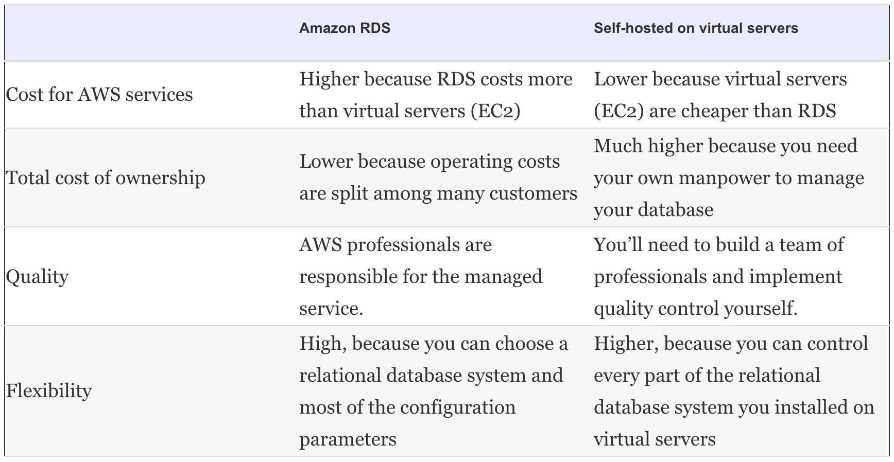

# Relational database service: RDS

Relational databases are the de facto standard for storing and querying **structured** data, and many applications are built on top of a relational database system such as MySQL, Oracle Database, Microsoft SQL Server, or PostgreSQL.

RDS is a managed service.

With AWS we have two options:

1. Use the managed relational database service _Amazon RDS_, which is offered by AWS.
2. Operate a relational database yourself on top of virtual servers.

# Amazon RDS

* The Amazon Relational Database Service (Amazon RDS) offers ready-to-use relational databases. 
* Under the hood, Amazon RDS operates a common relational database. 
* MySQL, Oracle Database, Microsoft SQL Server, and PostgreSQL are supported.



<br>

## STARTING A MYSQL DATABASE

### Launching a WordPress platform with an Amazon RDS database

Command:

```
$ aws cloudformation create-stack --stack-name wordpress --template-url \
https://s3.amazonaws.com/mukund-learning-aws/rds.json \
--parameters ParameterKey=KeyName,ParameterValue=mykey \
ParameterKey=AdminPassword,ParameterValue=delhi1234 \
ParameterKey=AdminEMail,ParameterValue=xxxxxxxmukund@mail.com

{
    "StackId": "arn:aws:cloudformation:us-east-1:825796472415:stack/wordpress/b04bc9c0-0a02-11e9-9d2f-120371d9064c"
}

$

```

rds.json can be found at https://raw.githubusercontent.com/biharimukund/learning/master/aws/CloudFormation/rds.json


