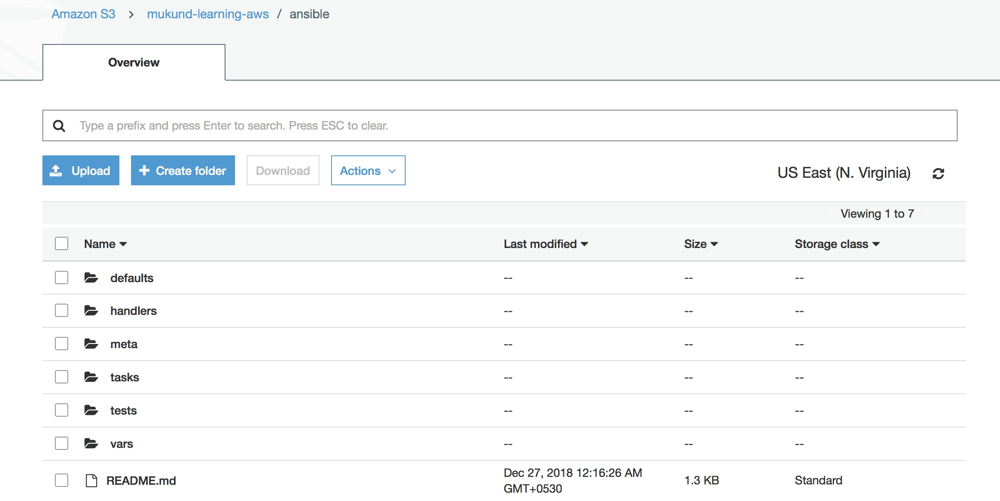
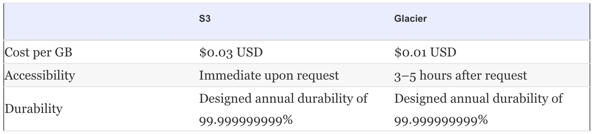
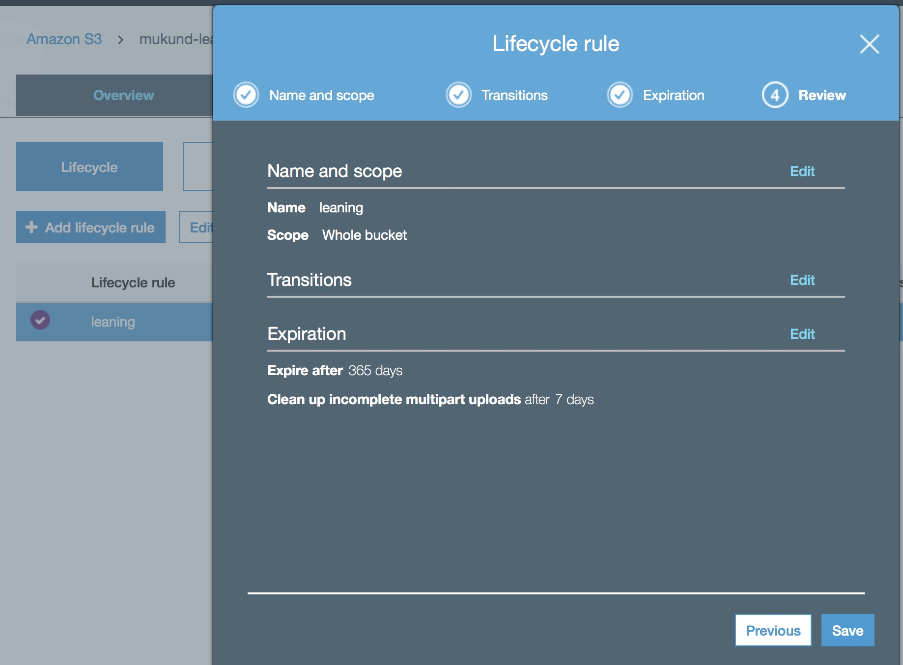

# Storing your objects: S3 and Glacier

## Object Store

Object storage essentially bundles the data itself along with metadata tags and a unique identifier. The metadata is customizable, which means we can input a lot more identifying information for each piece of data. These objects are stored in a flat address space, which makes it easier to locate and retrieve your data across regions.

* In an object store, data is stored as objects. 
* Each object consists of:
    1. a unique ID, 
    2. metadata describing the content,
    3. and the data itself. 
* An object’s globally unique identifier is also known as its key; addressing the object from different devices and machines in a distributed system is possible with the globally unique identifier.

The separation of metadata and data allows clients to work only with the metadata for managing and querying data.  Metadata is also used to store access-control information and for other management tasks.

<br>


<br>


# AMAZON S3

The Amazon S3 object store is one of the oldest services on AWS. Amazon S3 is an acronym for **Amazon Simple Storage Service**. It’s a typical web service that lets you store and retrieve data via an API reachable over HTTPS.

* The service offers unlimited storage space and stores your data in a highly available and durable way. 
* We can store any kind of data, such as images, documents, and binaries, as long as the size of a single object doesn’t exceed **5 TB**. 
* We have to pay for every GB you store in S3, and we also incur minor costs for every request and transferred data.

---

*  _S3 uses buckets to group objects._

*  _A bucket is a container for objects._

*  We can create up to 100 buckets, each of which has a globally unique name. _By unique we really mean - we have to choose a bucket name that isn’t used by any other AWS customer in any other region._

---

Typical use cases are as follows:

1. Backing up and restoring files with S3 and the help of the AWS CLI.
2. Archiving objects with Amazon Glacier to save money compared to Amazon S3.
3. Integrating Amazon S3 into applications with the help of the AWS SDKs to store and fetch objects such as images.
4. Hosting static web content that can be viewed by anyone with the help of S3.

## Create bucket on S3

1. Create bucket:

```
$ aws s3 mb s3://mukund-learning-aws
make_bucket: mukund-learning-aws

```

2. Sync files:

```
$ aws s3 sync test/ s3://mukund-learning-aws/ansible
upload: test/defaults/main.yml to s3://mukund-learning-aws/ansible/defaults/main.yml
upload: test/tests/inventory to s3://mukund-learning-aws/ansible/tests/inventory
upload: test/tests/test.yml to s3://mukund-learning-aws/ansible/tests/test.yml
upload: test/vars/main.yml to s3://mukund-learning-aws/ansible/vars/main.yml
upload: test/README.md to s3://mukund-learning-aws/ansible/README.md
upload: test/meta/main.yml to s3://mukund-learning-aws/ansible/meta/main.yml
upload: test/handlers/main.yml to s3://mukund-learning-aws/ansible/handlers/main.yml
upload: test/tasks/main.yml to s3://mukund-learning-aws/ansible/tasks/main.yml
```

<br>



3. Testing restore:

```
$ rm -rf test/
$ ls -lrt test
ls: test: No such file or directory
```

<br>

```
$ aws s3 cp --recursive s3://mukund-learning-aws/ansible test/
download: s3://mukund-learning-aws/ansible/meta/main.yml to test/meta/main.yml
download: s3://mukund-learning-aws/ansible/tests/test.yml to test/tests/test.yml
download: s3://mukund-learning-aws/ansible/tests/inventory to test/tests/inventory
download: s3://mukund-learning-aws/ansible/handlers/main.yml to test/handlers/main.yml
download: s3://mukund-learning-aws/ansible/defaults/main.yml to test/defaults/main.yml
download: s3://mukund-learning-aws/ansible/vars/main.yml to test/vars/main.yml
download: s3://mukund-learning-aws/ansible/tasks/main.yml to test/tasks/main.yml
download: s3://mukund-learning-aws/ansible/README.md to test/README.md


$ ls -lrt test/
total 8
-rw-r--r--  1 mukund_xxxxxxxx  staff  1328 Dec 27 00:16 README.md
drwxr-xr-x  3 mukund_xxxxxxxx  staff    96 Dec 27 00:19 meta
drwxr-xr-x  4 mukund_xxxxxxxx  staff   128 Dec 27 00:19 tests
drwxr-xr-x  3 mukund_xxxxxxxx  staff    96 Dec 27 00:19 handlers
drwxr-xr-x  3 mukund_xxxxxxxx  staff    96 Dec 27 00:19 defaults
drwxr-xr-x  3 mukund_xxxxxxxx  staff    96 Dec 27 00:19 vars
drwxr-xr-x  3 mukund_xxxxxxxx  staff    96 Dec 27 00:19 tasks

```

<br>

## Versioning for objects

By default, S3 versioning is disabled for every bucket. Suppose we use the following steps to upload two objects:

1.  Add an object with key City_name and data 1.

2.  Add an object with key City_name and data 2.

If downloaded, also known as get, the object with key City_name, we’ll download data 2. _The old data 1 doesn’t exist anymore._

We can change this behavior by turning on versioning for a bucket. The following command activates versioning for the bucket:

```
aws s3api put-bucket-versioning --bucket mukund-learning-aws \
--versioning-configuration Status=Enabled
```

<br>

```
$ aws s3api list-object-versions --bucket mukund-learning-aws
{
    "Versions": [
        {
            "LastModified": "2018-12-26T18:46:26.000Z", 
            "VersionId": "null", 
            "ETag": "\"433d370732878937b5cf7bdbf13b76d6\"", 
            "StorageClass": "STANDARD", 
            "Key": "ansible/README.md", 
            "Owner": {
                "DisplayName": "xxxxxxxxmukund", 
                "ID": "d782fc12585603a89690e1574826fc16722ee81fb1e7ec028cacf1a989837001"
            }, 
            "IsLatest": true, 
            "Size": 1328
        }, 
        {
            "LastModified": "2018-12-26T18:46:25.000Z", 
            "VersionId": "null", 
            "ETag": "\"92570869104cf76cc4a89bd35af903eb\"", 
            "StorageClass": "STANDARD", 
            "Key": "ansible/defaults/main.yml", 
            "Owner": {
                "DisplayName": "xxxxxxxxmukund", 
                "ID": "d782fc12585603a89690e1574826fc16722ee81fb1e7ec028cacf1a989837001"
            }, 
            "IsLatest": true, 
            "Size": 28
        }, 
        {
            "LastModified": "2018-12-26T18:46:27.000Z", 
            "VersionId": "null", 
            "ETag": "\"25e672f63b66c7146a35a1c14cbd980f\"", 
            "StorageClass": "STANDARD", 
            "Key": "ansible/handlers/main.yml", 
            "Owner": {
                "DisplayName": "xxxxxxxxmukund", 
                "ID": "d782fc12585603a89690e1574826fc16722ee81fb1e7ec028cacf1a989837001"
            }, 
            "IsLatest": true, 
            "Size": 28
        }, 
        {
            "LastModified": "2018-12-26T18:46:27.000Z", 
            "VersionId": "null", 
            "ETag": "\"6c6f6154a02e76a961409e5eb770d615\"", 
            "StorageClass": "STANDARD", 
            "Key": "ansible/meta/main.yml", 
            "Owner": {
                "DisplayName": "xxxxxxxxmukund", 
                "ID": "d782fc12585603a89690e1574826fc16722ee81fb1e7ec028cacf1a989837001"
            }, 
            "IsLatest": true, 
            "Size": 1777
        }, 
        {
            "LastModified": "2018-12-26T18:46:27.000Z", 
            "VersionId": "null", 
            "ETag": "\"2a8bdaa9e9e0d2ce169988a7ba3d17fb\"", 
            "StorageClass": "STANDARD", 
            "Key": "ansible/tasks/main.yml", 
            "Owner": {
                "DisplayName": "xxxxxxxxmukund", 
                "ID": "d782fc12585603a89690e1574826fc16722ee81fb1e7ec028cacf1a989837001"
            }, 
            "IsLatest": true, 
            "Size": 25
        }, 
        {
            "LastModified": "2018-12-26T18:46:26.000Z", 
            "VersionId": "null", 
            "ETag": "\"ff9555a021b549d18f9dc73454b903c8\"", 
            "StorageClass": "STANDARD", 
            "Key": "ansible/tests/inventory", 
            "Owner": {
                "DisplayName": "xxxxxxxxmukund", 
                "ID": "d782fc12585603a89690e1574826fc16722ee81fb1e7ec028cacf1a989837001"
            }, 
            "IsLatest": true, 
            "Size": 11
        }, 
        {
            "LastModified": "2018-12-26T18:46:26.000Z", 
            "VersionId": "null", 
            "ETag": "\"7790682a1bd2cf842348fab79701a78c\"", 
            "StorageClass": "STANDARD", 
            "Key": "ansible/tests/test.yml", 
            "Owner": {
                "DisplayName": "xxxxxxxxmukund", 
                "ID": "d782fc12585603a89690e1574826fc16722ee81fb1e7ec028cacf1a989837001"
            }, 
            "IsLatest": true, 
            "Size": 62
        }, 
        {
            "LastModified": "2018-12-26T18:46:26.000Z", 
            "VersionId": "null", 
            "ETag": "\"1065d1b3d0bfc42885612685609f61be\"", 
            "StorageClass": "STANDARD", 
            "Key": "ansible/vars/main.yml", 
            "Owner": {
                "DisplayName": "xxxxxxxxmukund", 
                "ID": "d782fc12585603a89690e1574826fc16722ee81fb1e7ec028cacf1a989837001"
            }, 
            "IsLatest": true, 
            "Size": 24
        }
    ]
}
```

<br>

After the version was enabled, one extra directory was created in test/ and then sync command:

```
$ aws s3 sync test/ s3://mukund-learning-aws/ansible 
upload: test/tasks_version1/main.yml to s3://mukund-learning-aws/ansible/tasks_version1/main.yml
```

3. Cleanup:

```
$ aws s3 rb --force s3://mukund-learning-aws
delete: s3://mukund-learning-aws/ansible/meta/main.yml
delete: s3://mukund-learning-aws/ansible/README.md
delete: s3://mukund-learning-aws/ansible/tasks/main.yml
delete: s3://mukund-learning-aws/ansible/handlers/main.yml
delete: s3://mukund-learning-aws/ansible/vars/main.yml
delete: s3://mukund-learning-aws/ansible/tests/inventory
delete: s3://mukund-learning-aws/ansible/tests/test.yml
delete: s3://mukund-learning-aws/ansible/defaults/main.yml
delete: s3://mukund-learning-aws/ansible/tasks_version1/main.yml
remove_bucket failed: s3://mukund-learning-aws An error occurred (BucketNotEmpty) when calling the DeleteBucket operation: The bucket you tried to delete is not empty. You must delete all versions in the bucket.
```

_If versioning is turned on for bucket, removing the bucket will cause a BucketNotEmpty error. Use the Management Console to delete the bucket. Some times even a empty bucket with versioning does not gets deleted. In this case simply try enabling/disabling the versioning from UI and then deleting the bucket._


# Amazon Glacier

Amazon Glacier is a storage service optimized for infrequently used data, or "cold data." Amazon Glacier is an extremely low-cost storage service that provides durable storage with security features for data archiving and backup.



<br>

We can use Glacier as a standalone service accessible via HTTPS or use the integration into S3.

Configruing buckets with lifecycle rules:



<br>

## STORING OBJECTS PROGRAMMATICALLY

* S3 is accessible over an API via HTTPS. 
* This enables the integration of S3 with applications by making requests to the API programmatically. 
* We can execute the following operations with the help of a SDK directly from your application:

    1. Listing buckets and their objects
    2. Creating, removing, updating, and deleting (CRUD) objects and buckets
    3.  Managing access to and the cycle of objects

* Integrating S3 into an application is a way to implement the concept of a stateless server. 

## USING S3 FOR STATIC WEB HOSTING

* We can host a static website with S3 and deliver static content like HTML, CSS, images (such as PNG and JPG), audio, and videos. 
* We can’t execute server-side scripts like PHP or JSP, but it’s possible to deliver client-side scripts (such as JavaScript) from S3.
* _Amazon S3 isn’t a CDN, but you can easily use S3 as the back end for the CDN service of AWS: Amazon CloudFront._
* In addition, S3 offers the following features for hosting a static website:

    1. Define a custom index document and error documents.
    2. Define redirects for all or specific requests.
    3. Set up a custom domain for S3 bucket.       

**Configuring a bucket for static web hosting:**

1. Create bucket:
```
$ aws s3 mb s3://$BucketName
make_bucket: mukund-learning-aws

```

2. Place a static page on bucket:
```
$ aws s3 cp helloworld.html s3://$BucketName/helloworld.html
upload: ./helloworld.html to s3://mukund-learning-aws/helloworld.html
```

3. Apply bucket policy for statuc page hosting:
```
GGN-142429-C02X70CGJHD5:chapter7 mukund_bihari$ aws s3api put-bucket-policy --bucket $BucketName --policy file://bucketpolicy.json
$ aws s3 website s3://$BucketName --index-document helloworld.html
```

4. Accessing the website:
```
$ curl http://$BucketName.s3-website-us-east-1.amazonaws.com
<html>
	<head>
		<title>Hello World!</title>
	</head>
	<body>
		Hello World!
	</body>
$ 
```

<br>

**bucketpolicy.json:** bucket policy hels control access to bucket objects globally.

```
{
  "Version":"2012-10-17",
  "Statement":[
    {
      "Sid":"AddPerm",
      "Effect":"Allow",                                  # allow access 
      "Principal": "*",                                  # to everyone
      "Action":["s3:GetObject"],                         # to download objects
      "Resource":["arn:aws:s3:::mukund-learning-aws/*"]  # from the bucket
    }
  ]
}
```

<br>

5. Linking a custom domain to an S3 bucket:

We can link a custom domain to an S3 bucket. For that we have add a CNAME record for the domain, pointing to the bucket’s S3 endpoint.

---

The CNAME record will only work if you comply with the following requirements:

- The bucket name must match the CNAME record name. For example, if we want to create a CNAME for static.yourdomain.com, your bucket name must be static.yourdomain.com as well.
- CNAME records won’t work for the primary domain name. We need to use a subdomain for CNAMEs like static or www, for example. 
- If we want to link a primary domain name to an S3 bucket, we need to use the Route 53 DNS service from AWS.

---


