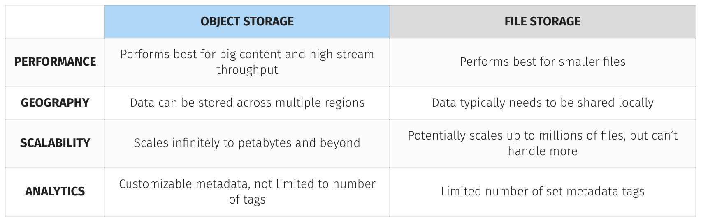

# Storing your objects: S3 and Glacier

## Object Store

Object storage essentially bundles the data itself along with metadata tags and a unique identifier. The metadata is customizable, which means we can input a lot more identifying information for each piece of data. These objects are stored in a flat address space, which makes it easier to locate and retrieve your data across regions.

* In an object store, data is stored as objects. 
* Each object consists of:
    1. a unique ID, 
    2. metadata describing the content,
    3. and the data itself. 
* An object’s globally unique identifier is also known as its key; addressing the object from different devices and machines in a distributed system is possible with the globally unique identifier.

The separation of metadata and data allows clients to work only with the metadata for managing and querying data.  Metadata is also used to store access-control information and for other management tasks.

<br>



<br>


# AMAZON S3

The Amazon S3 object store is one of the oldest services on AWS. Amazon S3 is an acronym for **Amazon Simple Storage Service**. It’s a typical web service that lets you store and retrieve data via an API reachable over HTTPS.

* The service offers unlimited storage space and stores your data in a highly available and durable way. 
* We can store any kind of data, such as images, documents, and binaries, as long as the size of a single object doesn’t exceed **5 TB**. 
* We have to pay for every GB you store in S3, and we also incur minor costs for every request and transferred data.

---

*  _S3 uses buckets to group objects._

*  _A bucket is a container for objects._

*  We can create up to 100 buckets, each of which has a globally unique name. _By unique we really mean - we have to choose a bucket name that isn’t used by any other AWS customer in any other region._

---

Typical use cases are as follows:

1. Backing up and restoring files with S3 and the help of the AWS CLI.
2. Archiving objects with Amazon Glacier to save money compared to Amazon S3.
3. Integrating Amazon S3 into applications with the help of the AWS SDKs to store and fetch objects such as images.
4. Hosting static web content that can be viewed by anyone with the help of S3.

## Create bucket on S3

1. Create bucket:

```
$ aws s3 mb s3://mukund-learning-aws
make_bucket: mukund-learning-aws

```

2. Sync files:

```
$ aws s3 sync test/ s3://mukund-learning-aws/ansible
upload: test/defaults/main.yml to s3://mukund-learning-aws/ansible/defaults/main.yml
upload: test/tests/inventory to s3://mukund-learning-aws/ansible/tests/inventory
upload: test/tests/test.yml to s3://mukund-learning-aws/ansible/tests/test.yml
upload: test/vars/main.yml to s3://mukund-learning-aws/ansible/vars/main.yml
upload: test/README.md to s3://mukund-learning-aws/ansible/README.md
upload: test/meta/main.yml to s3://mukund-learning-aws/ansible/meta/main.yml
upload: test/handlers/main.yml to s3://mukund-learning-aws/ansible/handlers/main.yml
upload: test/tasks/main.yml to s3://mukund-learning-aws/ansible/tasks/main.yml
```

<br>


3. Testing restore:

```
$ rm -rf test/
$ ls -lrt test
ls: test: No such file or directory
```

<br>

```
$ aws s3 cp --recursive s3://mukund-learning-aws/ansible test/
download: s3://mukund-learning-aws/ansible/meta/main.yml to test/meta/main.yml
download: s3://mukund-learning-aws/ansible/tests/test.yml to test/tests/test.yml
download: s3://mukund-learning-aws/ansible/tests/inventory to test/tests/inventory
download: s3://mukund-learning-aws/ansible/handlers/main.yml to test/handlers/main.yml
download: s3://mukund-learning-aws/ansible/defaults/main.yml to test/defaults/main.yml
download: s3://mukund-learning-aws/ansible/vars/main.yml to test/vars/main.yml
download: s3://mukund-learning-aws/ansible/tasks/main.yml to test/tasks/main.yml
download: s3://mukund-learning-aws/ansible/README.md to test/README.md


$ ls -lrt test/
total 8
-rw-r--r--  1 mukund_bihari  staff  1328 Dec 27 00:16 README.md
drwxr-xr-x  3 mukund_bihari  staff    96 Dec 27 00:19 meta
drwxr-xr-x  4 mukund_bihari  staff   128 Dec 27 00:19 tests
drwxr-xr-x  3 mukund_bihari  staff    96 Dec 27 00:19 handlers
drwxr-xr-x  3 mukund_bihari  staff    96 Dec 27 00:19 defaults
drwxr-xr-x  3 mukund_bihari  staff    96 Dec 27 00:19 vars
drwxr-xr-x  3 mukund_bihari  staff    96 Dec 27 00:19 tasks

```

<br>

## Versioning for objects


