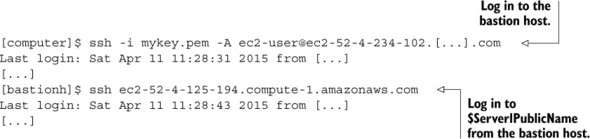

# Securing AWS infra: IAM, security groups, and VPC

## Networking terms

* **Subnet**

A subnet is a logical partition of an IP network into multiple, smaller network segments. It is typically used to subdivide large networks into smaller, more efficient subnetworks.

* **Route table**

A routing table is a set of rules, often viewed in table format, that is used to determine where data packets traveling over an Internet Protocol (IP) network will be directed. All IP-enabled devices, including routers and switches, use routing tables.

A basic routing table includes the following information:

1. Destination: The IP address of the packet's final destination
2. Next hop: The IP address to which the packet is forwarded
3. Interface: The outgoing network interface the device should use when forwarding the packet to the next hop or final destination
4. Metric: Assigns a cost to each available route so that the most cost-effective path can be chosen
5. Routes: Includes directly-attached subnets, indirect subnets that are not attached to the device but can be accessed through one or more hops, and default routes to use for certain types of traffic or when information is lacking.

* **Access control list (ACL)**

Access Control List (ACL) are filters that enable you to control which routing updates or packets are permitted or denied in or out of a network.

* **Gateway**

A gateway is a network node that connects two networks using different protocols together. While a bridge is used to join two similar types of networks, a gateway is used to join two dissimilar networks.

* **Firewall**

A firewall is a network security device that monitors incoming and outgoing network traffic and decides whether to allow or block specific traffic based on a defined set of security rules.


## ARN

Amazon resource name


<br>

Find out the account ID by CLI:

```
$ aws iam get-user --query "User.Arn" 
"arn:aws:iam::2323899173415:user/xxxxxmukund"
```

<br>

If you know the account ID, you can use ARNs to allow access to specific resources of a service:

```
{
  "Version": "2012-10-17",
  "Statement": [{
    "Sid": "2",
    "Effect": "Allow",
    "Action": ["ec2:TerminateInstances"],
    "Resource": ["arn:aws:ec2:us-east-1:878533158213:instance/i-3dd4f812"]
  }]
}
```

## Policies for authorization

There are two types of policies:

1. Managed policy —If you want to create policies that can be reused in your account, a managed policy is what you’re looking for. There are two types of managed policies:
    - AWS managed policy —A policy that is maintained by AWS. There are policies that grant admin rights, read-only rights, and so on.
    - Customer managed —Could be a policy that represents the roles in your organization.
2. Inline policy —A policy that belongs to a certain IAM role, user, or group. The inline policy can’t exist without the IAM role, the user, or the group.

With CloudFormation, it’s easy to maintain inline policies.

## Users for authentication, and groups to organize users

Using root user should be avoided.

**Commands to create user and group by CLI:**

1. Create group:

```
$ aws iam create-group --group-name "admin"
{
    "Group": {
        "Path": "/", 
        "CreateDate": "2018-12-26T14:28:14Z", 
        "GroupId": "SDJKFSJKFDC6UY2UKYXYWM", 
        "Arn": "arn:aws:iam::329573949834:group/admin", 
        "GroupName": "admin"
    }
}
```

<br>

2. Attach policy to group
```
aws iam attach-group-policy --group-name "admin" \
--policy-arn "arn:aws:iam::aws:policy/AdministratorAccess"
```

<br>

3. Create a user:
```
$ aws iam create-user --user-name "awsuser"
{
    "User": {
        "UserName": "awsuser", 
        "Path": "/", 
        "CreateDate": "2018-12-26T14:29:49Z", 
        "UserId": "ASKFJKSHFDLSHJLGHSDJL", 
        "Arn": "arn:aws:iam::329573949834:user/awsuser"
    }
}
```

<br>

4. Add the user to group:
`aws iam add-user-to-group --group-name "admin" --user-name "awsuser"`

<br>

5. Creating login profile:
```
$ aws iam create-login-profile --user-name "awsuser" --password "$Password"
{
    "LoginProfile": {
        "UserName": "awsuser", 
        "CreateDate": "2018-12-26T14:31:31Z", 
        "PasswordResetRequired": false
    }
}
```

<br>

6. Creating access key:
```
$ aws iam create-access-key --user-name awsuser
{
    "AccessKey": {
        "UserName": "awsuser", 
        "Status": "Active", 
        "CreateDate": "2018-12-26T14:40:21Z", 
        "SecretAccessKey": "SDKsadfrFJKadsfkaLSDFJKjdsvfJv9ybK+bRRL6fz//SHDkfu+Hl", 
        "AccessKeyId": "DCKSJDKHDLJHOWYFVKSANCK"
    }
}
```

# CONTROLLING NETWORK TRAFFIC TO AND FROM YOUR VIRTUAL SERVER


<br>

**Source vs. destination**

_Inbound security-group rules_ filter based on the source of the network traffic. The source is either an IP address or a security group. Thus you can allow inbound traffic only from specific source IP address ranges.

_Outbound security-group rules_ filter based on the destination of the network traffic. The destination is either an IP address or a security group. You can allow outbound traffic to only specific destination IP address ranges.

**AWS is responsible for the firewall, but we’re responsible for the rules.** By default, all inbound traffic is denied and all outbound traffic is allowed.

## Controlling traffic to virtual servers with security groups

A security group can be associated with AWS resources like EC2 instances. It’s common for EC2 instances to have more than one security group associated with them and for the same security group to be associated with many EC2 instances.

A security group follows a set of rules. A rule can allow network traffic based on the following:

1. Direction (inbound or outbound)
2. IP protocol (TCP, UDP, ICMP)
3. Source/destination IP address
4. Port
5. Source/destination security group (works only in AWS)

Example of empty security group associated with a EC2 instance:

```
{
	"AWSTemplateFormatVersion": "2010-09-09",
	"Description": "AWS in Action: chapter 6 (firewall 1)",
	"Parameters": {
		"KeyName": {
			"Description": "Key Pair name",
			"Type": "AWS::EC2::KeyPair::KeyName",
			"Default": "mykey"
		},
		"VPC": {
			"Description": "Just select the one and only default VPC",
			"Type": "AWS::EC2::VPC::Id"
		},
		"Subnet": {
			"Description": "Just select one of the available subnets",
			"Type": "AWS::EC2::Subnet::Id"
		}
	},
	"Mappings": {
		"EC2RegionMap": {
			"us-east-1": {"AmazonLinuxAMIHVMEBSBacked64bit": "ami-1ecae776"}
		}
	},
	"Resources": {
		"SecurityGroup": {
			"Type": "AWS::EC2::SecurityGroup",
			"Properties": {
				"GroupDescription": "My security group",
				"VpcId": {"Ref": "VPC"}
			}
		},
		"Server": {
			"Type": "AWS::EC2::Instance",
			"Properties": {
				"ImageId": {"Fn::FindInMap": ["EC2RegionMap", {"Ref": "AWS::Region"}, "AmazonLinuxAMIHVMEBSBacked64bit"]},
				"InstanceType": "t2.micro",
				"KeyName": {"Ref": "KeyName"},
				"SecurityGroupIds": [{"Ref": "SecurityGroup"}],
				"SubnetId": {"Ref": "Subnet"}
			}
		}
	},
	"Outputs": {
		"PublicName": {
			"Value": {"Fn::GetAtt": ["Server", "PublicDnsName"]},
			"Description": "Public name (connect via SSH as user ec2-user)"
		}
	}
}
```

<br>

## Allowing ICMP traffic

If we want to ping an EC2 instance from your computer, you must allow inbound Internet Control Message Protocol (ICMP) traffic. By default, all inbound traffic is blocked.

```
$ ping ec2-52-5-109-147.compute-1.amazonaws.com
PING ec2-52-5-109-147.compute-1.amazonaws.com (52.5.109.147): 56 data bytes
Request timeout for icmp_seq 0
Request timeout for icmp_seq 1

```

<br>

We need to add a rule to the security group that allows inbound traffic, where the protocol equals ICMP.

```
{
	"AWSTemplateFormatVersion": "2010-09-09",
	"Description": "AWS in Action: chapter 6 (firewall 2)",
	"Parameters": {
		"KeyName": {
			"Description": "Key Pair name",
			"Type": "AWS::EC2::KeyPair::KeyName",
			"Default": "mykey"
		},
		"VPC": {
			"Description": "Just select the one and only default VPC",
			"Type": "AWS::EC2::VPC::Id"
		},
		"Subnet": {
			"Description": "Just select one of the available subnets",
			"Type": "AWS::EC2::Subnet::Id"
		}
	},
	"Mappings": {
		"EC2RegionMap": {
			"us-east-1": {"AmazonLinuxAMIHVMEBSBacked64bit": "ami-1ecae776"}
		}
	},
	"Resources": {
		"SecurityGroup": {
			"Type": "AWS::EC2::SecurityGroup",
			"Properties": {
				"GroupDescription": "My security group",
				"VpcId": {"Ref": "VPC"}
			}
		},
		"AllowInboundICMP": {                           #ICMP role description
			"Type": "AWS::EC2::SecurityGroupIngress",   # Type of inound rule
			"Properties": {
				"GroupId": {"Ref": "SecurityGroup"},    # Connects the rule with s security group
				"IpProtocol": "icmp",                   # Specifies protocol
				"FromPort": "-1",                       # -1 means all ports
				"ToPort": "-1",                         
				"CidrIp": "0.0.0.0/0"                   #0.0.0.0/o means it can be pinged from any source IP
			}
		},
		"Server": {
			"Type": "AWS::EC2::Instance",
			"Properties": {
				"ImageId": {"Fn::FindInMap": ["EC2RegionMap", {"Ref": "AWS::Region"}, "AmazonLinuxAMIHVMEBSBacked64bit"]},
				"InstanceType": "t2.micro",
				"KeyName": {"Ref": "KeyName"},
				"SecurityGroupIds": [{"Ref": "SecurityGroup"}],
				"SubnetId": {"Ref": "Subnet"}
			}
		}
	},
	"Outputs": {
		"PublicName": {
			"Value": {"Fn::GetAtt": ["Server", "PublicDnsName"]},
			"Description": "Public name (connect via SSH as user ec2-user)"
		}
	}
}
```

<br>

After applying this rule we can ping the instance:

```
$ ping ec2-52-5-109-147.compute-1.amazonaws.com
PING ec2-52-5-109-147.compute-1.amazonaws.com (52.5.109.147): 56 data bytes
64 bytes from 52.5.109.147: icmp_seq=0 ttl=49 time=112.222 ms
64 bytes from 52.5.109.147: icmp_seq=1 ttl=49 time=121.893 ms
[...]
round-trip min/avg/max/stddev = 112.222/117.058/121.893/4.835 ms
```

<br>

## Allowing SSH traffic

Below rule needs to be added in above snippet in Resources section:

```
		"AllowInboundSSH": {
			"Type": "AWS::EC2::SecurityGroupIngress",
			"Properties": {
				"GroupId": {"Ref": "SecurityGroup"},
				"IpProtocol": "tcp",
				"FromPort": "22",
				"ToPort": "22",
				"CidrIp": "0.0.0.0/0"
			}
		}
```        
<br>

## Allowing SSH traffic from a source IP address

Security group that allows SSH only from specific IP address. Used $IpForSSH/32 as a value

```
Below code will go in Parameters setion:

		"IpForSSH": {
			"Description": "Your public IP address to allow SSH access",
			"Type": "String"
		}

Below code needs to be added in Resources section of above snippet:

		"AllowInboundSSH": {
			"Type": "AWS::EC2::SecurityGroupIngress",
			"Properties": {
				"GroupId": {"Ref": "SecurityGroup"},
				"IpProtocol": "tcp",
				"FromPort": "22",
				"ToPort": "22",
				"CidrIp": {"Fn::Join": ["", [{"Ref": "IpForSSH"}, "/32"]]}
			}
		}

```       

<br>

**What’s the difference between public and private IP addresses?**

On our local network, we use private IP addresses that start with 192.168.0.*. e.g My laptop uses 192.168.0.10, and my iPad uses 192.168.0.20. But if I access the internet, I have the same public IP (such as 79.241.98.155) for my laptop and iPad. That’s because only my internet gateway (the box that connects to the internet) has a public IP address, and all requests are redirected by the gateway (if you want to dive deep into this, search for network address translation). Our local network doesn’t know about this public IP address. My laptop and iPad only know that the internet gateway is reachable under 192.168.0.1 on the private network.

**Classless Inter-Domain Routing (CIDR)**

We may wonder what /32 means in above example. An IP address is 4 bytes or 32 bits long. The /32 defines how many bits (32, in this case) should be used to form a range of addresses. If we want to define the exact IP address that’s allowed, we must use all 32 bits.

But sometimes it makes sense to define a range of allowed IP addresses. For example, we can use 10.0.0.0/8 to create a range between 10.0.0.0 and 10.255.255.255, 10.0.0.0/16 to create a range between 10.0.0.0 and 10.0.255.255, or 10.0.0.0/24 to create a range between 10.0.0.0 and 10.0.0.255. we aren’t required to use the binary boundaries (8, 16, 24, 32), but they’re easier for most people to understand. We already used 0.0.0.0/0 to create a range that contains every possible IP address.

## Allowing SSH traffic from a source security group

If we want to control traffic from one AWS resource (like an EC2 instance) to another, security groups are powerful. We can control network traffic based on whether the source or destination belongs to a specific security group. For example, we can define that a MySQL database can only be accessed if the traffic comes from your web servers, or that only your web cache servers are allowed to access the web servers.

To explore the power of rules based on a source security group, let’s look at the concept of a _bastion host_ for SSH access (some people call it a _jump box_). The trick is that only one server, the bastion host, can be accessed via SSH from the internet (it should be restricted to a specific source IP address). All other servers can only be reached via SSH from the bastion host. This approach has two advantages:

We have only one entry point into the system, and that entry point does nothing but SSH. The chances of this box being hacked are small.

If one of the web servers, mail servers, FTP servers, and so on, is hacked, the attacker can’t jump from that server to all the other servers.

To implement the concept of a bastion host, we must follow these two rules:

1. Allow SSH access to the bastion host from 0.0.0.0/0 or a specific source address.
2. Allow SSH access to all other servers only if the traffic source is the bastion host.


<br>

The following listing shows the SSH rule that allows traffic from a specific source security group:

```
{
	"AWSTemplateFormatVersion": "2010-09-09",
	"Description": "AWS in Action: chapter 6 (firewall 5)",
	"Parameters": {
		"KeyName": {
			"Description": "Key Pair name",
			"Type": "AWS::EC2::KeyPair::KeyName",
			"Default": "mykey"
		},
		"VPC": {
			"Description": "Just select the one and only default VPC",
			"Type": "AWS::EC2::VPC::Id"
		},
		"Subnet": {
			"Description": "Just select one of the available subnets",
			"Type": "AWS::EC2::Subnet::Id"
		},
		"IpForSSH": {
			"Description": "Your public IP address to allow SSH access",
			"Type": "String"
		}
	},
	"Mappings": {
		"EC2RegionMap": {
			"us-east-1": {"AmazonLinuxAMIHVMEBSBacked64bit": "ami-1ecae776"}
		}
	},
	"Resources": {
		"SecurityGroup": {
			"Type": "AWS::EC2::SecurityGroup",
			"Properties": {
				"GroupDescription": "My security group",
				"VpcId": {"Ref": "VPC"}
			}
		},
		"AllowInboundICMP": {
			"Type": "AWS::EC2::SecurityGroupIngress",
			"Properties": {
				"GroupId": {"Ref": "SecurityGroup"},
				"IpProtocol": "icmp",
				"FromPort": "-1",
				"ToPort": "-1",
				"CidrIp": "0.0.0.0/0"
			}
		},
		"AllowInboundSSH": {
			"Type": "AWS::EC2::SecurityGroupIngress",
			"Properties": {
				"GroupId": {"Ref": "SecurityGroup"},
				"IpProtocol": "tcp",
				"FromPort": "22",
				"ToPort": "22",
				"CidrIp": {"Fn::Join": ["", [{"Ref": "IpForSSH"}, "/32"]]}
			}
		},
		"SecurityGroupPrivate": {
			"Type": "AWS::EC2::SecurityGroup",
			"Properties": {
				"GroupDescription": "My security group",
				"VpcId": {"Ref": "VPC"}
			}
		},
		"AllowPrivateInboundSSH": {
			"Type": "AWS::EC2::SecurityGroupIngress",
			"Properties": {
				"GroupId": {"Ref": "SecurityGroupPrivate"},
				"IpProtocol": "tcp",
				"FromPort": "22",
				"ToPort": "22",
				"SourceSecurityGroupId": {"Ref": "SecurityGroup"}
			}
		},
		"BastionHost": {
			"Type": "AWS::EC2::Instance",
			"Properties": {
				"ImageId": {"Fn::FindInMap": ["EC2RegionMap", {"Ref": "AWS::Region"}, "AmazonLinuxAMIHVMEBSBacked64bit"]},
				"InstanceType": "t2.micro",
				"KeyName": {"Ref": "KeyName"},
				"SecurityGroupIds": [{"Ref": "SecurityGroup"}],
				"SubnetId": {"Ref": "Subnet"}
			}
		},
		"Server1": {
			"Type": "AWS::EC2::Instance",
			"Properties": {
				"ImageId": {"Fn::FindInMap": ["EC2RegionMap", {"Ref": "AWS::Region"}, "AmazonLinuxAMIHVMEBSBacked64bit"]},
				"InstanceType": "t2.micro",
				"KeyName": {"Ref": "KeyName"},
				"SecurityGroupIds": [{"Ref": "SecurityGroupPrivate"}],
				"SubnetId": {"Ref": "Subnet"}
			}
		},
		"Server2": {
			"Type": "AWS::EC2::Instance",
			"Properties": {
				"ImageId": {"Fn::FindInMap": ["EC2RegionMap", {"Ref": "AWS::Region"}, "AmazonLinuxAMIHVMEBSBacked64bit"]},
				"InstanceType": "t2.micro",
				"KeyName": {"Ref": "KeyName"},
				"SecurityGroupIds": [{"Ref": "SecurityGroupPrivate"}],
				"SubnetId": {"Ref": "Subnet"}
			}
		}
	},
	"Outputs": {
		"BastionHostPublicName": {
			"Value": {"Fn::GetAtt": ["BastionHost", "PublicDnsName"]},
			"Description": "Bastion host public name (connect via SSH as user ec2-user)"
		},
		"Server1PublicName": {
			"Value": {"Fn::GetAtt": ["Server1", "PublicDnsName"]},
			"Description": "Server1 public name"
		},
		"Server2PublicName": {
			"Value": {"Fn::GetAtt": ["Server2", "PublicDnsName"]},
			"Description": "Server2 public name"
		}
	}
}
```

<br>

If the update is completed with above template, the stack shows three outputs:

* **BastionHostPublicName** —Use the bastion host to connect via SSH from your computer.
* **Server1PublicName** —You can connect to this server only from the bastion host.
* **Server2PublicName** —You can connect to this server only from the bastion host.

Now connect to BastionHostPublicName via SSH using ssh -i mykey.pem -A ec2-user@$BastionHostPublicName. 

The -A option is important to enable AgentForwarding; agent forwarding lets you authenticate with the same key you used to log in to the bastion host for further SSH logins initiated from the bastion host.



<br>


