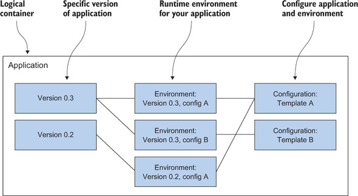
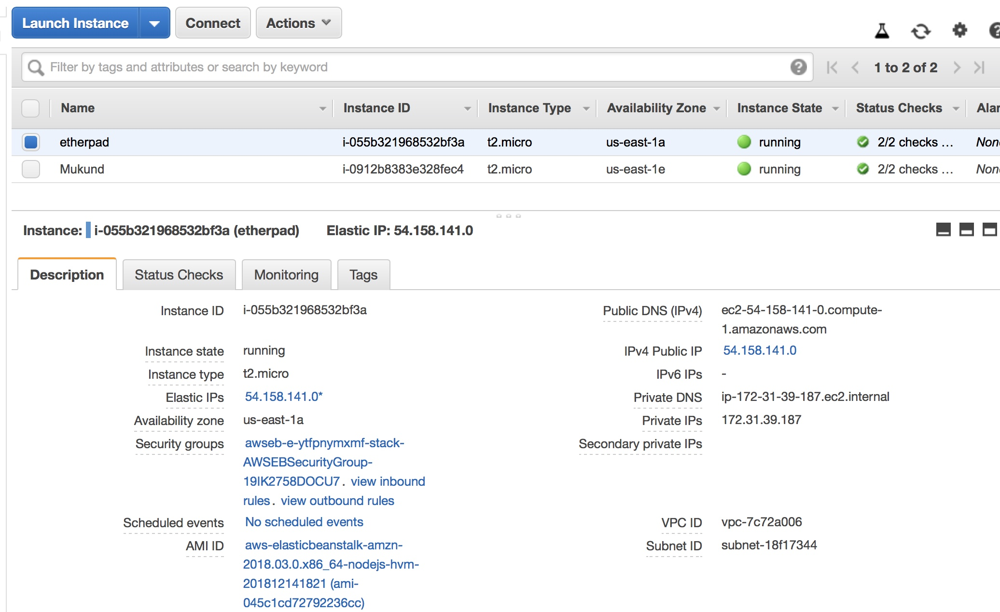
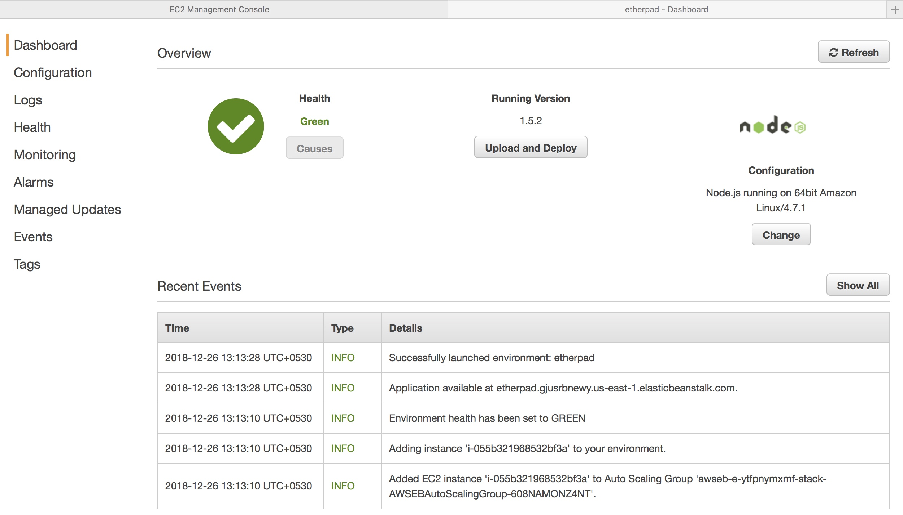
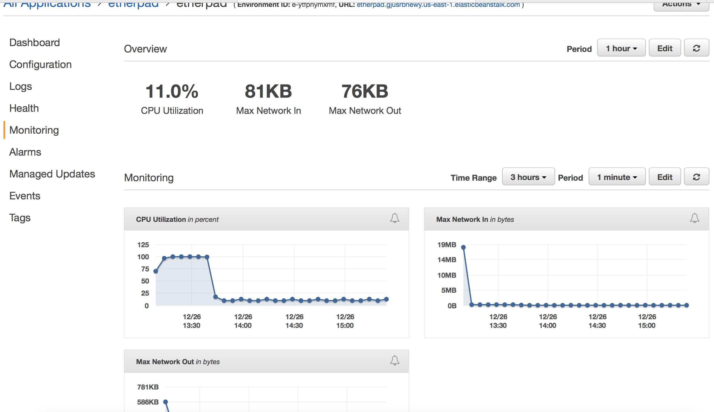

# Elastic Beanstalk

 AWS offers a service that can help you to deploy web applications based on PHP, Java, .NET, Ruby, Node.js, Python, Go, and Docker; it’s called AWS Elastic Beanstalk.
With Elastic Beanstalk, we don’t have to worry about our OS or virtual servers because it adds another layer of abstraction on top of them.

Elastic Beanstalk lets us handle the following recurring problems:

* Providing a runtime environment for a web application (PHP, Java, and so on)
* Installing and updating a web application automatically
* Configuring a web application and its environment
* Scaling a web application to balance load
* Monitoring and debugging a web application

## Components of Elastic Beanstalk

* **An application** is a logical container. It contains versions, environments, and configurations. If we start to use Elastic Beanstalk in a region, we have to create an application first.

* **A version** contains a specific version of the application. To create a new version, we have to upload our executables (packed into an archive) to the service Amazon S3, which stores static files. A version is basically a pointer to this archive of executables.

* **A configuration** template contains our default configuration. We can manage our application’s configuration (such as the port our application listens on) as well as the environment’s configuration (such as the size of the virtual server) with our custom configuration template.

* **An environment** is where Elastic Beanstalk executes our application. It consists of a version and the configuration. We can run multiple environments for one application using the versions and configurations multiple times.

<br><br>



## Using Elastic Beanstalk to deploy Etherpad, a Node.js application

Deployment of Node.js-based application- Ehterpad with the help of Elastic Beanstalk in three steps:

1.  Create an application: the logical container.
2.  Create a version: a pointer to a specific version of Etherpad.
3.  Create an environment: the place where Etherpad will run.

_**Note**: You need to have access on policy **AWSElasticBeanstalkFullAccess** in order to work with Elastic beanstalk._ Lack of access results in below error:

```
aws elasticbeanstalk create-application --application-name etherpad

An error occurred (AccessDenied) when calling the CreateApplication operation: User: arn:aws:iam::4359456772825:user/xxxxxxxxxxxx is not authorized to perform: elasticbeanstalk:CreateApplication on resource: arn:aws:elasticbeanstalk:us-east-1:4359456772825:application/etherpad
```

### Steps

1. **command to create an application for the Elastic Beanstalk service:**
<br>

```
aws elasticbeanstalk create-application --application-name etherpad
{
    "Application": {
        "ApplicationName": "etherpad", 
        "ApplicationArn": "arn:aws:elasticbeanstalk:us-east-1:825796472415:application/etherpad", 
        "ConfigurationTemplates": [], 
        "DateUpdated": "2018-12-26T07:24:42.893Z", 
        "DateCreated": "2018-12-26T07:24:42.893Z", 
        "ResourceLifecycleConfig": {
            "VersionLifecycleConfig": {
                "MaxCountRule": {
                    "DeleteSourceFromS3": false, 
                    "Enabled": false, 
                    "MaxCount": 200
                }, 
                "MaxAgeRule": {
                    "DeleteSourceFromS3": false, 
                    "Enabled": false, 
                    "MaxAgeInDays": 180
                }
            }
        }
    }
}
```

<br>

2. **create a new version of your Etherpad application with the following command:**

```
aws elasticbeanstalk create-application-version \
--application-name etherpad --version-label 1.5.2 \
--source-bundle S3Bucket=mukund-blog-state-store,S3Key=etherpad.zip
```

<br>

Output:

<br>

```
{
    "ApplicationVersion": {
        "ApplicationName": "etherpad", 
        "Status": "UNPROCESSED", 
        "VersionLabel": "1.5.2", 
        "ApplicationVersionArn": "arn:aws:elasticbeanstalk:us-east-1:825796472415:applicationversion/etherpad/1.5.2", 
        "DateCreated": "2018-12-26T07:33:01.071Z", 
        "DateUpdated": "2018-12-26T07:33:01.071Z", 
        "SourceBundle": {
            "S3Bucket": "mukund-blog-state-store", 
            "S3Key": "etherpad.zip"
        }
    }
}
```

3. **get the latest Node.js environment version, called a solution stack name**:

```
SolutionStackName=$(aws elasticbeanstalk list-available-solution-stacks --output text --query "SolutionStacks[?contains(@, 'running Node.js')] | [0]" )
```

4. **create an environment for Etherpad.**:

```
aws elasticbeanstalk create-environment --environment-name etherpad \
--application-name etherpad \
--option-settings Namespace=aws:elasticbeanstalk:environment,\
OptionName=EnvironmentType,Value=SingleInstance \
--solution-stack-name "$SolutionStackName" \
--version-label 1.5.2
```

Output:
<br>

```
$ aws elasticbeanstalk create-environment --environment-name etherpad \
 --application-name etherpad \
 --option-settings Namespace=aws:elasticbeanstalk:environment,\
 OptionName=EnvironmentType,Value=SingleInstance \
 --solution-stack-name "$SolutionStackName" \
 --version-label 1.5.2

{
    "ApplicationName": "etherpad", 
    "EnvironmentName": "etherpad", 
    "VersionLabel": "1.5.2", 
    "Status": "Launching", 
    "EnvironmentArn": "arn:aws:elasticbeanstalk:us-east-1:825796472415:environment/etherpad/etherpad", 
    "PlatformArn": "arn:aws:elasticbeanstalk:us-east-1::platform/Node.js running on 64bit Amazon Linux/4.7.1", 
    "SolutionStackName": "64bit Amazon Linux 2018.03 v4.7.1 running Node.js", 
    "EnvironmentId": "e-ytfpnymxmf", 
    "Health": "Grey", 
    "Tier": {
        "Version": "1.0", 
        "Type": "Standard", 
        "Name": "WebServer"
    }, 
    "DateUpdated": "2018-12-26T07:40:50.746Z", 
    "DateCreated": "2018-12-26T07:40:50.746Z"
}
```
<br>

A new EC2 instance is created:

<br>



Once the instance is up and running, we can describe the env:
<br>

```
aws elasticbeanstalk describe-environments --environment-names etherpad
{
    "Environments": [
        {
            "ApplicationName": "etherpad", 
            "EnvironmentName": "etherpad", 
            "VersionLabel": "1.5.2", 
            "Status": "Ready", 
            "EnvironmentArn": "arn:aws:elasticbeanstalk:us-east-1:825796472415:environment/etherpad/etherpad", 
            "EnvironmentLinks": [], 
            "PlatformArn": "arn:aws:elasticbeanstalk:us-east-1::platform/Node.js running on 64bit Amazon Linux/4.7.1", 
            "EndpointURL": "54.158.141.0", 
            "SolutionStackName": "64bit Amazon Linux 2018.03 v4.7.1 running Node.js", 
            "EnvironmentId": "e-ytfpnymxmf", 
            "CNAME": "etherpad.gjusrbnewy.us-east-1.elasticbeanstalk.com", 
            "AbortableOperationInProgress": false, 
            "Tier": {
                "Version": "1.0", 
                "Type": "Standard", 
                "Name": "WebServer"
            }, 
            "Health": "Green", 
            "DateUpdated": "2018-12-26T07:43:28.758Z", 
            "DateCreated": "2018-12-26T07:40:50.729Z"
        }
    ]
}
```

<br>
We can get details about the etherpad env if we got to beanstalk service on AWS
<br>


<br><br>



