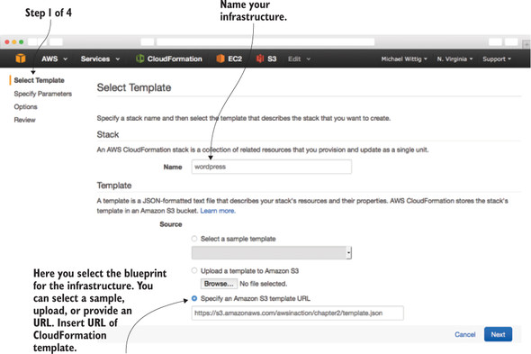

# Wordpress Blog

## Agenda
* Creating a blogging infrastructure
* Analyzing costs of a blogging infrastructure
* Exploring a blogging infrastructure
* Shutting down a blogging infrastructure

WordPress is written in PHP and uses a MySQL database to store data. Apache is used as the web server to serve the pages. With this information in mind, it’s time to map our requirements to AWS services.

1. **Elastic Load Balancing (ELB)** —AWS offers a load balancer as a service. The Elastic Load Balancer (ELB) distributes traffic to a bunch of servers behind it. It’s highly available by default.
2. **Elastic Compute Cloud (EC2)** —A virtual server is provided by the Elastic Compute Cloud (EC2) service. We’ll use a Linux server with an optimized distribution called Amazon Linux to install Apache, PHP, and WordPress. Virtual servers can fail, so we need at least two of them. The load balancer will distribute the traffic between them. In case of a server failure, the load balancer will stop sending traffic to the failed server, and the remaining server will need to handle all the requests until the failed server is replaced.
3. **Relational Database Service (RDS)** for MySQL —WordPress relies on the popular MySQL database. AWS provides MySQL as a Relational Database Service (RDS). We choose the database size (storage, CPU, RAM), and RDS takes care of the rest (backups, updates). RDS can also provide a highly available MySQL database by replication.
4. **Security groups** —Security groups are a fundamental service of AWS to control network traffic like a firewall. Security groups can be attached to a lot of services like ELB, EC2, and RDS. With security groups, we can configure our load balancer so that it only accepts requests on port 80 from the internet, web servers only accept connections on port 80 from the load balancer, and MySQL only accepts connections on port 3306 from the web servers. To access our web servers via SSH, we must also open port 22.

## Steps to create the blog

1.  Creating an ELB
2.  Creating a RDS MySQL database
3.  Creating and attaching security groups
4.  Creating two web servers:
    - Creating two EC2 virtual servers
    - Installing Apache and PHP via yum install php, php-mysql, mysql, httpd
    - Downloading and extracting the latest version of WordPress from http://wordpress.org/latest.tar.gz
    - Configuring WordPress to use the created RDS MySQL database
    - Starting Apache

_Flow diagram of blog creation_

_Steps on GUI_

_Output on GUI while blog is being created_

## Resources created

**EC2 Instances**

**DB Instance**

**LB Instance**

## Delete Blog

