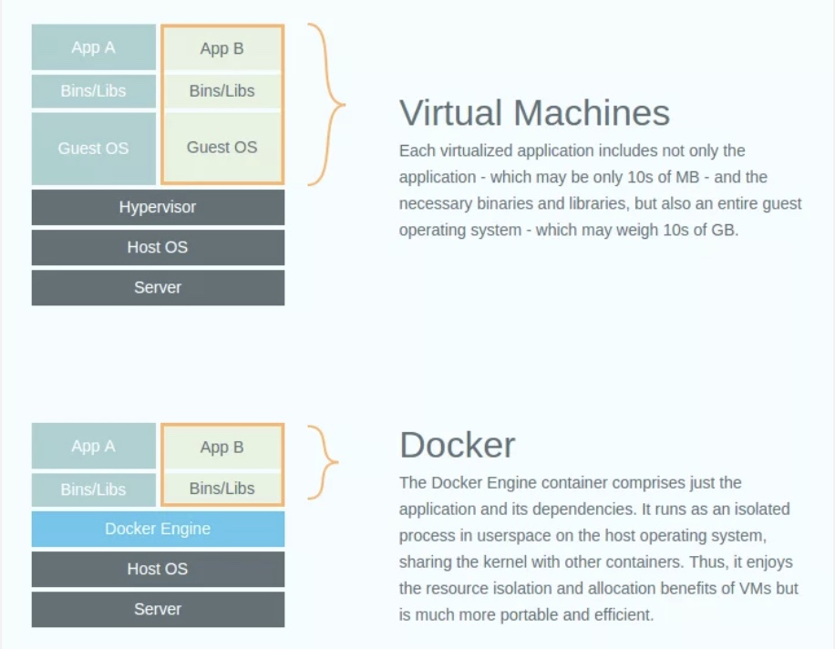
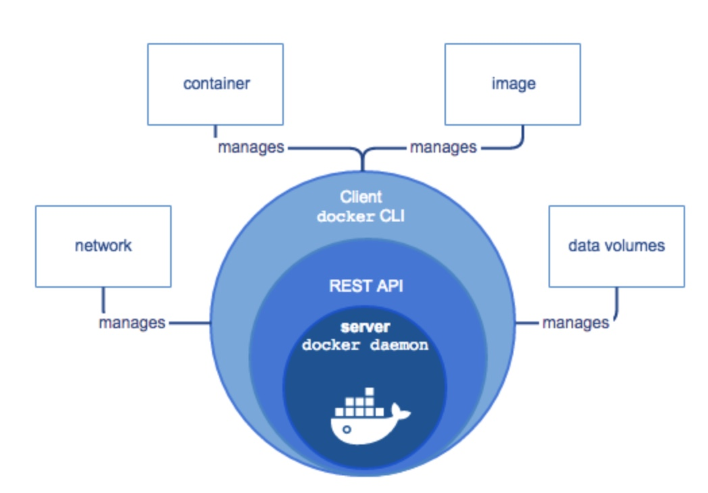

# Docker overview

* Docker is an open platform for developing, shipping, and running applications. 
* Docker enable us to separate applications from the infrastructure so we can deliver software quickly.

* Author: [Solomon Hykes](https://www.linkedin.com/in/solomonhykes/)
* Initial release: March 13, 2013
* [Stable release](https://docs.docker.com/engine/release-notes/): 18.09.0/ November 8, 2018

* Repository: [github.com/docker/docker-ce](https://github.com/docker/docker-ce)
* Language: Go

* Operating system:	Linux, Windows, macOS

## The Docker platform

* Docker provides the ability to package and run an application in a loosely isolated environment called a **container**. 
* The isolation and security allow us to run many containers simultaneously on a given host. 
* Containers are lightweight because they don’t need the extra load of a hypervisor, but run directly within the host machine’s kernel. 
* We can run more containers on a given hardware combination than if we were using virtual machines. 
* We can even run Docker containers within host machines that are actually virtual machines!

## Benefits of docker containers:

1. Containers offer a logical packaging mechanism in which applications can be abstracted from the environment in which they actually run. This the key benefit of Docker which allows users to package an application with all of its dependencies into a standardized unit for software development.
2. Decoupling allows container-based applications to be deployed easily and consistently, regardless of whether the target environment is a private data center, the public cloud, or even a developer’s personal laptop. This gives developers the ability to create predictable environments that are isolated from rest of the applications and can be run anywhere.
3. Unlike virtual machines, containers do not have the high overhead and hence enable more efficient usage of the underlying system and resources.
4. From an operations standpoint, apart from portability containers also give more granular control over resources giving your infrastructure improved efficiency which can result in better utilization of the compute resources.

## Docker container vs VMs

### Docker Engine

Docker Engine is a client-server application with these major components:

* A server which is a type of long-running program called a daemon process (the dockerd command).
* A REST API which specifies interfaces that programs can use to talk to the daemon and instruct it what to do.
* A command line interface (CLI) client (the docker command).

* The CLI uses the Docker REST API to control or interact with the Docker daemon through scripting or direct CLI commands. Many other Docker applications use the underlying API and CLI.
* The daemon creates and manages Docker objects, such as images, containers, networks, and volumes.

## Docker architecture

