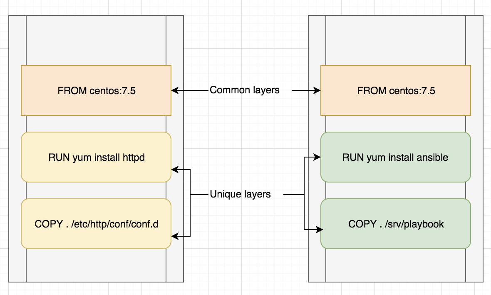
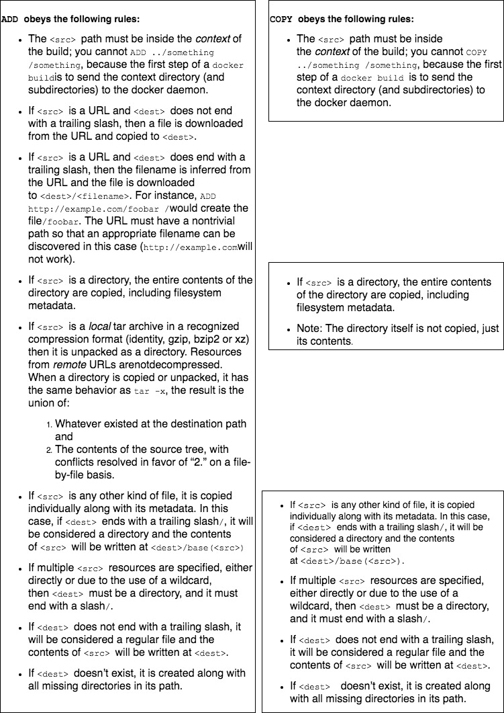

# Dockerfile

* `Dockerfile` is text file that contains all commands, in order, needed to build a given docker image.
* A Docker image consists of read-only layers each of which represents a Dockerfile instruction. The layers are stacked and each one is a delta of the changes from the previous layer. 

* The Docker daemon runs the instructions in the Dockerfile one-by-one i.e each instruction is run independently, and causes a new image to be created, committing the result of each instruction to a new image if necessary, before finally outputting the ID of the new image. 

## docker build

* The build is run by the Docker daemon, not by the CLI. 

##### Sample docker file

```
FROM centos:7.5
COPY . /app
RUN make /app
CMD python /app/config.py
```

Each instruction creates one layer:

1. FROM creates a layer from the centos version 7.5 Docker image.
2. COPY adds files from the Docker client’s current directory.
3. RUN builds our application with make.
4. CMD specifies what command to run within the container.

_When we run an image and generate a container, we add a new writable layer (the “container layer”) on top of the underlying layers. All changes made to the running container, such as writing new files, modifying existing files, and deleting files, are written to this thin writable container layer._



## Instructions in Dockerfile

1. [FROM](https://docs.docker.com/engine/reference/builder/#from)
2. [RUN](https://docs.docker.com/engine/reference/builder/#run)
3. [CMD](https://docs.docker.com/engine/reference/builder/#cmd)
4. [LABEL](https://docs.docker.com/engine/reference/builder/#label)
5. MAINTAINER (deprecated)
6. [EXPOSE](https://docs.docker.com/engine/reference/builder/#expose)
7. [ENV](https://docs.docker.com/engine/reference/builder/#env)
8. [ADD](https://docs.docker.com/engine/reference/builder/#add)
9. [COPY](https://docs.docker.com/engine/reference/builder/#copy)
10. [ENTRYPOINT](https://docs.docker.com/engine/reference/builder/#entrypoint)
11. [VOLUME](https://docs.docker.com/engine/reference/builder/#volume)
12. [USER](https://docs.docker.com/engine/reference/builder/#user)
13. [WORKDIR](https://docs.docker.com/engine/reference/builder/#workdir)
14. [ARG](https://docs.docker.com/engine/reference/builder/#arg)
15. [ONBUILD](https://docs.docker.com/engine/reference/builder/#onbuild)
16. [STOPSIGNAL](https://docs.docker.com/engine/reference/builder/#stopsignal)
17. [HEALTHCHECK](https://docs.docker.com/engine/reference/builder/#healthcheck)
18. [SHELL](https://docs.docker.com/engine/reference/builder/#shell)

### FROM
* FROM instruction initializes a new build stage and sets the Base Image for subsequent instructions.
* [ARG](https://docs.docker.com/engine/reference/builder/#understand-how-arg-and-from-interact) is the only instruction that may precede FROM in the Dockerfile. 
* FROM can appear multiple times within a single Dockerfile to create multiple images or use one build stage as a dependency for another.
* The tag or digest values are optional. 
Syntax:

`FROM <image> [AS <name>]` OR `FROM <image>[:<tag>] [AS <name>]` OR `FROM <image>[@<digest>] [AS <name>]`

### RUN
* RUN instruction executes any commands in a new layer on top of the current image and commit the results. The resulting committed image will be used for the next step in the Dockerfile.
* RUN has 2 forms:

    1. `RUN <command>` (shell form, the command is run in a shell, which by default is `/bin/sh -c` on Linux or cmd /S /C on Windows)
    2. `RUN ["executable", "param1", "param2"]` (exec form)
* The cache for RUN instructions isn’t invalidated automatically during the next build. The cache for an instruction like `RUN apt-get dist-upgrade -y` will be reused during the next build. 
* The cache for RUN instructions can be invalidated by using the `--no-cache` flag, for example `docker build --no-cache`.  

### CMD
* The main purpose of a CMD is to provide defaults for an executing container. These defaults can include an executable, or they can omit the executable, in which case you must specify an ENTRYPOINT instruction as well.
* The CMD instruction has three forms:

    1. `CMD ["executable","param1","param2"]` (exec form, this is the preferred form)
    2. `CMD ["param1","param2"]` (as default parameters to ENTRYPOINT)
    3. `CMD command param1 param2` (shell form)
* _RUN actually runs a command and commits the result; CMD does not execute anything at build time, but specifies the intended command for the image._
* _If we want container to run the same executable every time, then we should consider using ENTRYPOINT in combination with CMD._
* If the user specifies arguments to docker run then they will override the default specified in CMD.

## LABEL
* The LABEL instruction adds metadata to an image. 
* A LABEL is a key-value pair. 
* To include spaces within a LABEL value, use quotes and backslashes as you would in command-line parsing. 
* An image can have more than one label.
* Labels included in base or parent images are inherited by your image. 

```
LABEL "com.example.vendor"="ACME Incorporated"
LABEL version="1.0"
LABEL multi.label1="value1" \
      multi.label2="value2" \
      other="value3"
```      

### EXPOSE
* The EXPOSE instruction informs Docker that the container listens on the specified network ports at runtime. 
* Ports can be TCP or UDP, and the default is TCP if the protocol is not specified.
* The EXPOSE instruction does not actually publish the port.

```
# expose ports on both tcp and udp
EXPOSE 80/tcp
EXPOSE 80/udp
```
* Regardless of the EXPOSE settings, we can override them at runtime by using the -p flag.

### ENV
* The ENV instruction sets the environment variable `<key>` to the value `<value>`. 
* This value will be in the environment for all subsequent instructions in the build stage and can be replaced inline in many as well.
* The environment variables set using ENV will persist when a container is run from the resulting image. 
```
ENV myName="John Doe" myDog=Rex\ The\ Dog \
    myCat=fluffy
```    

### ADD
* The ADD instruction copies new files, directories or remote file URLs from `<src>` and adds them to the filesystem of the image at the path `<dest>`.
* `<src>` may contain wildcards and matching will be done using [Go’s filepath.Match rules](https://golang.org/pkg/path/filepath/#Match).
* The `<dest>` is an absolute path, or a path relative to WORKDIR, into which the source will be copied inside the destination container.

```
ADD [--chown=<user>:<group>] <src>... <dest>
ADD [--chown=<user>:<group>] ["<src>",... "<dest>"]
```

### COPY
* The COPY instruction copies new files or directories from `<src>` and adds them to the filesystem of the container at the path `<dest>`.

```
COPY [--chown=<user>:<group>] <src>... <dest>
COPY [--chown=<user>:<group>] ["<src>",... "<dest>"]
```

#### Comparison of ADD and COPY



