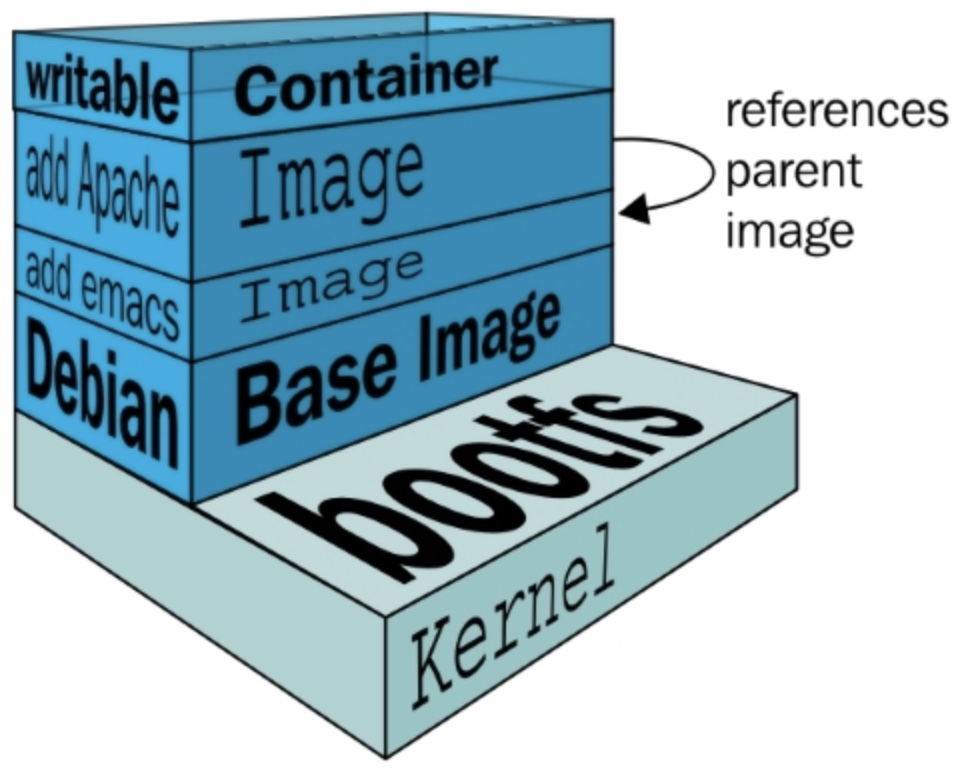
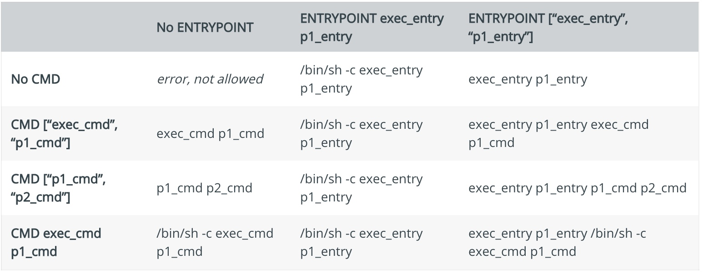

# Dockerfile

* `Dockerfile` is text file that contains all commands, in order, needed to build a given docker image.
* A Docker image consists of read-only layers each of which represents a Dockerfile instruction. The layers are stacked and each one is a delta of the changes from the previous layer. 

* The Docker daemon runs the instructions in the Dockerfile one-by-one i.e each instruction is run independently, and causes a new image to be created, committing the result of each instruction to a new image if necessary, before finally outputting the ID of the new image. 
* **A Dockerfile must start with a `FROM` instruction.**

## Format
* Docker treats lines that begin with `#` as a comment, unless the line is a valid parser directive. A `#`  marker anywhere else in a line is treated as an argument. 
* The escape directive sets the character used to escape characters in a Dockerfile. If not specified, the default escape character is `\`.  
```
# escape=\ (backslash)
# escape=` (backtick)
```
* The escape character is used both to escape characters in a line, and to escape a newline.
* Environment variables are notated in the Dockerfile either with $variable_name or ${variable_name}

---

The ${variable_name} syntax also supports a few of the standard bash modifiers as specified below:

1. ${variable:-word} indicates that if variable is set then the result will be that value. If variable is not set then word will be the result.
2. ${variable:+word} indicates that if variable is set then word will be the result, otherwise the result is the empty string.

---

## docker build

* The build is run by the Docker daemon, not by the CLI. 

##### Sample docker file

```
FROM centos:7.5
COPY . /app
RUN yum install httpd -y
CMD python /app/config.py
```

Each instruction creates one layer:

1. FROM creates a layer from the centos version 7.5 Docker image.
2. COPY adds files from the Docker client’s current directory.
3. RUN install httpd package use yum package manager.
4. CMD specifies what command to run within the container.

_When we run an image and generate a container, we add a new writable layer (the “container layer”) on top of the underlying layers. All changes made to the running container, such as writing new files, modifying existing files, and deleting files, are written to this thin writable container layer._



Layers in container:


## Instructions in Dockerfile

1. [FROM](https://docs.docker.com/engine/reference/builder/#from)
2. [RUN](https://docs.docker.com/engine/reference/builder/#run)
3. [CMD](https://docs.docker.com/engine/reference/builder/#cmd)
4. [LABEL](https://docs.docker.com/engine/reference/builder/#label)
5. MAINTAINER (deprecated)
6. [EXPOSE](https://docs.docker.com/engine/reference/builder/#expose)
7. [ENV](https://docs.docker.com/engine/reference/builder/#env)
8. [ADD](https://docs.docker.com/engine/reference/builder/#add)
9. [COPY](https://docs.docker.com/engine/reference/builder/#copy)
10. [ENTRYPOINT](https://docs.docker.com/engine/reference/builder/#entrypoint)
11. [VOLUME](https://docs.docker.com/engine/reference/builder/#volume)
12. [USER](https://docs.docker.com/engine/reference/builder/#user)
13. [WORKDIR](https://docs.docker.com/engine/reference/builder/#workdir)
14. [ARG](https://docs.docker.com/engine/reference/builder/#arg)
15. [ONBUILD](https://docs.docker.com/engine/reference/builder/#onbuild)
16. [STOPSIGNAL](https://docs.docker.com/engine/reference/builder/#stopsignal)
17. [HEALTHCHECK](https://docs.docker.com/engine/reference/builder/#healthcheck)
18. [SHELL](https://docs.docker.com/engine/reference/builder/#shell)

### [FROM](https://docs.docker.com/engine/reference/builder/#from)
* FROM instruction initializes a new build stage and sets the Base Image for subsequent instructions.
* [ARG](https://docs.docker.com/engine/reference/builder/#understand-how-arg-and-from-interact) is the only instruction that may precede FROM in the Dockerfile, but Dockerfile must start with FROM.
* FROM can appear multiple times within a single Dockerfile to create multiple images or use one build stage as a dependency for another.
* The tag or digest values are optional. 

Syntax:

`FROM <image> [AS <name>]` OR `FROM <image>[:<tag>] [AS <name>]` OR `FROM <image>[@<digest>] [AS <name>]`

### [RUN](https://docs.docker.com/engine/reference/builder/#run)
* RUN instruction executes any commands in a new layer on top of the current image and commit the results. The resulting committed image will be used for the next step in the Dockerfile.
* RUN has 2 forms:

    1. `RUN <command>` (shell form, the command is run in a shell, which by default is `/bin/sh -c` on Linux or cmd /S /C on Windows)
    2. `RUN ["executable", "param1", "param2"]` (exec form)
* The cache for RUN instructions isn’t invalidated automatically during the next build. The cache for an instruction like `RUN apt-get dist-upgrade -y` will be reused during the next build. 
* The cache for RUN instructions can be invalidated by using the `--no-cache` flag, for example `docker build --no-cache`.  

### [CMD](https://docs.docker.com/engine/reference/builder/#cmd)
* The main purpose of a CMD is to provide defaults for an executing container. These defaults can include an executable, or they can omit the executable, in which case you must specify an ENTRYPOINT instruction as well.
* The CMD instruction has three forms:

    1. `CMD ["executable","param1","param2"]` (exec form, this is the preferred form)
    2. `CMD ["param1","param2"]` (as default parameters to ENTRYPOINT)
    3. `CMD command param1 param2` (shell form)
* _RUN actually runs a command and commits the result; CMD does not execute anything at build time, but specifies the intended command for the image._
* _If we want container to run the same executable every time, then we should consider using ENTRYPOINT in combination with CMD._
* If the user specifies arguments to docker run then they will override the default specified in CMD.

## [LABEL](https://docs.docker.com/engine/reference/builder/#label)
* The LABEL instruction adds metadata to an image. 
* A LABEL is a key-value pair. 
* To include spaces within a LABEL value, use quotes and backslashes as you would in command-line parsing. 
* An image can have more than one label.
* Labels included in base or parent images are inherited by your image. 

```
LABEL "com.example.vendor"="ACME Incorporated"
LABEL version="1.0"
LABEL multi.label1="value1" \
      multi.label2="value2" \
      other="value3"
```      

### [EXPOSE](https://docs.docker.com/engine/reference/builder/#expose)
* The EXPOSE instruction informs Docker that the container listens on the specified network ports at runtime. 
* Ports can be TCP or UDP, and the default is TCP if the protocol is not specified.
* The EXPOSE instruction does not actually publish the port.

```
# expose ports on both tcp and udp
EXPOSE 80/tcp
EXPOSE 80/udp
```
* Regardless of the EXPOSE settings, we can override them at runtime by using the -p flag.

### [ENV](https://docs.docker.com/engine/reference/builder/#env)
* The ENV instruction sets the environment variable `<key>` to the value `<value>`. 
* This value will be in the environment for all subsequent instructions in the build stage and can be replaced inline in many as well.
* The environment variables set using ENV will persist when a container is run from the resulting image. 
```
ENV myName="John Doe" myDog=Rex\ The\ Dog \
    myCat=fluffy
```    

### [ADD](https://docs.docker.com/engine/reference/builder/#add)
* The ADD instruction copies new files, directories or remote file URLs from `<src>` and adds them to the filesystem of the image at the path `<dest>`.
* `<src>` may contain wildcards and matching will be done using [Go’s filepath.Match rules](https://golang.org/pkg/path/filepath/#Match).
* The `<dest>` is an absolute path, or a path relative to WORKDIR, into which the source will be copied inside the destination container.

```
ADD [--chown=<user>:<group>] <src>... <dest>
ADD [--chown=<user>:<group>] ["<src>",... "<dest>"]
```

### [COPY](https://docs.docker.com/engine/reference/builder/#copy)
* The COPY instruction copies new files or directories from `<src>` and adds them to the filesystem of the container at the path `<dest>`.

```
COPY [--chown=<user>:<group>] <src>... <dest>
COPY [--chown=<user>:<group>] ["<src>",... "<dest>"]
```

#### Comparison of ADD and COPY


### [ENTRYPOINT](https://docs.docker.com/engine/reference/builder/#entrypoint)

* An ENTRYPOINT allows you to configure a container that will run as an executable.
* If CMD is defined from the base image, setting ENTRYPOINT will reset CMD to an empty value. In this scenario, CMD must be defined in the current image to have a value.
* ENTRYPOINT has two forms:

    1. `ENTRYPOINT ["executable", "param1", "param2"]` (exec form, preferred)
    2. `ENTRYPOINT command param1 param2` (shell form)
* Command line arguments to `docker run <image>` will be appended after all elements in an exec form ENTRYPOINT, and **will override all elements specified using CMD.**
* The shell form prevents any CMD or run command line arguments from being used, but has the disadvantage that your ENTRYPOINT will be started as a subcommand of /bin/sh -c, which does not pass signals.
* Only the last ENTRYPOINT instruction in the Dockerfile will have an effect.
* We you can override the ENTRYPOINT setting using --entrypoint, but this can only set the binary to exec.

___

#### 1. Exec form ENTRYPOINT

* The exec form is parsed as a JSON array, which means that you must use double-quotes (“) around words not single-quotes (‘).
* Unlike the shell form, the exec form does not invoke a command shell. This means that normal shell processing does not happen. For example, ENTRYPOINT [ "echo", "$HOME" ] will not do variable substitution on $HOME

#### 2. Shell form ENTRYPOINT 

* We can specify a plain string for the ENTRYPOINT and it will execute in /bin/sh -c. 
* This form will use shell processing to substitute shell environment variables, and will ignore any CMD or docker run command line arguments. 

___

#### Understand how CMD and ENTRYPOINT interact
Both CMD and ENTRYPOINT instructions define what command gets executed when running a container. There are few rules that describe their co-operation.

1. Dockerfile should specify at least one of CMD or ENTRYPOINT commands.
2. ENTRYPOINT should be defined when using the container as an executable.
3. CMD should be used as a way of defining default arguments for an ENTRYPOINT command or for executing an ad-hoc command in a container.
4. CMD will be overridden when running the container with alternative arguments.



### [VOLUME](https://docs.docker.com/engine/reference/builder/#volume)
* The VOLUME instruction creates a mount point with the specified name and marks it as holding externally mounted volumes from native host or other containers. 
* The value can be a JSON array, VOLUME ["/var/log/"], or a plain string with multiple arguments, such as VOLUME /var/log or VOLUME /var/log /var/db.

```
FROM centos
RUN mkdir /dockder
RUN echo "hello docker" > /docker/greeting
VOLUME /docker
```

### [USER](https://docs.docker.com/engine/reference/builder/#user)
* The USER instruction sets the user name (or UID) and optionally the user group (or GID) to use when running the image and for any RUN, CMD and ENTRYPOINT instructions that follow it in the Dockerfile.
* When the user doesn’t have a primary group then the image (or the next instructions) will be run with the root group.

```
USER <user>[:<group>] or
USER <UID>[:<GID>]
```

### [WORKDIR](https://docs.docker.com/engine/reference/builder/#workdir)
* The WORKDIR instruction sets the working directory for any RUN, CMD, ENTRYPOINT, COPY and ADD instructions that follow it in the Dockerfile. 
* If the WORKDIR doesn’t exist, it will be created even if it’s not used in any subsequent Dockerfile instruction.
* The WORKDIR instruction can be used multiple times in a Dockerfile. 
* If a relative path is provided, it will be relative to the path of the previous WORKDIR instruction. 
* The WORKDIR instruction can resolve environment variables previously set using ENV.

```
ENV DIRPATH /path
WORKDIR $DIRPATH/$DIRNAME
RUN pwd
```

## [ARG](https://docs.docker.com/engine/reference/builder/#arg)
* The ARG instruction defines a variable that users can pass at build-time to the builder with the docker build command using the `--build-arg <varname>=<value>` flag. 
* A Dockerfile may include one or more ARG instructions.
* If an ARG instruction has a default value and if there is no value passed at build-time, the builder uses the default.
* An ARG variable definition comes into effect from the line on which it is defined in the Dockerfile not from the argument’s use on the command-line or elsewhere. 

```
    1 FROM busybox
    2 USER ${user:-some_user}
    3 ARG user
    4 USER $user
    ...
```
```
    $ docker build --build-arg user=what_user .
```
The USER at line 2 evaluates to some_user as the user variable is defined on the subsequent line 3. The USER at line 4 evaluates to what_user as user is defined and the what_user value was passed on the command line. Prior to its definition by an ARG instruction, any use of a variable results in an empty string.

* An ARG instruction goes out of scope at the end of the build stage where it was defined. To use an arg in multiple stages, each stage must include the ARG instruction.
    ```
    ARG SETTINGS
    RUN ./run/setup $SETTINGS

    FROM busybox
    ARG SETTINGS
    RUN ./run/other $SETTINGS
    ```
* We can use an ARG or an ENV instruction to specify variables that are available to the RUN instruction. Environment variables defined using the ENV instruction always override an ARG instruction of the same name.     

### [ONBUILD](https://docs.docker.com/engine/reference/builder/#onbuild)

* The ONBUILD instruction adds to the image a trigger instruction to be executed at a later time, when the image is used as the base for another build. 
* The trigger will be executed in the context of the downstream build, as if it had been inserted immediately after the FROM instruction in the downstream Dockerfile.
* Any build instruction can be registered as a trigger.
* Chaining ONBUILD instructions using ONBUILD ONBUILD isn’t allowed.
* The ONBUILD instruction may not trigger FROM or MAINTAINER instructions.

```
[...]
ONBUILD ADD . /app/src
ONBUILD RUN /usr/local/bin/python-build --dir /app/src
[...]
```

### [STOPSIGNAL](https://docs.docker.com/engine/reference/builder/#stopsignal)

* The STOPSIGNAL instruction sets the system call signal that will be sent to the container to exit. 
* This signal can be a valid unsigned number that matches a position in the kernel’s syscall table, for instance 9, or a signal name in the format SIGNAME, for instance SIGKILL.

### [HEALTHCHECK](https://docs.docker.com/engine/reference/builder/#healthcheck)

* The HEALTHCHECK instruction tells Docker how to test a container to check that it is still working. 
* This can detect cases such as a web server that is stuck in an infinite loop and unable to handle new connections, even though the server process is still running.
* The HEALTHCHECK instruction has two forms:

    1. HEALTHCHECK [OPTIONS] CMD command (check container health by running a command inside the container)
    2. HEALTHCHECK NONE (disable any healthcheck inherited from the base image)

```
HEALTHCHECK --interval=5m --timeout=3s \
  CMD curl -f http://localhost/ || exit 1
```

### [SHELL](https://docs.docker.com/engine/reference/builder/#shell)
* The SHELL instruction allows the default shell used for the shell form of commands to be overridden. The default shell on Linux is ["/bin/sh", "-c"], and on Windows is ["cmd", "/S", "/C"]. 
* The SHELL instruction must be written in JSON form in a Dockerfile.
* The SHELL instruction can appear multiple times. Each SHELL instruction overrides all previous SHELL instructions, and affects all subsequent instructions.
* The SHELL instruction can also be used on Linux should an alternate shell be required such as zsh, csh, tcsh and others.
```
SHELL ["executable", "parameters"]
```

## Best practices of Dockerfile

1. Use a .dockerignore file
    - The best way is to put the Dockerfile inside the empty directory and then add only the application and configuration files required for building the docker image. 
    - To increase the build’s performance, you can exclude files and directories by adding a .dockerignore file to that directory as well.
2. Containers should be immutable & ephemeral
    - The container created with the image produced by Dockerfile should be ephemeral and immutable. 
    - In other words, the container should be destroyed and a new one built and put in place with an absolute minimum set-up and configuration.
3. Minimize the number of layers / Consolidate instructions
    - Each instruction in the Dockerfile adds an extra layer to the docker image. 
    - The number of instructions and layers should be kept to a minimum as this ultimately affects build performance and time.
4. Avoid installing unnecessary packages
5. Sort multi-line arguments
6. Build cache:
    - While building an image, Docker will step through the instructions mentioned in the Dockerfile, executing them in chronological order. 
    - As each instruction is examined Docker will look for an existing image layer in its cache that it can reuse, rather than creating a new image layer.
    - _If we do not want to use the cache at all, then use the--no-cache=true option with the docker build command._


## [Multiple stage build ](https://docs.docker.com/develop/develop-images/multistage-build/#stop-at-a-specific-build-stage)

```
FROM golang:1.7.3
WORKDIR /go/src/github.com/alexellis/href-counter/
RUN go get -d -v golang.org/x/net/html  
COPY app.go .
RUN CGO_ENABLED=0 GOOS=linux go build -a -installsuffix cgo -o app .

FROM alpine:latest  
RUN apk --no-cache add ca-certificates
WORKDIR /root/
COPY --from=0 /go/src/github.com/alexellis/href-counter/app .
CMD ["./app"]  
```

- The second FROM instruction starts a new build stage with the alpine:latest image as its base. 
- The COPY --from=0 line copies just the built artifact from the previous stage into this new stage. 
- The Go SDK and any intermediate artifacts are left behind, and not saved in the final image.


