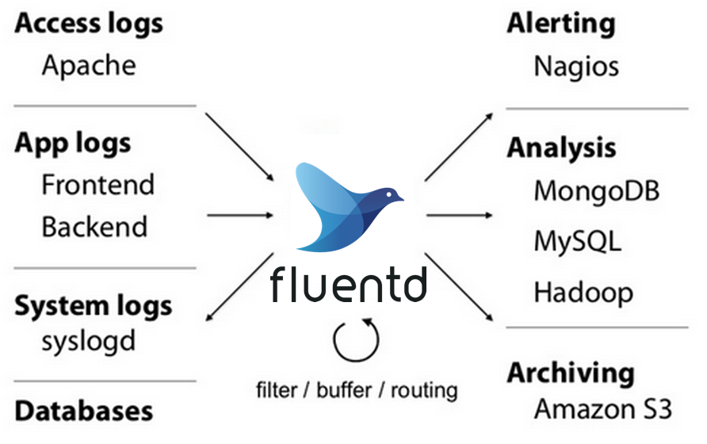
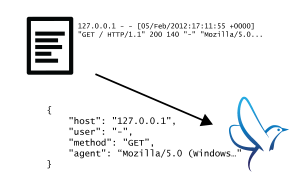
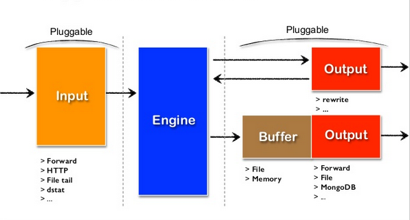
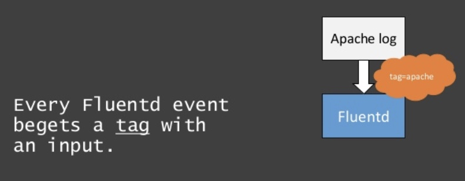
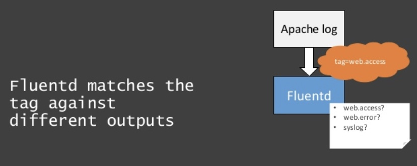
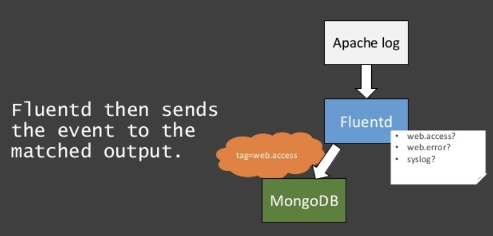
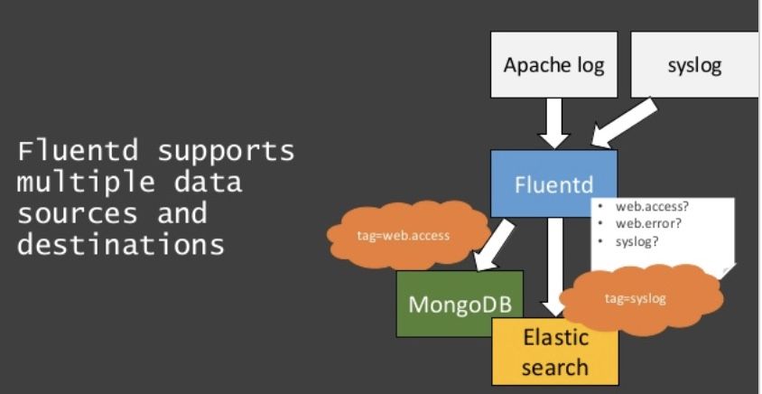

# Fluentd

* Fluentd is a fully free and fully open-source data collector, which lets us unify the data collection and consumption for a better use and understanding of data.
* Fluentd treats logs as JSON, a popular machine-readable format. 
* It is written primarily in C with a thin-Ruby wrapper that gives users flexibility.



## Use Cases
- Data Search like Splunk
- Data Filtering and Alerting
- Data Analytics with Treasure Data
- Data Collection to MongoDB
- Data Collection to HDFS
- Data Archiving to Amazon S3
- Windows Event Collection

## Advantages

### 1. Unified Logging with JSON



* Fluentd tries to structure data as JSON as much as possible: this allows Fluentd to unify all facets of processing log data: collecting, filtering, buffering, and outputting logs across multiple sources and destinations (Unified Logging Layer). 
* The downstream data processing is much easier with JSON, since it has enough structure to be accessible while retaining flexible schemas.

### 2. Pluggable Architecture



* Fluentd has a flexible plugin system that allows the community to extend its functionality. 
* 500+ community-contributed plugins connect dozens of data sources and data outputs. By leveraging the plugins, we can start making better use of our logs right away.

## The Life of a Fluentd Event



<br>



<br>



<br>



<br>

* The configuration file allows the user to control the input and output behavior of Fluentd by 
    - selecting input and output plugins and 
    - specifying the plugin parameters. The file is required for Fluentd to operate properly.


## Config file

### Config File Location

* /etc/fluent/fluent.conf if installed using ruby gems.

### FLUENT_CONF environment variable
We can change default configuration file location via FLUENT_CONF. 

* _Fluentd assumes configuration file is UTF-8 or ASCII._

### List of Directives

The configuration file consists of the following directives:

1. **source** directives determine the input sources. Where all the data come from.
2. **match** directives determine the output destinations.Tell fluentd what to do! 
3. **filter** directives determine the event processing pipelines. 
4. **system** directives set system wide configuration.
5. **label** directives group the output and filter for internal routing
6. **include** directives include other files. Re-use your config.


### 1. Source

* Fluentd’s standard input plugins include 
    - `http` and 
    - `forward`. 
* `http` turns fluentd into an HTTP endpoint to accept incoming HTTP messages 
*  `forward` turns fluentd into a TCP endpoint to accept TCP packets. Of course, it can be both at the same time.
* _We can add many sources as we wish!_

```
# Receive events from 28424/tcp
# This is used by log forwarding and the fluent-cat command
<source>
  @type forward
  port 28424
</source>

# http://mukund-learning-fluentd:9880/myapp.access?json={"event":"data"}
<source>
  @type http
  port 9880
</source>
```

* Each source directive must include a `@type` parameter. The `@type` parameter specifies which input plugin to use.

### 2. match

* The “match” directive looks for events with matching tags and processes them. 
* The most common use of the match directive is to output events to other systems.
* That's why the plugins that correspond to the match directive are called **output plugins**.
* Fluentd’s standard output plugins include file and forward.

* Each match directive must include a match pattern and a `@type` parameter. 
* Only events with a tag matching the pattern will be sent to the output destination.
* The @type parameter specifies the output plugin to use.

```
# Receive events from 28424/tcp
# This is used by log forwarding and the fluent-cat command
<source>
  @type forward
  port 28424
</source>

# http://mukund-learning-fluentd:9880/myapp.access?json={"event":"data"}
<source>
  @type http
  port 9880
</source>

# Match events tagged with "myapp.access" and
# store them to /var/log/fluent/access.%Y-%m-%d
# Of course, you can control how you partition your data
# with the time_slice_format option.
<match myapp.access>
  @type file
  path /var/log/fluent/access
</match>
```

### 3. Filter

* The “filter” directive has same syntax as `match` but `filter` could be chained for processing pipeline. Using filters, event flow is like below:

`Input -> filter 1 -> ... -> filter N -> Output`

```
# http://mukund-learning-fluentd:9880/myapp.access?json={"event":"data"}
<source>
  @type http
  port 9880
</source>

<filter myapp.access>
  @type record_transformer
  <record>
    host_param "#{Socket.gethostname}"
  </record>
</filter>

<match myapp.access>
  @type file
  path /var/log/fluent/access
</match>

```

Received event, `{"event":"data"}`, goes to record_transformer filter first. `record_transformer` adds `host_param` field to event and filtered event, `{"event":"data","host_param":"webserver1"}`, goes to file output.

### 4. System

Following configurations are set by system directive:

1. log_level
2. suppress_repeated_stacktrace
3. emit_error_log_interval
4. suppress_config_dump
5. without_source
6. process_name: If set this parameter, fluentd’s supervisor and worker process names are changed.

### 5. Label

The “label” directive groups filter and output for internal routing. “label” reduces the complexity of tag handling.

```
<source>
  @type forward
</source>

<source>
  @type tail
  @label @SYSTEM
</source>

<filter access.**>
  @type record_transformer
  <record>
    # ...
  </record>
</filter>
<match **>
  @type elasticsearch
  # ...
</match>

<label @SYSTEM>
  <filter var.log.middleware.**>
    @type grep
    # ...
  </filter>
  <match **>
    @type s3
    # ...
  </match>
</label>
```

* In this configuration, `forward` events are routed to `record_transformer` filter / `elasticsearch` output and `in_tail` events are routed to `grep `filter / `s3` output inside `@SYSTEM` label.
* `label` is useful for event flow separation without tag prefix.

___

@ERROR label is a built-in label used for error record emitted by plugin’s emit_error_event API.

If we set <label @ERROR> in the configuration, events are routed to this label when emit related error, e.g. buffer is full or invalid record.

___


### 6. Include

Directives in separate configuration files can be imported using the @include directive:

```
root@splunk-connect:/fluentd/etc# cat fluent.conf 
@include system.conf
@include source.containers.conf
@include source.journald.conf
@include output.conf
@include config.d/*.conf
@include http://example.com/fluent.conf
```

* The @include directive supports regular file path, glob pattern, and http URL conventions.
* _For glob pattern, files are expanded in the alphabetical order._

## How match patterns work?

### Wildcards and Expansions

The following match patterns can be used in <match> and <filter> tags.

* matches a single tag part.

    - For example, the pattern a.* matches a.b, but does not match a or a.b.c

* ** matches zero or more tag parts.

    - For example, the pattern a.** matches a, a.b and a.b.c

* {X,Y,Z} matches X, Y, or Z, where X, Y, and Z are match patterns.

    - For example, the pattern {a,b} matches a and b, but does not match c
    - This can be used in combination with the * or ** patterns. Examples include a.{b,c}.* and a.{b,c.**}

* When multiple patterns are listed inside a single tag (delimited by one or more whitespaces), it matches any of the listed patterns. For example:

    -  The patterns <match a b> match a and b.
    - The patterns <match a.** b.*> match a, a.b, a.b.c (from the first pattern) and b.d (from the second pattern).


