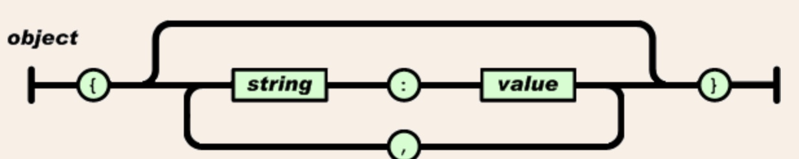
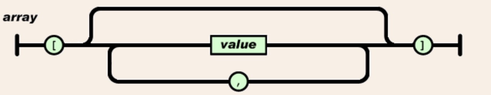
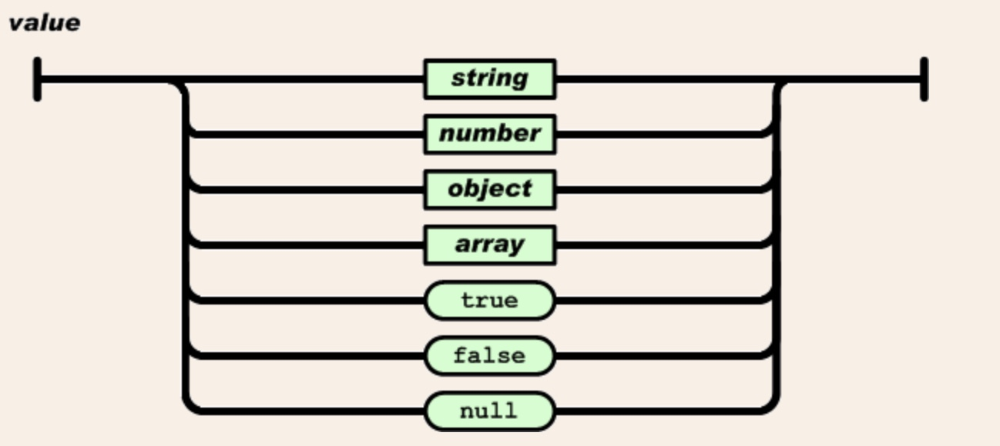
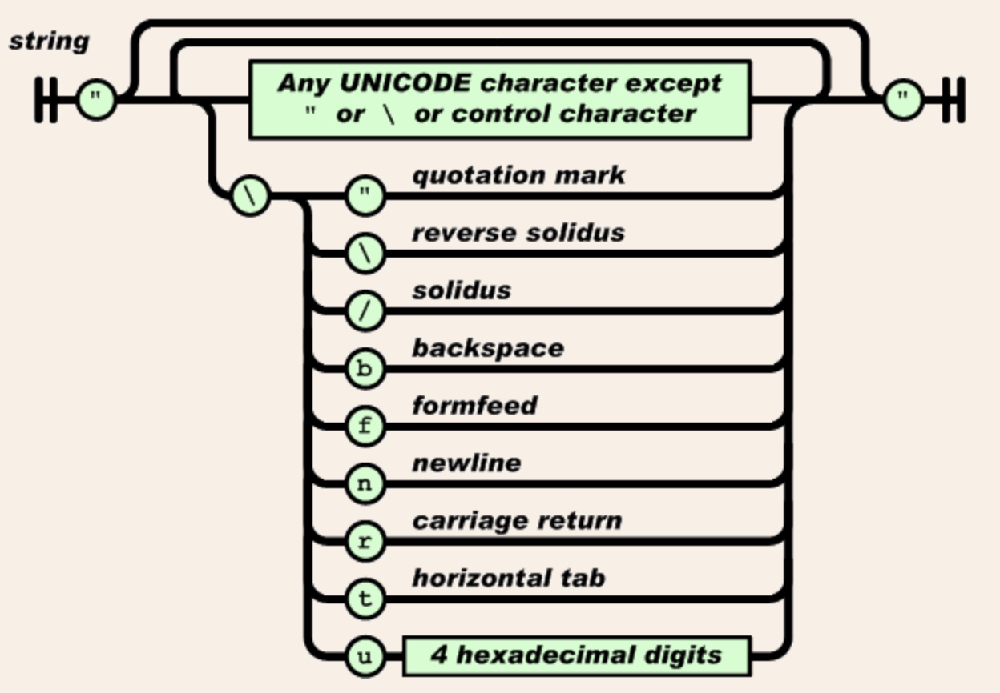
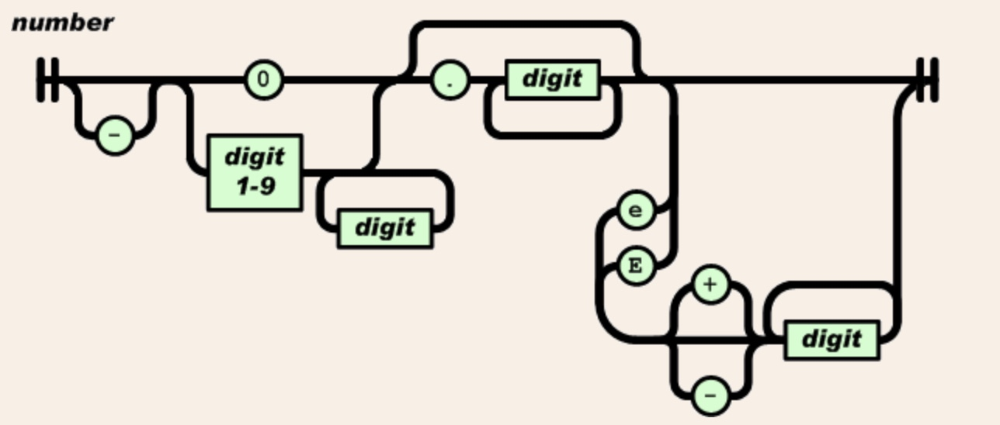

# JSON

* JSON (JavaScript Object Notation)  is a data-interchange format. 
*  It is easy for humans to read and write. 
* It is easy for machines to parse and generate. It is based on a subset of the JavaScript Programming Language.
* This format is based on ECMA-404. For more information, refer to http://www.ecma-international.org/publications/files/ECMA-ST/ECMA-404.pdf. 


JSON is built on two structures:

1. A collection of name/value pairs. In various languages, this is realized as an object, record, struct, dictionary, hash table, keyed list, or associative array.
2. An ordered list of values. In most languages, this is realized as an array, vector, list, or sequence.

JSON can be defined as a key-value model. We can write the following script:

```
{
 key: value
}
```

For instance, we can define a JSON object for the Employee data. We can write the following scripts:

```
{
 "id": 1,
 "name": "mukund",
 "country": "india"
}
```

We can see that the Employee object has three attributes—id, name, and country. 
Technically, we can declare an attribute in numeric and string types. We can also define a collection of the Employee object using []. 
Each object is defined in {}. We can write the scripts as follows:

```
[
 {
  "id": 1,
  "name": "govind",
  "state": "up"
 },
 {
  "id": 2,
  "name": "jason",
  "state": "goa"
 },
 {
  "id": 3,
  "name": "lingdo",
  "state": "assam"
 }
]
```

JSON supports unlimited parent-child attributes. For instance, each Employee object probably has two or more addresses. We can declare them as follows:

```
{
 "id": 1,
 "name": "modi",
 "address":[
      {
        "street": "abc street",
        "city": "new delhi"
      },
      {
        "street": "harding street",
        "city": "delhi"
      }
 ],
 "country": "India"
}

```

In the JSON format, we use {} and : for key-value data. In YAML, we only use :

## Structures in JSON

1. **Object**:

An object is an unordered set of name/value pairs. An object begins with { (left brace) and ends with } (right brace). Each name is followed by : (colon) and the name/value pairs are separated by , (comma).



<br>

2. **Array:**

An array is an ordered collection of values. An array begins with [ (left bracket) and ends with ] (right bracket). Values are separated by , (comma).



<br>

3. **Value:**

A value can be a string in double quotes, or a number, or true or false or null, or an object or an array. These structures can be nested.



<br>

4. **String:**

A string is a sequence of zero or more Unicode characters, wrapped in double quotes, using backslash escapes. A character is represented as a single character string.



<br>

5. **Number:**

A number is very much like a C or Java number, except that the octal and hexadecimal formats are not used.



<br>

Example:

```
json
    element

value
    object
    array
    string
    number
    "true"
    "false"
    "null"

object
    '{' ws '}'
    '{' members '}'

members
    member
    member ',' members

member
    ws string ws ':' element

array
    '[' ws ']'
    '[' elements ']'

elements
    element
    element ',' elements

element
    ws value ws

string
    '"' characters '"'
characters
    ""
    character characters
character
    '0020' . '10ffff' - '"' - '\'
    '\' escape
escape
    '"'
    '\'
    '/'
    'b'
    'n'
    'r'
    't'
    'u' hex hex hex hex

hex
    digit
    'A' . 'F'
    'a' . 'f'

number
    int frac exp

int
    digit
    onenine digits
    '-' digit
    '-' onenine digits

digits
    digit
    digit digits

digit
    '0'
    onenine

onenine
    '1' . '9'

frac
    ""
    '.' digits

exp
    ""
    'E' sign digits
    'e' sign digits

sign
    ""
    '+'
    '-'

ws
    ""
    '0009' ws
    '000a' ws
    '000d' ws
    '0020' ws
```

Reference: https://www.json.org/

